# VisitorMS - 访客管理控制系统

[TOC]

------

## 项目介绍

项目为**基于树莓派Linux系统开发的访客管理控制应用系统**。

- 系统既有多种用户身份验证功能，又针对不同身份的用户提供不同的应用功能。

- 涉及多线程、多并发、socket编程、数据加密等功能，设备控制部分基于简单工厂模式开发；
- 运用ncurses界面库、libcurl网络库、sqlite3数据库、wiringPi驱动库；
- 项目还包含MJPG-Streamer开源视频方案、安卓APP开发。

**项目 Gitee 仓库**

```
https://gitee.com/yang-haoqing/visitor-ms.git
git@gitee.com:yang-haoqing/visitor-ms.git
```

仓库数据统计（不定时更新）

> 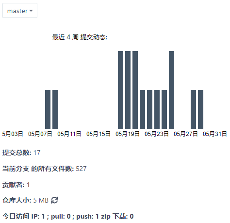

仓库网络图（不定时更新）

==具体见同一目录下【树莓派项目 - 开发流程 - HQ】文档==

> 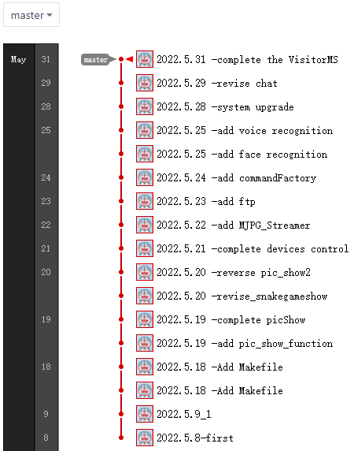


## 项目说明

项目从2022.5.8开始开发，创建项目工程文件，创建Git仓库。

到2022.5.31完成基本开发，所有预设功能全部实现。

- 整个系统可编(make)可清(make clean)，

- 可进(进入子菜单)可退(进入父菜单)，

- 具有一定的健壮性（不会轻易报错崩溃）。

整个项目由HQ一人开发，其中70%以上代码为个人编写。

#### 项目统计报告

详细统计报告见最后一章【项目统计】

```
Total Files:           42
Total Bytes:       177439
Total Lines:         6318
Total Symbols:        454
```

#### 开发文档说明

**项目详细开发流程见同一目录下【树莓派项目 - 开发流程 - HQ】文档**

> 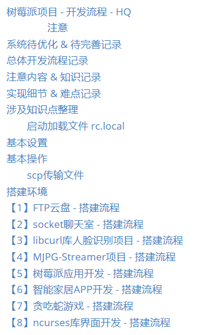

**项目详细组织架构见同一目录下【树莓派项目 - 组织架构 - HQ】文档**

>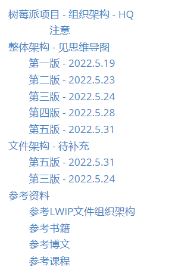

**此外同一目录下还提供系统结构图的源文件**

> 

**项目开发具体详细资料，及每一部分开发参考案例、库、手册等，请联系我 970407688@qq.com。**


## 项目待完善部分

==具体见同一目录下【树莓派项目 - 开发流程 - HQ】文档==

| 定位       | 需要解决的Bug                                |
| ---------- | -------------------------------------------- |
| 贪吃蛇游戏 | 第一次进入游戏正常运行，第二次进入游戏会闪退 |
|            |                                              |

| 定位 | 更多操作需要优化的地方 |
| ---- | ---------------------- |
| xxx  | xxx                    |
|      |                        |


## 项目结构

#### 系统程序功能结构图

>

#### 系统菜单切换结构图

>

#### 系统身份验证方式导图

>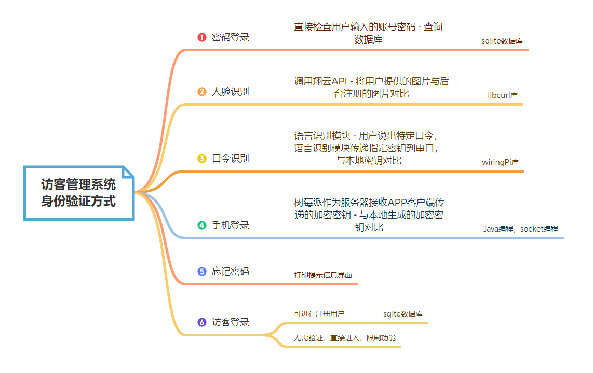

#### 系统不同用户功能导图

>


## 项目配置

### 项目运行环境

平台：树莓派 3B 板子

系统：树莓派 Linux-ubuntu 系统

具体参考：

```
pi@raspberrypi:~/raspberry/VisitorMS $ cat /proc/version
Linux version 5.10.17-v7+ (dom@buildbot) (arm-linux-gnueabihf-gcc-8 (Ubuntu/Linaro 8.4.0-3ubuntu1) 8.4.0, GNU ld (GNU Binutils for Ubuntu) 2.34) #1414 SMP Fri Apr 30 13:18:35 BST 2021

pi@raspberrypi:~/raspberry/VisitorMS $ uname -a
Linux raspberrypi 5.10.17-v7+ #1414 SMP Fri Apr 30 13:18:35 BST 2021 armv7l GNU/Linux

pi@raspberrypi:~/raspberry/VisitorMS $ lsb_release -a
No LSB modules are available.
Distributor ID: Raspbian
Description:    Raspbian GNU/Linux 10 (buster)
Release:        10
Codename:       buster

pi@raspberrypi:~/raspberry/VisitorMS $ cat /etc/issue
Raspbian GNU/Linux 10 \n \l

pi@raspberrypi:~/raspberry/VisitorMS $ df -h
Filesystem      Size  Used Avail Use% Mounted on
/dev/root        25G  3.5G   20G  15% /
devtmpfs        404M     0  404M   0% /dev
tmpfs           437M     0  437M   0% /dev/shm
tmpfs           437M  6.0M  431M   2% /run
tmpfs           5.0M  4.0K  5.0M   1% /run/lock
tmpfs           437M     0  437M   0% /sys/fs/cgroup
/dev/mmcblk0p1  253M   48M  205M  19% /boot
tmpfs            88M  4.0K   88M   1% /run/user/1000
```

### 项目所需要的库

#### 更新

```
sudo apt-get update      #更新软件列表
sudo apt-get upgrade     #更新软件
```

#### sqlite3库 - 数据库需要

```
sudo apt-get install sqlite sqlite3   
sudo apt-get install libsqlite3-dev 
```

#### openssl库 - 人脸识别需要

```
wget https://www.openssl.org/source/openssl-1.1.1a.tar.gz
tar xvf openssl-1.1.1a.tar.gz
cd openssl-1.1.1a/
./config
make
make install
```

#### libcurl库 - 人脸识别需要

解压libcurl库安装包到指令目录

```
tar xvf curl-7.71.1.tar.bz2 
./configure --prefix=$PWD/_install --with-ssl
make
make install
```

#### MJPG-Streamer - 摄像头需要

[参考文章](https://jingyan.baidu.com/article/47a29f2474a555c01523994c.html)

```
sudo apt-get install subversion		#Subversion是一个自由开源的版本控制系统
sudo apt-get install libjpeg8-dev   #JPEG支持库
sudo apt-get install imagemagick
sudo apt-get install libv4l-dev  	#4l是小写"L"
sudo apt-get install cmake 			#下载编译工具

sudo apt-get install git
git clone https://github.com/jacksonliam/mjpg-streamer.git

cd mjpg-streamer/mjpg-streamer-experimental #进入下载目录后进入左侧路径
make all 				#编译
sudo make install 		#安装

#其他具体设置见详细说明
```

#### wiringPi库 - 驱动需要

默认已安装

查看wiringPi库版本

```
gpio -v
```

#### ncurses库 - 界面显示需要

```
sudo apt-get install libncurses5-dev libncursesw5-dev 
```


## 项目使用

### 项目编译

#### 编译方法

```
chmod 777 *.sh
./make_project.sh
```

#### 编译过程

```
pi@raspberrypi:~/raspberry/VisitorMS $ ./make_project.sh
This is VisitorMS by HQ.
----------------------------------
Configure library files ...
Configuration library file succeeded!
----------------------------------
Start compile FTP module ...
FTP module compiled successfully!
----------------------------------
Start compile chat module ...
prepare to compile server
make[1]: Entering directory '/home/pi/raspberry/VisitorMS/src/lib/chat/chat_server/src'
make[1]: Leaving directory '/home/pi/raspberry/VisitorMS/src/lib/chat/chat_server/src'
make[1]: Entering directory '/home/pi/raspberry/VisitorMS/src/lib/chat/chat_server/obj'
server linked successfully.
make[1]: Leaving directory '/home/pi/raspberry/VisitorMS/src/lib/chat/chat_server/obj'
prepare to compile client
make[1]: Entering directory '/home/pi/raspberry/VisitorMS/src/lib/chat/chat_client/src'
make[1]: Leaving directory '/home/pi/raspberry/VisitorMS/src/lib/chat/chat_client/src'
make[1]: Entering directory '/home/pi/raspberry/VisitorMS/src/lib/chat/chat_client/obj'
client linked successfully.
make[1]: Leaving directory '/home/pi/raspberry/VisitorMS/src/lib/chat/chat_client/obj'
Chat module compiled successfully!
----------------------------------
Start compile the VisitorMS ...
compile core/system/mainPro.c successfully.
compile core/system/menu.c successfully.
compile core/controlDevice/equipment2.c successfully.
compile core/controlDevice/fireAlarm.c successfully.
compile core/controlDevice/equipment1.c successfully.
compile core/identityRecognition/passwordIdentification.c successfully.
compile core/identityRecognition/data.c successfully.
compile core/identityRecognition/appRecognition.c successfully.
compile core/identityRecognition/faceRecognition.c successfully.
compile core/otherFunctions/camera.c successfully.
compile core/otherFunctions/ftp.c successfully.
compile core/otherFunctions/snake.c successfully.
compile core/inputCommand/usartControl.c successfully.
compile core/inputCommand/voiceControl.c successfully.
compile core/inputCommand/socketControl.c successfully.
prepare to link
VisitorMS linked successfully.
VisitorMS created successfully!
----------------------------------
```

#### 编译前

```
pi@raspberrypi:~/raspberry/VisitorMS $ tree
.
├── clean_project.sh
├── make_project.sh
└── src
    ├── core
    │   ├── controlDevice
    │   │   ├── equipment1.c
    │   │   ├── equipment2.c
    │   │   └── fireAlarm.c
    │   ├── identityRecognition
    │   │   ├── appRecognition.c
    │   │   ├── data.c
    │   │   ├── faceRecognition.c
    │   │   └── passwordIdentification.c
    │   ├── inputCommand
    │   │   ├── socketControl.c
    │   │   ├── usartControl.c
    │   │   └── voiceControl.c
    │   ├── otherFunctions
    │   │   ├── camera.c
    │   │   ├── ftp.c
    │   │   └── snake.c
    │   └── system
    │       ├── mainPro.c
    │       └── menu.c
    ├── include
    │   ├── camera.h
    │   ├── controlDevice.h
    │   ├── data.h
    │   ├── ftp.h
    │   ├── identityRecognition.h
    │   ├── inputCommand.h
    │   ├── mainPro.h
    │   ├── menu.h
    │   └── snake.h
    ├── lib
    │   ├── chat
    │   │   ├── chat_client
    │   │   │   ├── include
    │   │   │   │   └── key.h
    │   │   │   ├── Makefile
    │   │   │   ├── obj
    │   │   │   │   └── Makefile
    │   │   │   └── src
    │   │   │       ├── client.c
    │   │   │       ├── key.c
    │   │   │       └── Makefile
    │   │   ├── chat_client_start.sh
    │   │   ├── chat.h
    │   │   ├── chat_server
    │   │   │   ├── include
    │   │   │   │   ├── data.h
    │   │   │   │   └── key.h
    │   │   │   ├── Makefile
    │   │   │   ├── obj
    │   │   │   │   └── Makefile
    │   │   │   └── src
    │   │   │       ├── data.c
    │   │   │       ├── key.c
    │   │   │       ├── Makefile
    │   │   │       └── server.c
    │   │   ├── chat_server_start.sh
    │   │   ├── clean.sh
    │   │   └── gcc.sh
    │   ├── ftp
    │   │   ├── ftp_client.c
    │   │   ├── ftp_client_start.sh
    │   │   ├── ftp_server.c
    │   │   └── ftp_server_start.sh
    │   ├── libcurl
    │   │   ├── back_up_photo2.jpg
    │   │   ├── back_up_photo.jpg
    │   │   ├── include
    │   │   │   └── curl
    │   │   │       ├── curl.h
    │   │   │       ├── curlver.h
    │   │   │       ├── easy.h
    │   │   │       ├── mprintf.h
    │   │   │       ├── multi.h
    │   │   │       ├── stdcheaders.h
    │   │   │       ├── system.h
    │   │   │       ├── typecheck-gcc.h
    │   │   │       └── urlapi.h
    │   │   └── lib
    │   │       └── libcurl.so.4.6.0
    │   ├── ncurses
    │   ├── sqlite3
    │   └── wiringPi
    ├── Makefile
    └── tmp
        ├── photo2.jpg
        └── photo.jpg

27 directories, 64 files

```

#### 编译后

```
pi@raspberrypi:~/raspberry/VisitorMS $ tree
.
├── clean_project.sh
├── make_project.sh
├── src
│   ├── core
│   │   ├── controlDevice
│   │   │   ├── equipment1.c
│   │   │   ├── equipment1.o
│   │   │   ├── equipment2.c
│   │   │   ├── equipment2.o
│   │   │   ├── fireAlarm.c
│   │   │   └── fireAlarm.o
│   │   ├── identityRecognition
│   │   │   ├── appRecognition.c
│   │   │   ├── appRecognition.o
│   │   │   ├── data.c
│   │   │   ├── data.o
│   │   │   ├── faceRecognition.c
│   │   │   ├── faceRecognition.o
│   │   │   ├── passwordIdentification.c
│   │   │   └── passwordIdentification.o
│   │   ├── inputCommand
│   │   │   ├── socketControl.c
│   │   │   ├── socketControl.o
│   │   │   ├── usartControl.c
│   │   │   ├── usartControl.o
│   │   │   ├── voiceControl.c
│   │   │   └── voiceControl.o
│   │   ├── otherFunctions
│   │   │   ├── camera.c
│   │   │   ├── camera.o
│   │   │   ├── ftp.c
│   │   │   ├── ftp.o
│   │   │   ├── snake.c
│   │   │   └── snake.o
│   │   └── system
│   │       ├── mainPro.c
│   │       ├── mainPro.o
│   │       ├── menu.c
│   │       └── menu.o
│   ├── include
│   │   ├── camera.h
│   │   ├── controlDevice.h
│   │   ├── data.h
│   │   ├── ftp.h
│   │   ├── identityRecognition.h
│   │   ├── inputCommand.h
│   │   ├── mainPro.h
│   │   ├── menu.h
│   │   └── snake.h
│   ├── lib
│   │   ├── chat
│   │   │   ├── chat_client
│   │   │   │   ├── bin
│   │   │   │   ├── include
│   │   │   │   │   └── key.h
│   │   │   │   ├── Makefile
│   │   │   │   ├── obj
│   │   │   │   │   ├── client.o
│   │   │   │   │   ├── key.o
│   │   │   │   │   └── Makefile
│   │   │   │   └── src
│   │   │   │       ├── client.c
│   │   │   │       ├── key.c
│   │   │   │       └── Makefile
│   │   │   ├── chat_client_start.sh
│   │   │   ├── chat.h
│   │   │   ├── chat_server
│   │   │   │   ├── bin
│   │   │   │   ├── include
│   │   │   │   │   ├── data.h
│   │   │   │   │   └── key.h
│   │   │   │   ├── Makefile
│   │   │   │   ├── obj
│   │   │   │   │   ├── data.o
│   │   │   │   │   ├── key.o
│   │   │   │   │   ├── Makefile
│   │   │   │   │   └── server.o
│   │   │   │   └── src
│   │   │   │       ├── data.c
│   │   │   │       ├── key.c
│   │   │   │       ├── Makefile
│   │   │   │       └── server.c
│   │   │   ├── chat_server_start.sh
│   │   │   ├── clean.sh
│   │   │   ├── client
│   │   │   ├── gcc.sh
│   │   │   └── server
│   │   ├── ftp
│   │   │   ├── client
│   │   │   ├── ftp_client.c
│   │   │   ├── ftp_client_start.sh
│   │   │   ├── ftp_server.c
│   │   │   ├── ftp_server_start.sh
│   │   │   └── server
│   │   ├── libcurl
│   │   │   ├── back_up_photo2.jpg
│   │   │   ├── back_up_photo.jpg
│   │   │   ├── include
│   │   │   │   └── curl
│   │   │   │       ├── curl.h
│   │   │   │       ├── curlver.h
│   │   │   │       ├── easy.h
│   │   │   │       ├── mprintf.h
│   │   │   │       ├── multi.h
│   │   │   │       ├── stdcheaders.h
│   │   │   │       ├── system.h
│   │   │   │       ├── typecheck-gcc.h
│   │   │   │       └── urlapi.h
│   │   │   └── lib
│   │   │       ├── libcurl.so -> libcurl.so.4.6.0
│   │   │       ├── libcurl.so.4 -> libcurl.so.4.6.0
│   │   │       └── libcurl.so.4.6.0
│   │   ├── ncurses
│   │   ├── sqlite3
│   │   └── wiringPi
│   ├── Makefile
│   └── tmp
│       ├── photo2.jpg
│       └── photo.jpg
└── VisitorMS

29 directories, 91 files
```

### 项目清理

```
./clean_project.sh
```

**清理过程**

```
pi@raspberrypi:~/raspberry/VisitorMS $ ./clean_project.sh
This is VisitorMS by HQ.
----------------------------------
Start clean FTP module ...
FTP module cleanup succeeded!
----------------------------------
Start clean chat module ...
server cleanup complete.
client cleanup complete.
Chat module cleanup succeeded!
----------------------------------
Start clean the VisitorMS ...
VisitorMS cleanup complete.
VisitorMS cleanup succeeded!
----------------------------------
```


## 项目展示

运行项目

```
./VisitorMS
```

### 系统部分

#### 系统提示

**开始界面 - 选择登录身份**

- 输入1 - 以访客身份登录
- 输入2 - 以User1身份登录
- 输入3 - 以User2身份登录
- 输入4 - 以管理员身份登录
- 输入5 - 以其他用户身份登录
- 输入q - 退出系统

> 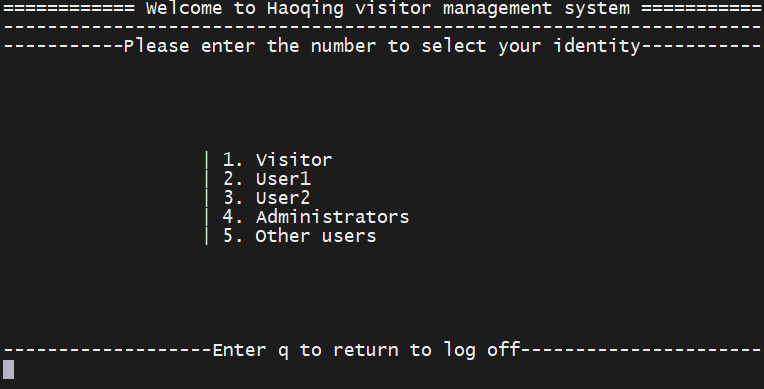

**提示界面 - 输入未指定功能的按键**

在每个功能选择中，如果输入的不是指定按键则会显示此提示错误界面

- 按任意键返回

> 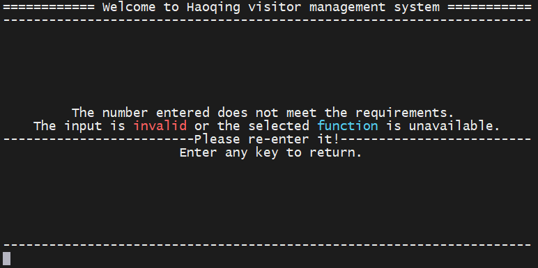


### 身份验证部分

#### 身份验证提示

**提示界面 - 选择身份验证方式**

- 输入1 - 账号密码验证
- 输入2 - 人脸识别验证
- 输入3 - 语音口令验证
- 输入4 - 手机APP验证
- 输入5 - 忘记密码
- 输入q - 返回开始界面

> 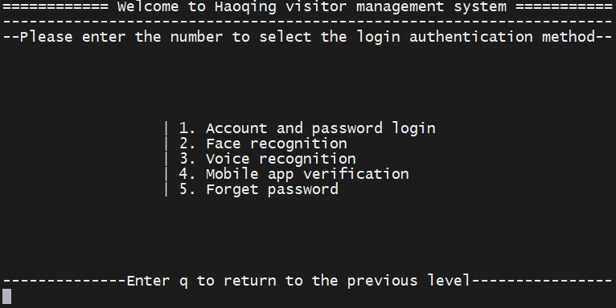

**提示界面 - 忘记密码**

选择 5 忘记密码后打印的提示界面

- 按任意键返回

>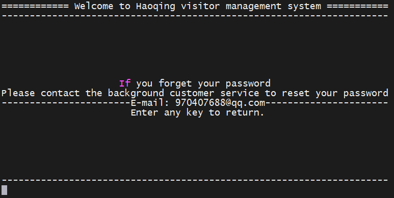

**提示界面 - 登录验证失败**

任一验证方式失败后，打印的提示界面

- 按任意键返回

>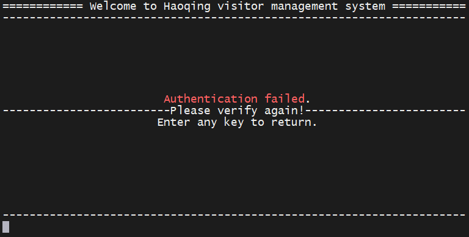

#### 账号密码验证

**验证界面 - 账号密码验证**

进入验证功能后打印的提示界面如下，然后系统会初始化数据库，提示用户输入账号和密码

- 输入账号，然后回车
- 输入密码，然后回车

>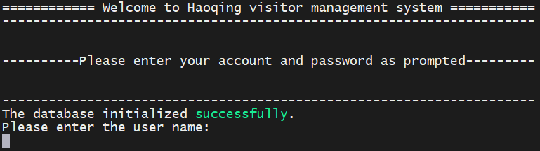

验证成功后，提示如下

- 按任意键返回（进入该身份对于的功能选择列表）

> 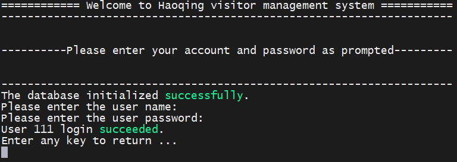

如果输入的账号不存在，提示如下

- 按任意键返回

> 

如果输入的账号存在，但是密码不正确，提示如下

- 按任意键返回

> 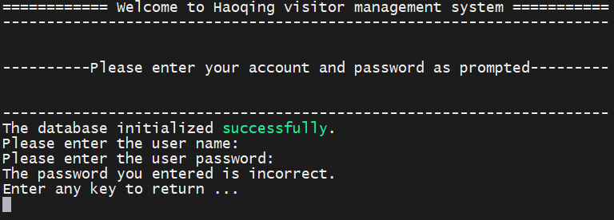

#### 人脸识别验证

**验证界面 - 人脸识别验证**

进入验证功能后打印的提示界面如下

- 根据提示，将自己的照片放到.\src\tmp目录下（相对于VisitorMS系统存放的位置）
- 输入任意键开始进行识别

>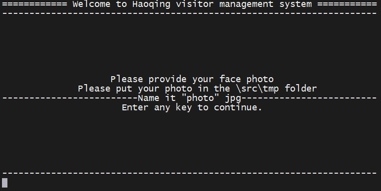

识别成功提示界面如下

- 按任意键返回

> 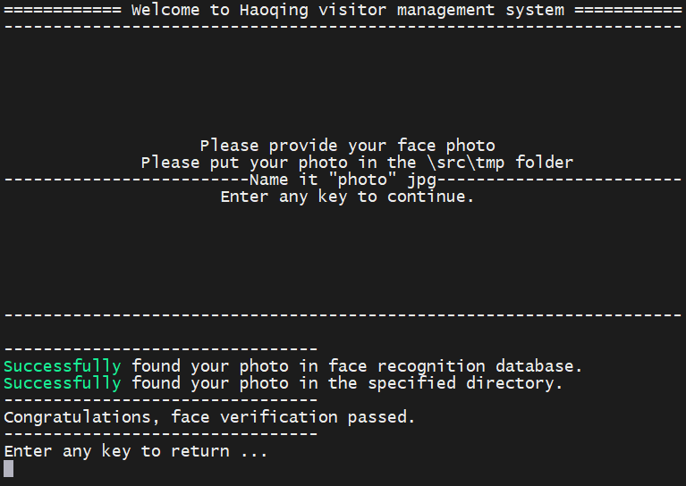

识别失败提示界面如下

- 按任意键返回

>

#### 语音口令验证

**验证界面 - 语音口令验证**

进入验证功能后打印的提示界面如下

- 按任意键开始进行语音识别
- 然后对着语音模块说出识别口令，如”芝麻开门“，语音模块识别到正确口令后，发送特定密钥给系统，系统接收后与本地特定密钥对比相同，则提示识别成功，否则失败

>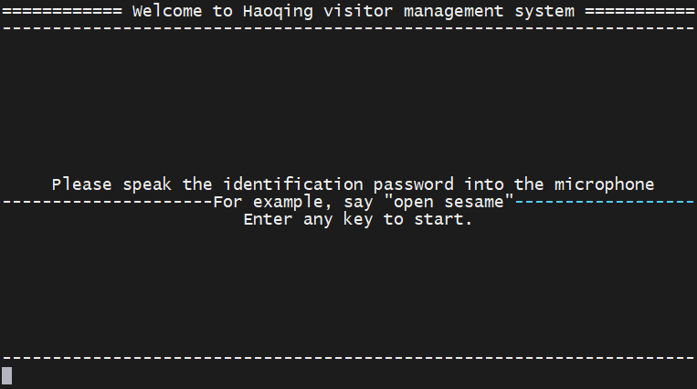

识别成功提示界面如下

- 按任意键返回

>

识别失败提示界面如下，由于树莓派没有连接串口，提示串口打开失败

- 按任意键返回

>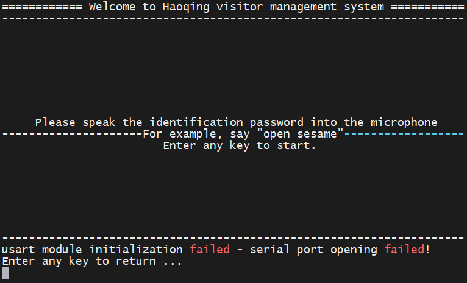

#### 手机APP验证

**验证界面 - 手机APP验证**

进入验证功能后打印的提示界面如下，系统启动服务端，等待手机app客户端进行连接，然后接收手机app客户端发送的加密密钥，与本地生成的加密密钥对比相同后，提示识别成功，否则失败

- 按任意键开始进行语音识别

>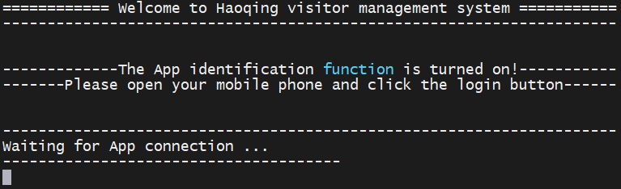

手机app客户端成功连接系统服务端提示如下

- 等待app发送特定密钥（123312）

> 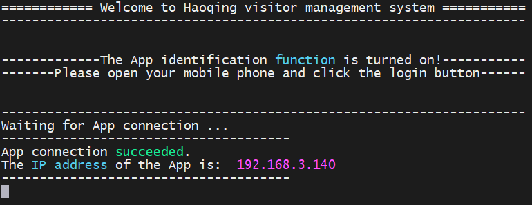

系统接收到app发送的特定密钥后，提示识别成功

- 按任意键返回

>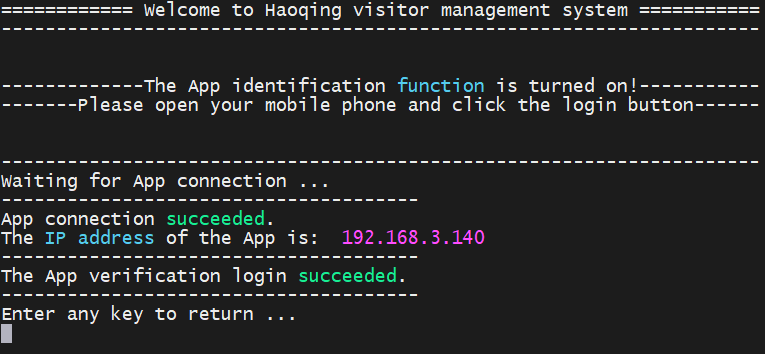

识别失败提示界面如下

- 按任意键返回

>


### 用户功能选择部分

#### 访客

**用户功能选择界面 - 选择访客可使用的功能**

- 输入1 - 注册用户
- 输入2 - 打开贪吃蛇游戏
- 输入3 - 进入聊天室
- 输入q - 返回用户选择界面

> 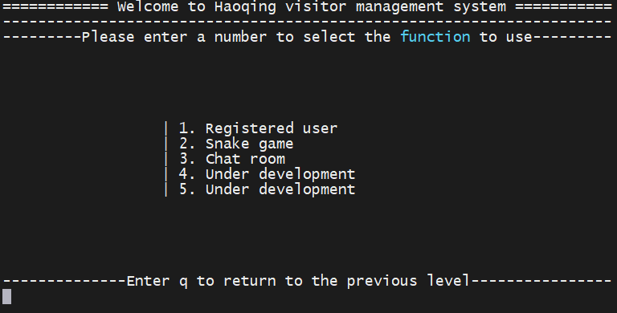

#### User1

**用户功能选择界面 - 选择User1可使用的功能**

- 输入1 - 选择控制设备1
- 输入2 - 选择控制设备2
- 输入3 - 选择控制火灾报警器
- 输入4 - 开启语音控制
- 输入5 - 开启串口控制
- 输入6 - 开启网络控制
- 输入7 - 进入聊天室
- 输入q - 返回用户选择界面
- 输入其他按键 - 刷新语音 & 串口 & 网络控制 

> 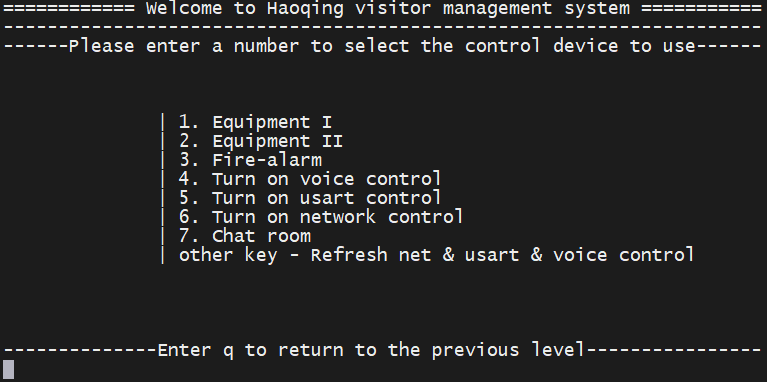

#### User2

**用户功能选择界面 - 选择User2可使用的功能**

- 输入1 - 选择控制设备1
- 输入2 - 选择控制火灾报警器
- 输入3 - 选择控制摄像头
- 输入4 - 开启语音控制
- 输入5 - 开启串口控制
- 输入6 - 开启网络控制
- 输入7 - 进入聊天室
- 输入q - 返回用户选择界面
- 输入其他按键 - 刷新语音 & 串口 & 网络控制 

> 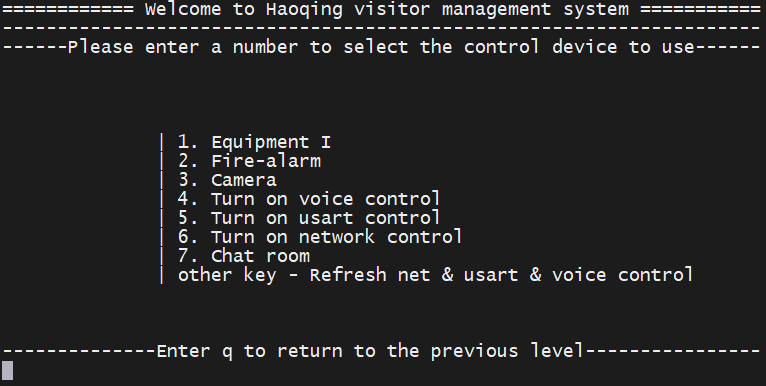

#### 管理员

**用户功能选择界面 - 选择管理员可使用的功能**

- 输入1 - 选择控制设备1
- 输入2 - 选择控制设备2
- 输入3 - 选择控制火灾报警器
- 输入4 - 选择控制摄像头
- 输入5 - 开启语音控制
- 输入6 - 开启串口控制
- 输入7 - 开启网络控制
- 输入8 - 进入聊天室
- 输入q - 返回用户选择界面
- 输入其他按键 - 刷新语音 & 串口 & 网络控制 

> 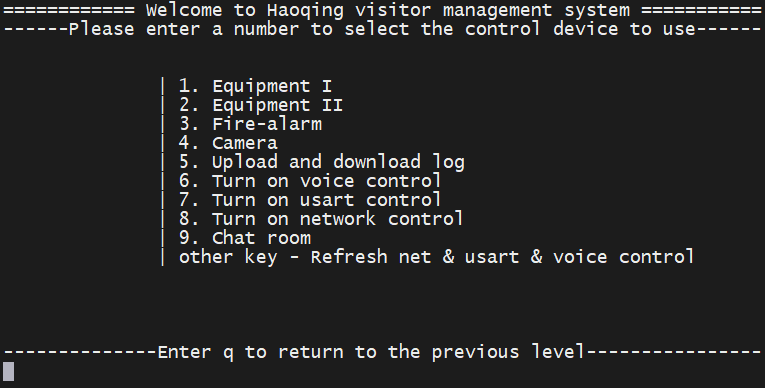

#### 其他用户

**用户功能选择界面 - 选择其他/普通用户可使用的功能**

- 输入1 - 打开贪吃蛇游戏
- 输入2 - 进入聊天室
- 输入q - 返回用户选择界面

> 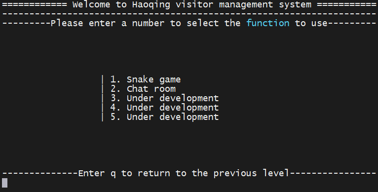


### 系统功能部分

#### 注册用户

选择注册用户功能后，系统成功初始化数据库，打印的提示界面如下，根据提示输入想要注册的账号和密码

- 输入想要注册的账号

>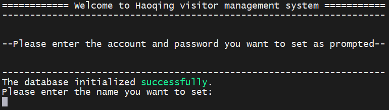

输入的账号，与数据库中的账号重复，提示错误

- 按任意键返回

> 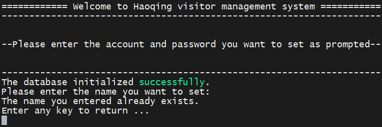

输入的账号可用

- 输入想要注册的密码

> 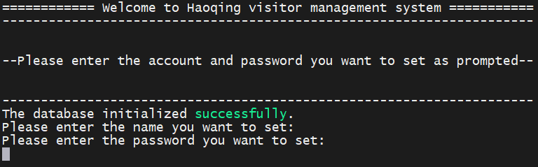

账号密码都可用，注册成功

- 按任意键返回

> 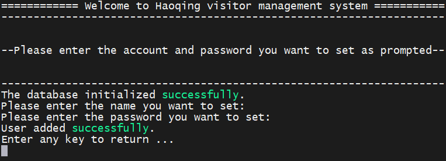

#### 控制设备1

选择控制设备1功能后，进入控制设备1功能选择菜单，选择想要进行的控制功能

- 输入1 - 打开设备1
- 输入2 - 关闭设备1 
- 输入3 - 读取设备1当前状态
- 输入q - 返回上一级

>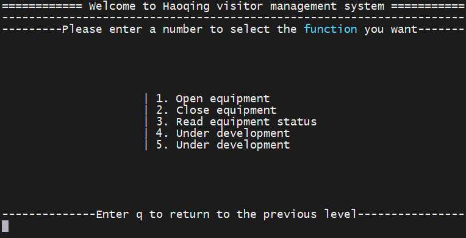

设备1打开成功

- 输入任意键返回

> 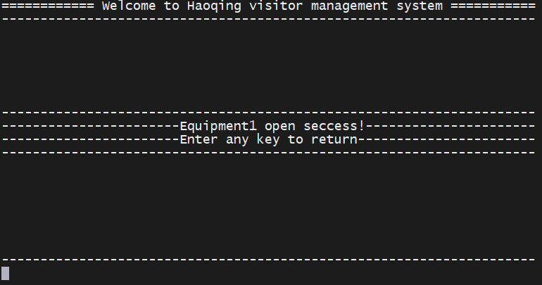

设备1关闭成功

- 输入任意键返回

> 

读取设备当前状态

- 按任意键返回

> 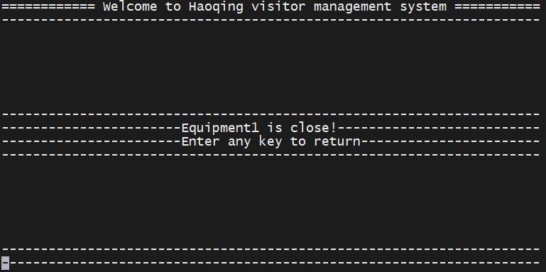

#### 控制设备2

选择控制设备2功能后，进入控制设备2功能选择菜单，选择想要进行的控制功能

- 输入1 - 打开设备1
- 输入2 - 关闭设备1 
- 输入3 - 读取设备1当前状态
- 输入q - 返回上一级

>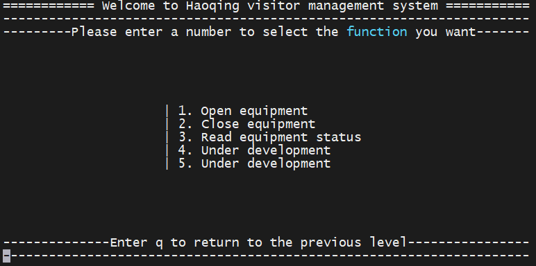

设备2打开成功

- 输入任意键返回

> 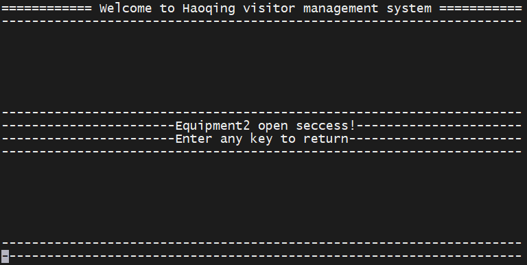

设备2关闭成功

- 输入任意键返回

> 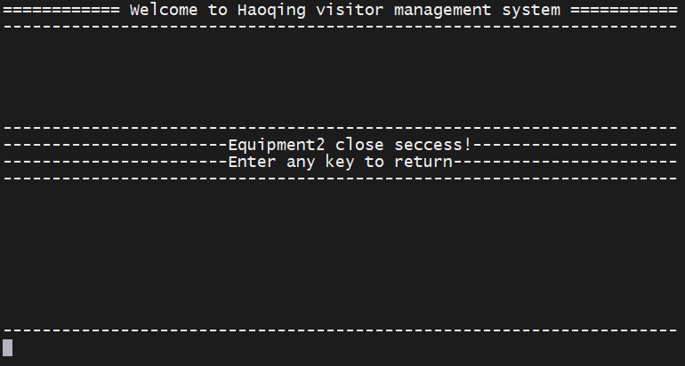

读取设备当前状态

- 按任意键返回

> 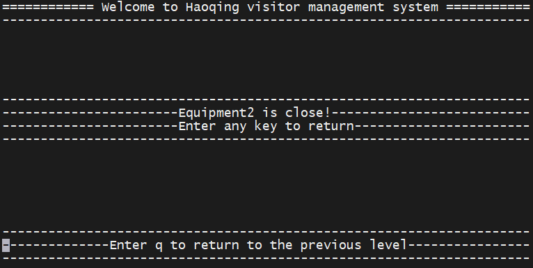

#### 控制火灾报警器

选择火灾报警器功能后，进入火灾报警器功能选择菜单，选择想要进行的控制功能

- 输入1 - 打开火灾报警器
- 输入2 - 关闭火灾报警器
- 输入3 - 读取火灾报警器当前状态
- 输入q - 返回上一级

>

火灾报警器默认为开启状态，选择打开后，将提示一直处于开启状态

- 输入任意键返回

> 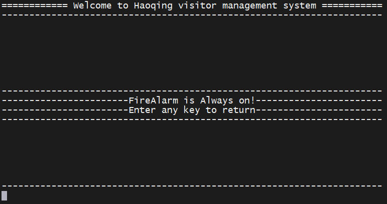

火灾报警器关闭成功，提示注意防火

- 输入任意键返回

> 

读取火灾报警器当前状态

- 按任意键返回

> 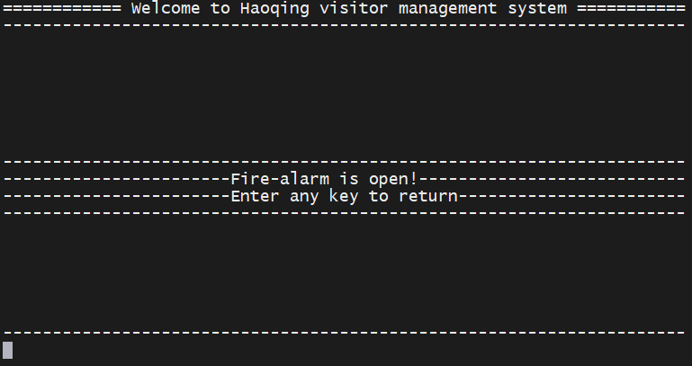

#### 控制摄像头

选择控制摄像头后，进入摄像头功能选择界面

- 打开摄像头
- 关闭摄像头

>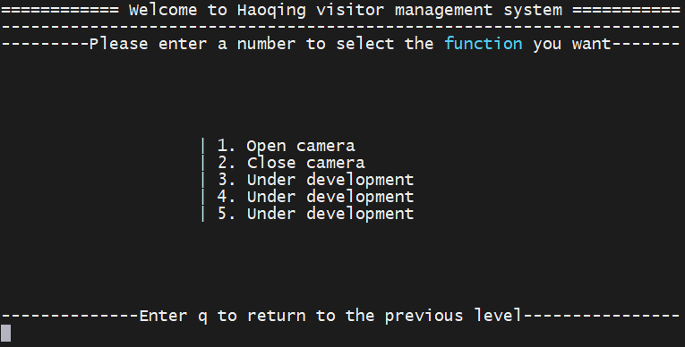

选择打开摄像头后，打印如下提示界面

- 输入任意键继续（真正打开摄像头）

> 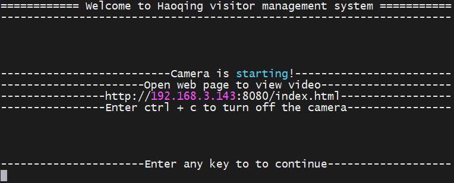

成功打开摄像头，输出运行信息

- 进入 `http://192.168.3.143:8080/index.html` 查看摄像头画面
- 输入 `ctrl + c` 关闭摄像头，返回系统

> 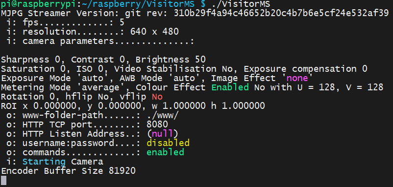

浏览器进入 `http://192.168.3.143:8080/index.html` 网址，查看摄像头画面

>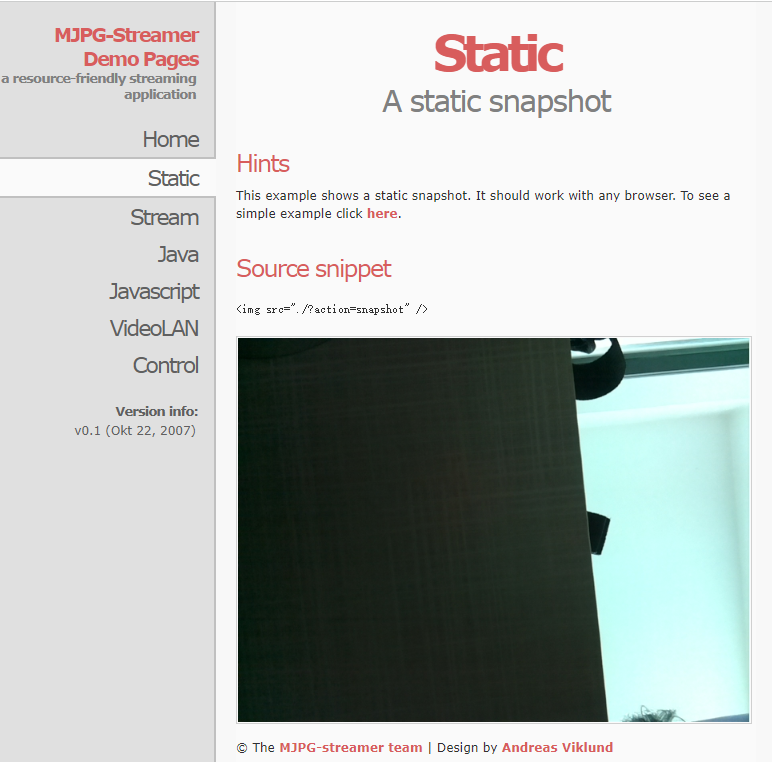

输入 `ctrl + c` 结束摄像头运行后，打印界面提示关闭成功

- 输入任意键返回

> 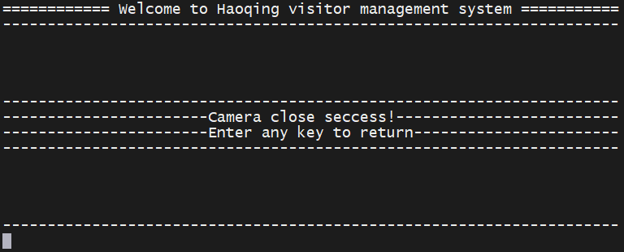

选择关闭摄像头后，打印提示界面如下，提示摄像头已经关闭

- 输入任意键返回

> 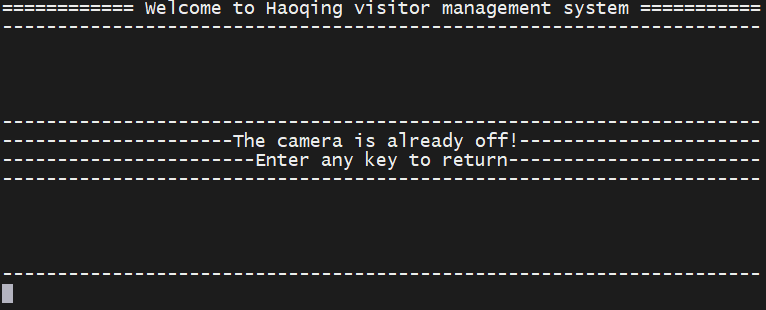

#### 语音控制

选择语音控制后，打印界面如下，由于未连接语音识别模块，提示打开串口失败

- 输入任意键返回

>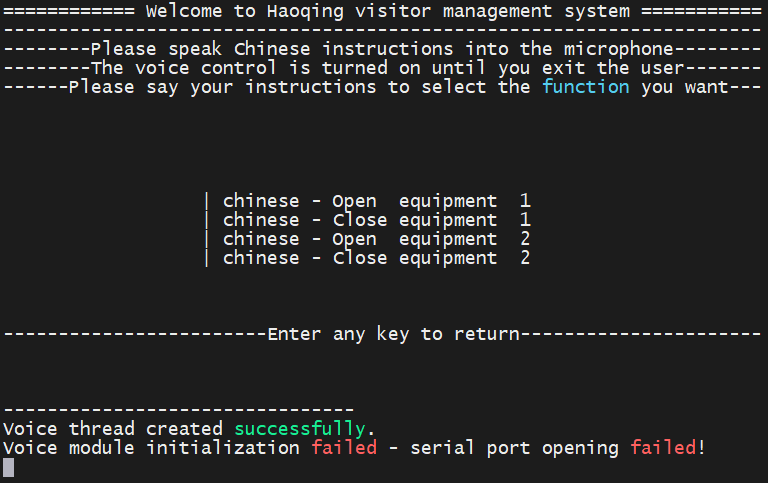

#### 串口控制

选择串口控制后，打印界面如下，由于树莓派未连接串口，提示打开串口失败

- 输入任意键返回

>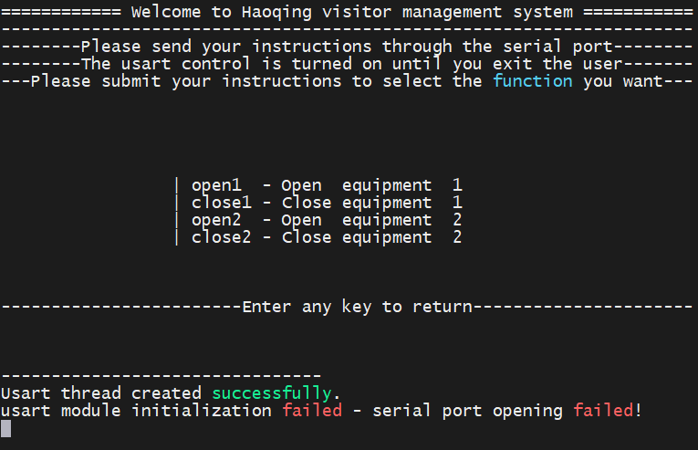

#### 网络控制

选择网络控制功能后，打印的界面如下，此时系统创建了新线程作为服务端，接收客户端的连接，并接收其发送的控制指令，然后执行相应的控制。

- 运行客户端连接服务端， `./client 192.168.3.143 8010`

>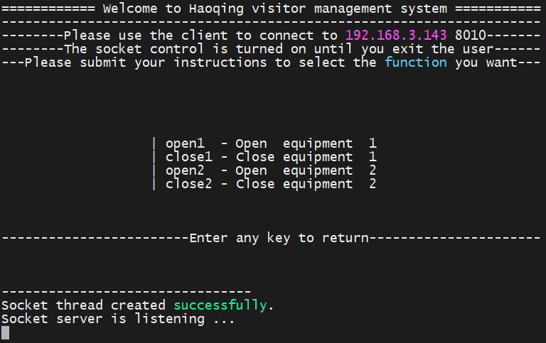

客户端连接成功

- 客户端输入open1 - 系统打开设备1
- 客户端输入close1 - 系统关闭设备1
- 客户端输入open2 - 系统打开设备2
- 客户端输入close2 - 系统关闭设备2
- 输入任意键返回

> 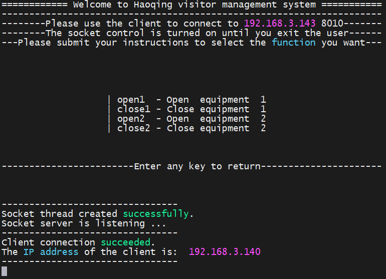

输入close1，系统成功关闭设备1

- 按任意键返回

> 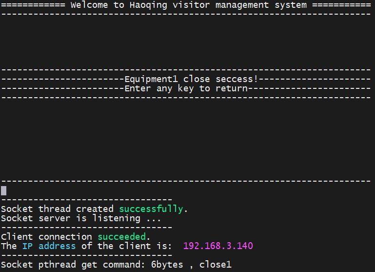

返回用户功能选择界面后，此时既可以选择控制设备进行相应的控制，也可以通过客户端发送对应的指令来进行控制。

- 输入1-9 - 选择相应的功能
- 输入q - 返回用户身份选择界面
- 输入其他按键 - 刷新网络控制

> 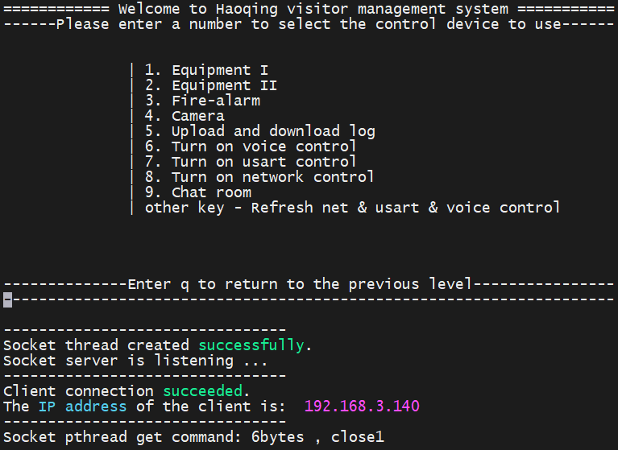

#### 日志传输

选择上传或下载日志功能后，进入功能选择界面

- 输入1 - 选择下载日志功能（系统作为服务器，通过其他客户端连接后下载服务端日志）
- 输入2 - 选择上传日志功能（系统作为客户端，通过连接其他服务器后上传本地日志）
- 输入3 - 关闭功能（返回到上一级）
- 输入q - 返回上一级

>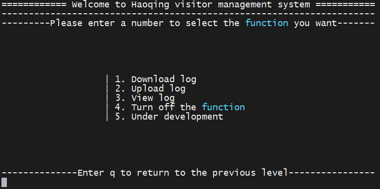

选择下载日志功能，打印提示界面

- 输入任意键继续

> 

选择下载日志功能（系统作为服务器，通过其他客户端连接后下载服务端日志）

- 通过运行其他客户端进行连接 `./client 192.168.3.143 8000`
  - 客户端输入`ls指令`，能获取服务端上文件列表。
  - 客户端输入`cd指令+路径`，可以切换服务端的目录。
  - 客户端输入`pwd`，可以获取服务端当前路径。
  - 客户端输入`lls指令` 能够查看自己的文件列表。
  - 客户端输入`lcd指令+路径` 能够切换自己的目录。
  - 客户端输入`get指令+文件名`，能将服务端上面的某个文件下载到客户端。
  - 客户端输入`put指令+文件名`，能将客户端上面的某个文件上传到服务端。
- 输入 `ctrl + c` 返回系统

> 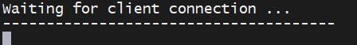

运行结束后，打印提示界面

- 按任意键返回

> 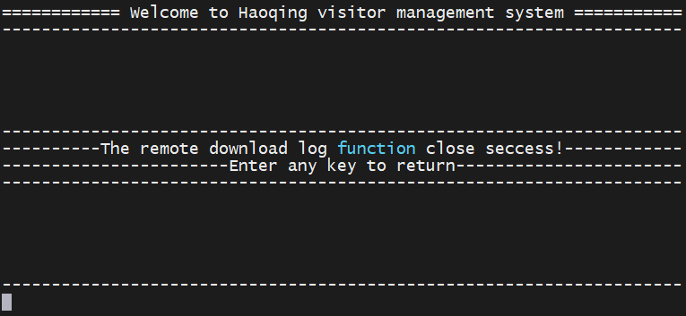

---

选择上传日志功能，打印提示界面

- 输入任意键继续

>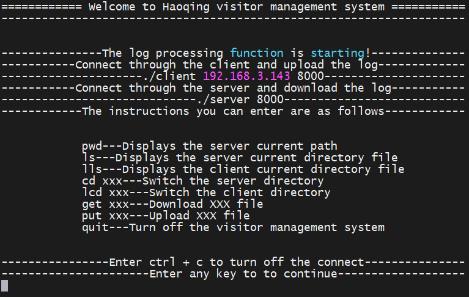

选择上传日志功能（系统作为客户端，通过连接其他服务器后上传本地日志）

- 通过连接其他运行中的服务器 `.server 8000`  （其他服务器的开启要先于此系统）
  - 客户端输入`ls指令`，能获取服务端上文件列表。
  - 客户端输入`cd指令+路径`，可以切换服务端的目录。
  - 客户端输入`pwd`，可以获取服务端当前路径。
  - 客户端输入`lls指令` 能够查看自己的文件列表。
  - 客户端输入`lcd指令+路径` 能够切换自己的目录。
  - 客户端输入`get指令+文件名`，能将服务端上面的某个文件下载到客户端。
  - 客户端输入`put指令+文件名`，能将客户端上面的某个文件上传到服务端。
- 输入 `ctrl + c` 返回系统

> 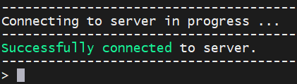

运行结束后，打印提示界面

- 输入任意键返回

> 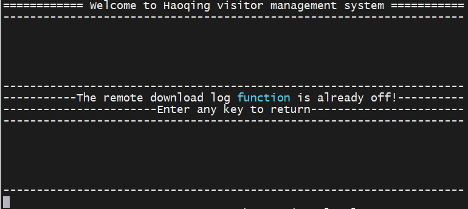

---

客户端运行界面

> 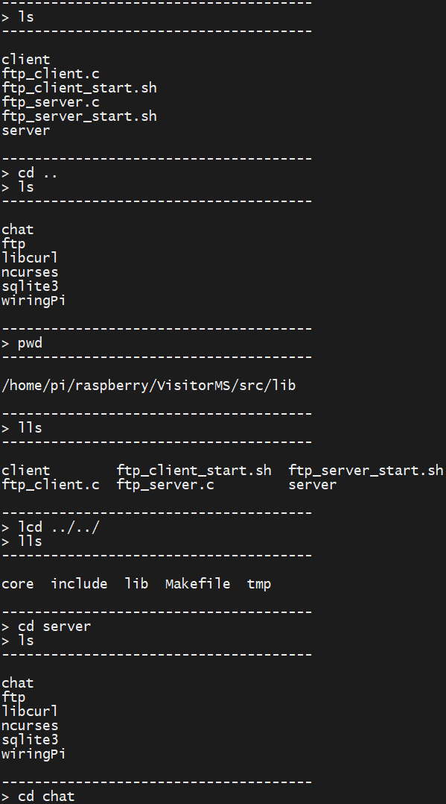
>
> 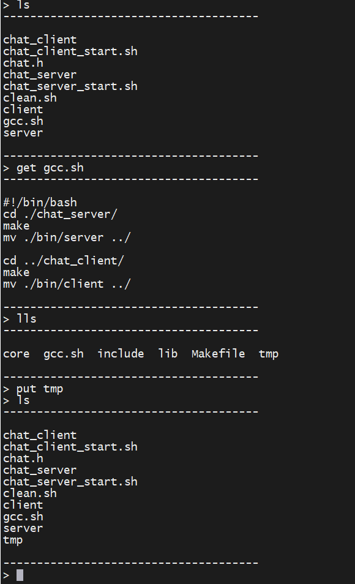

服务端运行界面

>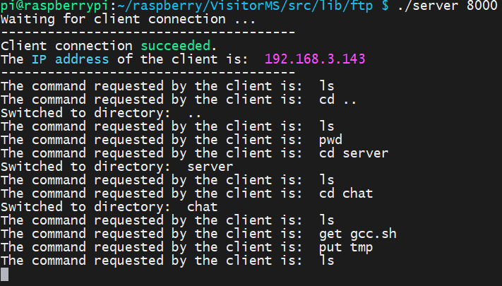

#### 聊天室

选择聊天室功能后，打印界面如下，此时系统后台新建线程已经在运行聊天室服务器程序，并且成功初始化数据库

- 输入任意键进入聊天室

>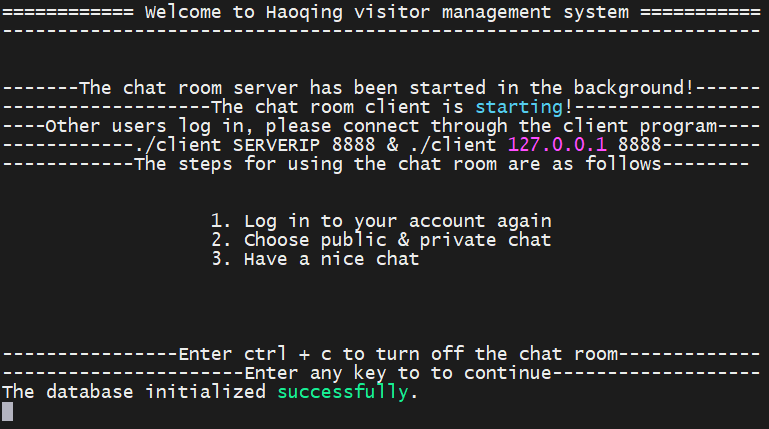

进入聊天室后，打印界面如下，注意，目前系统的数据库和聊天室数据库并不互通，这里需要重新注册一个账号

- 输入1 - 选择注册一个用户
- 输入2 - 选择进行登录账号
- 输入ctrl + c 退出聊天室
- 输入0 - 退出聊天室

> 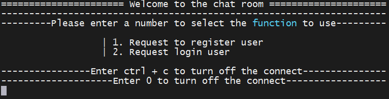

选择注册账号，注册成功，界面如下

- 输入注册的账号名称，然后回车
- 输入注册的账号密码，然后回车
- 输入回车，重新选择功能
- 输入ctrl + c 退出聊天室
- 输入0 - 退出聊天室

> 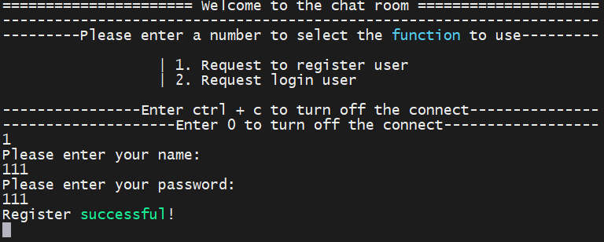

选择登录账号，登录成功，界面如下

- 输入账号名称，然后回车
- 输入账号密码，然后回车
- 输入回车，重新选择功能
- 输入ctrl + c 退出聊天室
- 输入0 - 退出聊天室

> 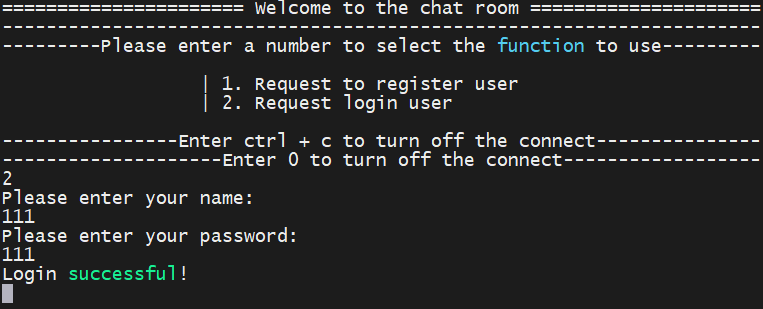

登录成功后，打印界面如下

- 输入3 - 选择公聊（所有在线用户可以接收到你的消息）
- 输入4 - 选择私聊（选择指定用户可以接收到你的消息）
- 输入5 - 查看当前在线的用户
- 输入ctrl + c 退出聊天室
- 输入0 - 退出聊天室

> 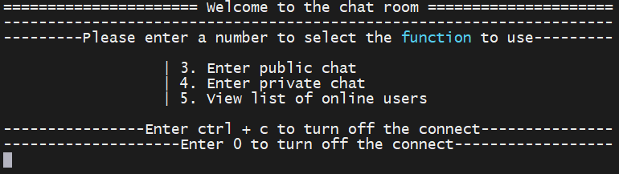

选择公聊，成功发送消息后，界面如下

- 输入想要发送的消息，回车发送
- 消息发送成功后，回车返回
- 输入ctrl + c 退出聊天室
- 输入0 - 退出聊天室

> 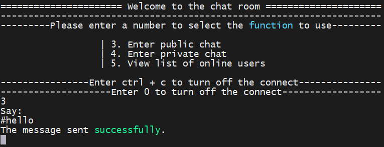

选择私聊，成功发送消息后，界面如下

- 选择想要给哪个用户发送消息
- 输入想要发送的消息，回车发送
- 消息发送成功后，回车返回
- 输入ctrl + c 退出聊天室
- 输入0 - 退出聊天室

>

选择查看当前在线的用户，界面如下

- 输入ctrl + c 退出聊天室
- 输入0 - 退出聊天室

> 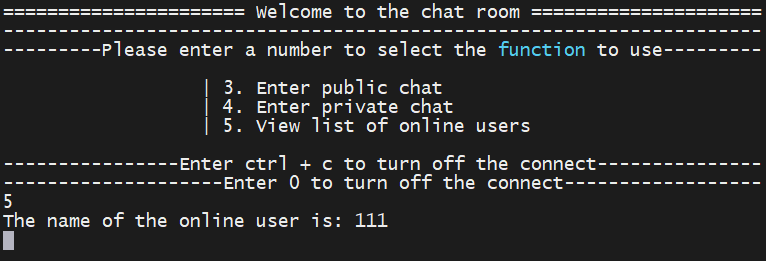

退出聊天室后，打印界面如下

- 输入任意键返回

> 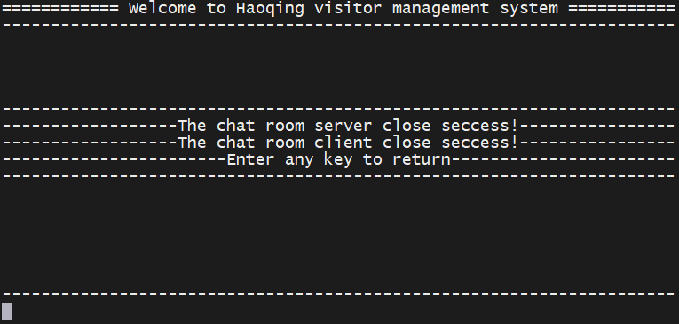

#### 贪吃蛇游戏

选择贪吃蛇游戏后，打印界面如下，然后选择贪吃蛇游戏难度

- 输入1 - 选择傻瓜模式 - 蛇的移动速度非常慢，允许触碰蛇身，允许触碰边界，允许跨越边界，允许掉头
- 输入2 - 选择简单模式 - 蛇的移动速度较慢，允许触碰蛇身，允许触碰边界，允许跨越边界，允许掉头
- 输入3 - 选择困难模式 - 蛇的移动速度较快，不允许触碰蛇身，不允许触碰边界，不允许掉头
- 输入4 - 选择地狱模式 - 蛇的移动速度非常快，不允许触碰蛇身，不允许触碰边界，不允许掉头
- 输入5 - 选择开挂模式 - 自动控制蛇吃食物，且允许触碰蛇身，允许掉头
- 输入q - 返回上一级

> 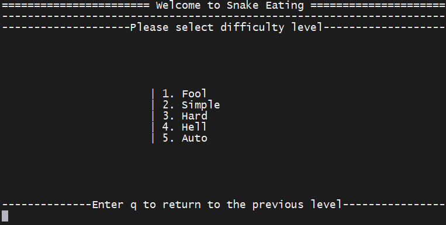

进入贪吃蛇游戏后，界面如下（如果遇到界面乱码情况，调整一下终端的大小即可恢复正常）

- 输入上下左右 - 控制蛇头移动方向
- 输入q - 退出游戏

> 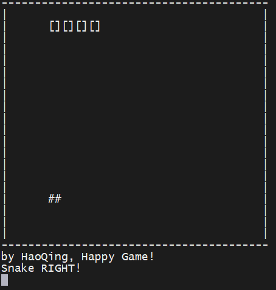

游戏闯关成功，提示界面如下

- 输入q - 退出游戏

>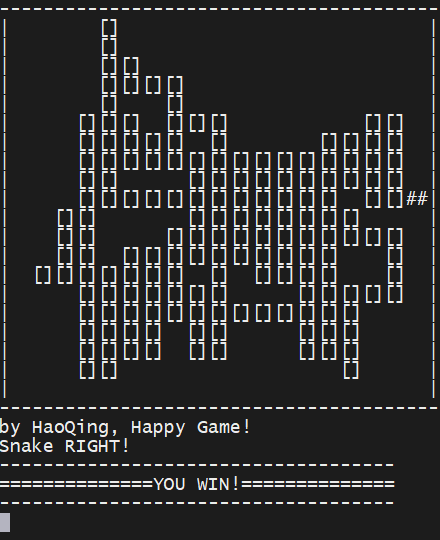


## 项目报告

统计数据 - 来自Source Insight软件

```
Project Report for G:\知识汇总\0 - 个人学习\1 - 工程实践\校招树莓派项目开发\VisitorMS_Project\VisitorMS.si4project\VisitorMS

Project Data Directory: G:\知识汇总\0 - 个人学习\1 - 工程实践\校招树莓派项目开发\VisitorMS_Project\VisitorMS.si4project
Project Source Directory: G:\知识汇总\0 - 个人学习\1 - 工程实践\校招树莓派项目开发\VisitorMS_Project
Project contains 454 symbol records, 1444 index entries, and 42 files.


File                                                                                    大小      Obj  Lines      Date
------------------------------------------------------------------------------
appRecognition.c (VisitorMS\src\core\identityRecognition)                                 2940        -    101     2022/5/31
    AppRecognitionMain                                                                  (Function at line 13-83)
    Msg                                                                                 (Structure at line 8-9)
        data                                                                                (Data Member at line 9-9)
camera.c (VisitorMS\src\core\otherFunctions)                                              5014        -     96     2022/5/31
    closeCamera                                                                         (Function at line 67-91)
    openCamera                                                                          (Function at line 5-63)
camera.h (VisitorMS\src\include)                                                           163        -     11     2022/5/22
    closeCamera                                                                         (Function Prototype at line 10-10)
    openCamera                                                                          (Function Prototype at line 7-7)
chat.h (VisitorMS\src\lib\chat)                                                           1356        -     67     2022/5/29
    BROADCAST                                                                           (Constant at line 50-50)
    enc_data                                                                            (Structure at line 43-46)
        data                                                                                (Data Member at line 46-46)
        sync                                                                                (Data Member at line 45-45)
    KEYGEN                                                                              (Constant at line 56-56)
    LOGIN                                                                               (Constant at line 53-53)
    LOGOUT                                                                              (Constant at line 55-55)
    MAX_USER_NAME_LEN                                                                   (Constant at line 21-21)
    MAX_USER_NUM                                                                        (Constant at line 22-22)
    NAME_EXIST                                                                          (Constant at line 62-62)
    NAME_PWD_NMATCH                                                                     (Constant at line 63-63)
    ONLINEUSER                                                                          (Constant at line 54-54)
    ONLINEUSER_OK                                                                       (Constant at line 60-60)
    ONLINEUSER_OVER                                                                     (Constant at line 61-61)
    ONLINE_USER                                                                         (Structure at line 26-31)
        fd                                                                                  (Data Member at line 28-28)
        flage                                                                               (Data Member at line 29-29)
        name                                                                                (Data Member at line 30-30)
        passwd                                                                              (Data Member at line 31-31)
    OP_OK                                                                               (Constant at line 59-59)
    PRIVATE                                                                             (Constant at line 51-51)
    protocol                                                                            (Structure at line 35-40)
        cmd                                                                                 (Data Member at line 37-37)
        data                                                                                (Data Member at line 40-40)
        name                                                                                (Data Member at line 39-39)
        state                                                                               (Data Member at line 38-38)
    REGISTE                                                                             (Constant at line 52-52)
    SERVER_PORT                                                                         (Constant at line 23-23)
    _TCP_CHAT                                                                           (Constant at line 5-5)
    USER_LOGED                                                                          (Constant at line 64-64)
    USER_NOT_REGIST                                                                     (Constant at line 65-65)
client.c (VisitorMS\src\lib\chat\chat_client\src)                                        10599        -    491     2022/5/30
    addrlen                                                                             (Variable at line 16-16)
    born_sync                                                                           (Function Prototype at line 25-25)
    broadcast_client                                                                    (Function at line 186-207)
    enc_keygen_rcv                                                                      (Function at line 64-96)
    enc_rcv                                                                             (Function at line 100-137)
    enc_send                                                                            (Function at line 28-59)
    func                                                                                (Function at line 141-182)
    glob_keygen                                                                         (Variable at line 18-18)
    list_online_user                                                                    (Function at line 241-261)
    login                                                                               (Function at line 305-332)
    login_f                                                                             (Variable at line 21-21)
    logout                                                                              (Function at line 336-339)
    main                                                                                (Function at line 368-490)
    pid                                                                                 (Variable at line 19-19)
    private_client                                                                      (Function at line 211-237)
    rcv_keygen                                                                          (Function at line 344-364)
    registe                                                                             (Function at line 265-301)
    reset_keygen                                                                        (Function Prototype at line 24-24)
    server_addr                                                                         (Variable at line 17-17)
    sockfd                                                                              (Variable at line 15-15)
controlDevice.h (VisitorMS\src\include)                                                    853        -     51     2022/5/21
    addequipment1ToDevices                                                              (Function Prototype at line 25-25)
    addequipment2ToDevices                                                              (Function Prototype at line 26-26)
    addfireAlarmToDevices                                                               (Function Prototype at line 27-27)
    controlDevice                                                                       (Structure at line 9-21)
        changeStatus                                                                        (Data Member at line 19-19)
        close                                                                               (Data Member at line 15-15)
        deviceInit                                                                          (Data Member at line 16-16)
        deviceName                                                                          (Data Member at line 10-10)
        deviceStatus                                                                        (Data Member at line 11-11)
        next                                                                                (Data Member at line 21-21)
        open                                                                                (Data Member at line 14-14)
        pinNum                                                                              (Data Member at line 12-12)
        readStatus                                                                          (Data Member at line 18-18)
data.c (VisitorMS\src\core\identityRecognition)                                           3878        -    167     2022/5/31
    database_close                                                                      (Function at line 163-165)
    database_init                                                                       (Function at line 131-159)
    DATABASE_NAME                                                                       (Constant at line 16-16)
    db                                                                                  (Variable at line 20-20)
    db_add_user                                                                         (Function at line 24-52)
    db_mutex                                                                            (Variable at line 19-19)
    db_user_if_reg                                                                      (Function at line 58-86)
    db_user_pwd_corrct                                                                  (Function at line 90-127)
    TABLE_USER                                                                          (Constant at line 17-17)
data.c (VisitorMS\src\lib\chat\chat_server\src)                                          10551        -    508     2022/5/30
    database_close                                                                      (Function at line 471-474)
    database_init                                                                       (Function at line 439-467)
    DATABASE_NAME                                                                       (Constant at line 17-17)
    db                                                                                  (Variable at line 15-15)
    db_add_user                                                                         (Function at line 26-64)
    db_broadcast                                                                        (Function at line 292-333)
    db_list_online_user                                                                 (Function at line 391-435)
    db_mutex                                                                            (Variable at line 19-19)
    db_private                                                                          (Function at line 337-387)
    db_update_keygen                                                                    (Function at line 195-231)
    db_user_if_online                                                                   (Function at line 72-113)
    db_user_if_reg                                                                      (Function at line 120-152)
    db_user_on_off                                                                      (Function at line 240-286)
    db_user_pwd_corrct                                                                  (Function at line 158-191)
    enc_send_srv                                                                        (Function Prototype at line 22-22)
    TABLE_USER                                                                          (Constant at line 18-18)
data.h (VisitorMS\src\include)                                                             767        -     52     2022/5/30
    database_close                                                                      (Function Prototype at line 29-29)
    database_init                                                                       (Function Prototype at line 26-26)
    db_add_user                                                                         (Function Prototype at line 15-15)
    db_user_if_reg                                                                      (Function Prototype at line 20-20)
    db_user_pwd_corrct                                                                  (Function Prototype at line 23-23)
    ONLINE_USER                                                                         (Structure at line 5-10)
        fd                                                                                  (Data Member at line 7-7)
        flage                                                                               (Data Member at line 8-8)
        name                                                                                (Data Member at line 9-9)
        passwd                                                                              (Data Member at line 10-10)
data.h (VisitorMS\src\lib\chat\chat_server\include)                                        455        -     19     2022/5/30
    database_close                                                                      (Function Prototype at line 15-15)
    database_init                                                                       (Function Prototype at line 14-14)
    db_add_user                                                                         (Function Prototype at line 10-10)
    db_broadcast                                                                        (Function Prototype at line 16-16)
    _DB_DATA                                                                            (Constant at line 5-5)
    db_user_if_online                                                                   (Function Prototype at line 17-17)
    db_user_if_reg                                                                      (Function Prototype at line 11-11)
    db_user_on_off                                                                      (Function Prototype at line 13-13)
    db_user_pwd_corrct                                                                  (Function Prototype at line 12-12)
    OFFLINE                                                                             (Constant at line 7-7)
    ONLINE                                                                              (Constant at line 8-8)
equipment1.c (VisitorMS\src\core\controlDevice)                                           4317        -    123     2022/5/28
    addequipment1ToDevices                                                              (Function at line 95-102)
    equipment1                                                                          (Variable at line 85-91)
    equipment1Close                                                                     (Function at line 28-48)
    equipment1Init                                                                      (Function at line 51-54)
    equipment1Open                                                                      (Function at line 4-25)
    equipment1Status                                                                    (Function at line 57-81)
equipment2.c (VisitorMS\src\core\controlDevice)                                           4149        -    122     2022/5/29
    addequipment2ToDevices                                                              (Function at line 93-100)
    equipment2                                                                          (Variable at line 83-89)
    equipment2Close                                                                     (Function at line 26-46)
    equipment2Init                                                                      (Function at line 49-52)
    equipment2Open                                                                      (Function at line 4-23)
    equipment2Status                                                                    (Function at line 55-79)
faceRecognition.c (VisitorMS\src\core\identityRecognition)                                3542        -    121     2022/5/30
    bool                                                                                (Type Definition at line 7-7)
    buf                                                                                 (Variable at line 8-8)
    faceRecognitionMain                                                                 (Function at line 102-104)
    getPicBase64FromFile                                                                (Function at line 15-32)
    postUrl                                                                             (Function at line 35-99)
    readData                                                                            (Function at line 10-12)
fireAlarm.c (VisitorMS\src\core\controlDevice)                                            4162        -    121     2022/5/31
    addfireAlarmToDevices                                                               (Function at line 93-100)
    fireAlarm                                                                           (Variable at line 83-89)
    fireAlarmClose                                                                      (Function at line 27-46)
    fireAlarmInit                                                                       (Function at line 77-80)
    fireAlarmOpen                                                                       (Function at line 4-24)
    fireStatusRead                                                                      (Function at line 49-74)
ftp.c (VisitorMS\src\core\otherFunctions)                                                 5496        -    106     2022/5/31
    closeFtp                                                                            (Function at line 77-101)
    openFtp                                                                             (Function at line 5-73)
ftp.h (VisitorMS\src\include)                                                              156        -     11     2022/5/23
    closeFtp                                                                            (Function Prototype at line 10-10)
    openFtp                                                                             (Function Prototype at line 7-7)
ftp_client.c (VisitorMS\src\lib\ftp)                                                      7646        -    261     2022/5/28
    CD                                                                                  (Constant at line 19-19)
    cmd_handler                                                                         (Function at line 58-134)
    DOFILE                                                                              (Constant at line 22-22)
    GET                                                                                 (Constant at line 14-14)
    get_cmd_type                                                                        (Function at line 32-44)
    get_dir                                                                             (Function at line 48-54)
    handler_server_message                                                              (Function at line 138-171)
    IFGO                                                                                (Constant at line 16-16)
    LCD                                                                                 (Constant at line 17-17)
    LLS                                                                                 (Constant at line 18-18)
    LS                                                                                  (Constant at line 13-13)
    main                                                                                (Function at line 175-260)
    Msg                                                                                 (Structure at line 25-28)
        data                                                                                (Data Member at line 27-27)
        secondBuf                                                                           (Data Member at line 28-28)
        type                                                                                (Data Member at line 26-26)
    PUT                                                                                 (Constant at line 20-20)
    PWD                                                                                 (Constant at line 15-15)
    QUIT                                                                                (Constant at line 21-21)
ftp_server.c (VisitorMS\src\lib\ftp)                                                      7546        -    217     2022/5/31
    CD                                                                                  (Constant at line 20-20)
    DOFILE                                                                              (Constant at line 23-23)
    GET                                                                                 (Constant at line 15-15)
    get_cmd_type                                                                        (Function at line 33-42)
    get_dir                                                                             (Function at line 46-52)
    IFGO                                                                                (Constant at line 17-17)
    LCD                                                                                 (Constant at line 18-18)
    LLS                                                                                 (Constant at line 19-19)
    LS                                                                                  (Constant at line 14-14)
    main                                                                                (Function at line 134-216)
    Msg                                                                                 (Structure at line 26-29)
        data                                                                                (Data Member at line 28-28)
        secondBuf                                                                           (Data Member at line 29-29)
        type                                                                                (Data Member at line 27-27)
    msg_handler                                                                         (Function at line 56-130)
    PUT                                                                                 (Constant at line 21-21)
    PWD                                                                                 (Constant at line 16-16)
    QUIT                                                                                (Constant at line 22-22)
identityRecognition.h (VisitorMS\src\include)                                             2136        -     59     2022/5/31
    ADMINISTRATORS                                                                      (Constant at line 21-21)
    AppRecognitionMain                                                                  (Function Prototype at line 54-54)
    faceRecognitionMain                                                                 (Function Prototype at line 39-39)
    OTHERUSERS                                                                          (Constant at line 22-22)
    passwordRecognitionMain                                                             (Function Prototype at line 46-46)
    registeredUserMain                                                                  (Function Prototype at line 32-32)
    USER1                                                                               (Constant at line 19-19)
    USER2                                                                               (Constant at line 20-20)
    VISITOR                                                                             (Constant at line 18-18)
inputCommand.h (VisitorMS\src\include)                                                     988        -     51     2022/5/25
    addsocketControlToCommand                                                           (Function Prototype at line 36-36)
    addusartControlToCommand                                                            (Function Prototype at line 37-37)
    addvoiceControlToCommand                                                            (Function Prototype at line 35-35)
    inputCommand                                                                        (Structure at line 19-31)
        commandID                                                                           (Data Member at line 22-22)
        commandName                                                                         (Data Member at line 20-20)
        deviceName                                                                          (Data Member at line 21-21)
        fd                                                                                  (Data Member at line 29-29)
        getCommand                                                                          (Data Member at line 24-24)
        initCommand                                                                         (Data Member at line 23-23)
        IP                                                                                  (Data Member at line 27-27)
        log                                                                                 (Data Member at line 25-25)
        next                                                                                (Data Member at line 31-31)
        port                                                                                (Data Member at line 26-26)
        sfd                                                                                 (Data Member at line 28-28)
key.c (VisitorMS\src\lib\chat\chat_client\src)                                            1992        -     97     2022/5/30
    born_keygen                                                                         (Function at line 30-36)
    born_seed                                                                           (Function at line 63-65)
    born_sync                                                                           (Function at line 40-46)
    default_keygen                                                                      (Variable at line 14-14)
    keygen                                                                              (Variable at line 12-12)
    offset                                                                              (Variable at line 13-13)
    print_array                                                                         (Function at line 17-26)
    request_key                                                                         (Function at line 72-96)
    reset_keygen                                                                        (Function at line 50-52)
    set_keygen                                                                          (Function at line 56-59)
key.c (VisitorMS\src\lib\chat\chat_server\src)                                            1992        -     97     2022/5/30
    born_keygen                                                                         (Function at line 30-36)
    born_seed                                                                           (Function at line 63-65)
    born_sync                                                                           (Function at line 40-46)
    default_keygen                                                                      (Variable at line 14-14)
    keygen                                                                              (Variable at line 12-12)
    offset                                                                              (Variable at line 13-13)
    print_array                                                                         (Function at line 17-26)
    request_key                                                                         (Function at line 72-96)
    reset_keygen                                                                        (Function at line 50-52)
    set_keygen                                                                          (Function at line 56-59)
key.h (VisitorMS\src\lib\chat\chat_client\include)                                         242        -     12     2022/5/29
    born_seed                                                                           (Function Prototype at line 9-9)
    _KEY_STATION                                                                        (Constant at line 5-5)
    MAX_KEY_REQUEST                                                                     (Constant at line 6-6)
    request_key                                                                         (Function Prototype at line 10-10)
    set_keygen                                                                          (Function Prototype at line 8-8)
key.h (VisitorMS\src\lib\chat\chat_server\include)                                         267        -     13     2022/5/29
    born_seed                                                                           (Function Prototype at line 9-9)
    born_sync                                                                           (Function Prototype at line 11-11)
    _KEY_STATION                                                                        (Constant at line 5-5)
    MAX_KEY_REQUEST                                                                     (Constant at line 6-6)
    request_key                                                                         (Function Prototype at line 10-10)
    set_keygen                                                                          (Function Prototype at line 8-8)
mainPro.c (VisitorMS\src\core\system)                                                     7843        -    386     2022/5/29
    administratorsProcess                                                               (Function at line 257-326)
    identityRecognitionProcess                                                          (Function at line 5-48)
    main                                                                                (Function at line 330-385)
    otherUsersProcess                                                                   (Function at line 86-119)
    user1Process                                                                        (Function at line 123-185)
    user2Process                                                                        (Function at line 189-252)
    visitorProcess                                                                      (Function at line 52-82)
mainPro.h (VisitorMS\src\include)                                                        22638        -    840     2022/5/31
    AppRecognitionProcess                                                               (Function at line 805-822)
    cameraProcess                                                                       (Function at line 567-595)
    chatRoomProcess                                                                     (Function at line 637-667)
    chatThread                                                                          (Variable at line 24-24)
    chat_thread                                                                         (Function at line 155-157)
    CLOSE1                                                                              (Constant at line 13-13)
    CLOSE2                                                                              (Constant at line 14-14)
    c_fd                                                                                (Variable at line 20-20)
    doInputCommand                                                                      (Function at line 93-142)
    downloadLogProcess                                                                  (Function at line 599-633)
    equipment1Process                                                                   (Function at line 443-480)
    equipment2Process                                                                   (Function at line 485-522)
    faceRecognitionProcess                                                              (Function at line 699-713)
    findCommandByName                                                                   (Function at line 67-79)
    findDeviceByName                                                                    (Function at line 42-54)
    fireAlarmProcess                                                                    (Function at line 526-563)
    mainFunctionInit                                                                    (Function at line 354-364)
    name                                                                                (Variable at line 23-23)
    OPEN1                                                                               (Constant at line 11-11)
    OPEN2                                                                               (Constant at line 12-12)
    passwordRecognitionProcess                                                          (Function at line 783-800)
    pcommandHead                                                                        (Variable at line 18-18)
    pdeviceHead                                                                         (Variable at line 17-17)
    registeredUserProcess                                                               (Function at line 671-689)
    socketControlDeviceProcess                                                          (Function at line 420-439)
    socketHead                                                                          (Variable at line 19-19)
    socketReadThread                                                                    (Variable at line 28-28)
    socketThread                                                                        (Variable at line 27-27)
    socket_read_thread                                                                  (Function at line 266-294)
    socket_thread                                                                       (Function at line 307-341)
    tmp                                                                                 (Variable at line 30-30)
    usartControlDeviceProcess                                                           (Function at line 374-393)
    usartThread                                                                         (Variable at line 26-26)
    usart_thread                                                                        (Function at line 170-205)
    voiceControlDeviceProcess                                                           (Function at line 397-416)
    voiceRecognitionProcess                                                             (Function at line 717-779)
    voiceThread                                                                         (Variable at line 25-25)
    voice_thread                                                                        (Function at line 218-253)
Makefile (VisitorMS\src)                                                                  3905        -    123     2022/5/30
    all                                                                                 (Label at line 53-123)
    all                                                                                 (Label at line 53-99)
    CC                                                                                  (Variable at line 6-8)
    CFLAGS                                                                              (Variable at line 9-14)
    clean                                                                               (Label at line 100-123)
    INCLUDE                                                                             (Variable at line 42-44)
    OBJ1                                                                                (Variable at line 45-45)
    OBJ2                                                                                (Variable at line 46-46)
    OBJ3                                                                                (Variable at line 47-47)
    OBJ4                                                                                (Variable at line 48-48)
    OBJ5                                                                                (Variable at line 49-49)
    OBJH                                                                                (Variable at line 50-123)
    SRC1                                                                                (Variable at line 30-30)
    src1                                                                                (Variable at line 15-15)
    SRC2                                                                                (Variable at line 31-31)
    src2                                                                                (Variable at line 16-16)
    SRC3                                                                                (Variable at line 32-32)
    src3                                                                                (Variable at line 17-17)
    SRC4                                                                                (Variable at line 33-33)
    src4                                                                                (Variable at line 18-18)
    src5                                                                                (Variable at line 19-19)
    SRC5                                                                                (Variable at line 34-34)
    SRCH                                                                                (Variable at line 35-41)
    srch                                                                                (Variable at line 20-29)
    TARGETS                                                                             (Variable at line 12-123)
    TARGETS                                                                             (Label at line 12-52)
Makefile (VisitorMS\src\lib\chat\chat_client)                                              375        -     21     2022/5/29
    all                                                                                 (Label at line 10-21)
    all                                                                                 (Label at line 10-10)
    BIN                                                                                 (Variable at line 5-5)
    BIN_DIR                                                                             (Variable at line 7-21)
    CC                                                                                  (Variable at line 1-1)
    CHECK_DIR                                                                           (Label at line 11-14)
    clean                                                                               (Label at line 17-21)
    ECHO                                                                                (Label at line 15-16)
    OBJS                                                                                (Variable at line 4-4)
    OBJS_DIR                                                                            (Variable at line 6-6)
    SUBDIRS                                                                             (Variable at line 2-3)
Makefile (VisitorMS\src\lib\chat\chat_client\obj)                                          111        -      5     2022/5/29
Makefile (VisitorMS\src\lib\chat\chat_client\src)                                          126        -      4     2022/5/29
    all                                                                                 (Label at line 1-4)
Makefile (VisitorMS\src\lib\chat\chat_server)                                              382        -     21     2022/5/29
    all                                                                                 (Label at line 10-21)
    all                                                                                 (Label at line 10-10)
    BIN                                                                                 (Variable at line 5-5)
    BIN_DIR                                                                             (Variable at line 7-21)
    CC                                                                                  (Variable at line 1-1)
    CHECK_DIR                                                                           (Label at line 11-14)
    clean                                                                               (Label at line 17-21)
    ECHO                                                                                (Label at line 15-16)
    OBJS                                                                                (Variable at line 4-4)
    OBJS_DIR                                                                            (Variable at line 6-6)
    SUBDIRS                                                                             (Variable at line 2-3)
Makefile (VisitorMS\src\lib\chat\chat_server\obj)                                          108        -      4     2022/5/29
Makefile (VisitorMS\src\lib\chat\chat_server\src)                                          181        -      5     2022/5/29
    all                                                                                 (Label at line 1-5)
menu.c (VisitorMS\src\core\system)                                                       32597        -    659     2022/5/31
    initNcurse                                                                          (Function at line 5-9)
    picOfAppRecognition                                                                 (Function at line 103-115)
    picOfAuthenticationInterface                                                        (Function at line 425-443)
    picOfAuthenticationInterfacePro                                                     (Function at line 447-466)
    picOfCameraFunctionSelect                                                           (Function at line 162-180)
    picOfChatRoomEnd                                                                    (Function at line 230-247)
    picOfChatRoomFunction                                                               (Function at line 206-226)
    picOfEquipmentFunctionSelect                                                        (Function at line 140-158)
    picOfFaceRecognition                                                                (Function at line 57-76)
    picOfForgetPassword                                                                 (Function at line 34-53)
    picOfFtpFunctionSelect                                                              (Function at line 184-202)
    picOfFunctionSelect_administrators                                                  (Function at line 562-582)
    picOfFunctionSelect_otherusers                                                      (Function at line 492-510)
    picOfFunctionSelect_user1                                                           (Function at line 514-534)
    picOfFunctionSelect_user2                                                           (Function at line 538-558)
    picOfFunctionSelect_visitor                                                         (Function at line 470-488)
    picOfIdentityError                                                                  (Function at line 335-353)
    picOfInputError                                                                     (Function at line 357-376)
    picOfPasswordRecognition                                                            (Function at line 119-130)
    picOfRegisteredUser                                                                 (Function at line 19-30)
    picOfSelectIdentity                                                                 (Function at line 380-398)
    picOfSelectIdentityPro                                                              (Function at line 402-421)
    picOfSnakeGame                                                                      (Function at line 586-604)
    picOfSocketControl                                                                  (Function at line 257-277)
    picOfUsartControl                                                                   (Function at line 305-325)
    picOfVoiceControl                                                                   (Function at line 281-301)
    picOfVoiceRecognition                                                               (Function at line 80-99)
    picRefresh                                                                          (Function at line 608-643)
menu.h (VisitorMS\src\include)                                                            3435        -    117     2022/5/30
    initNcurse                                                                          (Function Prototype at line 9-9)
    picOfAppRecognition                                                                 (Function Prototype at line 30-30)
    picOfAuthenticationInterface                                                        (Function Prototype at line 105-105)
    picOfAuthenticationInterfacePro                                                     (Function Prototype at line 108-108)
    picOfCameraFunctionSelect                                                           (Function Prototype at line 45-45)
    picOfChatRoomEnd                                                                    (Function Prototype at line 54-54)
    picOfChatRoomFunction                                                               (Function Prototype at line 51-51)
    picOfEquipmentFunctionSelect                                                        (Function Prototype at line 42-42)
    picOfFaceRecognition                                                                (Function Prototype at line 24-24)
    picOfForgetPassword                                                                 (Function Prototype at line 21-21)
    picOfFtpFunctionSelect                                                              (Function Prototype at line 48-48)
    picOfFunctionSelect_administrators                                                  (Function Prototype at line 102-102)
    picOfFunctionSelect_otherusers                                                      (Function Prototype at line 93-93)
    picOfFunctionSelect_user1                                                           (Function Prototype at line 96-96)
    picOfFunctionSelect_user2                                                           (Function Prototype at line 99-99)
    picOfFunctionSelect_visitor                                                         (Function Prototype at line 90-90)
    picOfIdentityError                                                                  (Function Prototype at line 78-78)
    picOfInputError                                                                     (Function Prototype at line 81-81)
    picOfPasswordRecognition                                                            (Function Prototype at line 33-33)
    picOfRegisteredUser                                                                 (Function Prototype at line 18-18)
    picOfSelectIdentity                                                                 (Function Prototype at line 84-84)
    picOfSelectIdentityPro                                                              (Function Prototype at line 87-87)
    picOfSnakeGame                                                                      (Function Prototype at line 111-111)
    picOfSocketControl                                                                  (Function Prototype at line 66-66)
    picOfUsartControl                                                                   (Function Prototype at line 69-69)
    picOfVoiceControl                                                                   (Function Prototype at line 63-63)
    picOfVoiceRecognition                                                               (Function Prototype at line 27-27)
    picRefresh                                                                          (Function Prototype at line 114-114)
passwordIdentification.c (VisitorMS\src\core\identityRecognition)                         2526        -    134     2022/5/31
    passwordRecognitionMain                                                             (Function at line 9-63)
    registeredUserMain                                                                  (Function at line 67-115)
server.c (VisitorMS\src\lib\chat\chat_server\src)                                        10686        -    459     2022/5/30
    born_keygen                                                                         (Function Prototype at line 29-29)
    broadcast_server                                                                    (Function at line 124-131)
    database_close                                                                      (Function Prototype at line 25-25)
    database_init                                                                       (Function Prototype at line 24-24)
    db_add_user                                                                         (Function Prototype at line 20-20)
    db_list_online_user                                                                 (Function Prototype at line 30-30)
    db_mutex                                                                            (External Variable at line 33-33)
    db_private                                                                          (Function Prototype at line 26-26)
    db_update_keygen                                                                    (Function Prototype at line 27-27)
    db_user_if_reg                                                                      (Function Prototype at line 21-21)
    db_user_on_off                                                                      (Function Prototype at line 23-23)
    db_user_pwd_corrct                                                                  (Function Prototype at line 22-22)
    __DEBUG                                                                             (Constant at line 16-16)
    enc_rcv_srv                                                                         (Function at line 81-120)
    enc_send_srv                                                                        (Function at line 37-77)
    func                                                                                (Function at line 320-385)
    keygen_send                                                                         (Function at line 274-316)
    login                                                                               (Function at line 189-268)
    main                                                                                (Function at line 389-458)
    __PRINTF                                                                            (Constant at line 17-17)
    private_server                                                                      (Function at line 135-151)
    regist                                                                              (Function at line 155-185)
    reset_keygen                                                                        (Function Prototype at line 28-28)
snake.c (VisitorMS\src\core\otherFunctions)                                               7209        -    366     2022/5/20
    addNode                                                                             (Function at line 49-75)
    changeDir                                                                           (Function at line 136-170)
    deleNode                                                                            (Function at line 40-45)
    gamePic                                                                             (Function at line 192-256)
    hasFood                                                                             (Function at line 14-20)
    hasSnakeNode                                                                        (Function at line 24-36)
    ifSnakeDie                                                                          (Function at line 104-118)
    initFood                                                                            (Function at line 5-10)
    initSnake                                                                           (Function at line 79-100)
    moveSnake                                                                           (Function at line 174-188)
    refreshJieMian                                                                      (Function at line 260-287)
    snakeGameStart                                                                      (Function at line 291-348)
    turn                                                                                (Function at line 122-132)
snake.h (VisitorMS\src\include)                                                            626        -     54     2022/5/20
    dir                                                                                 (Variable at line 25-25)
    DOWN                                                                                (Constant at line 8-8)
    food                                                                                (Variable at line 21-21)
    head                                                                                (Variable at line 22-22)
    key                                                                                 (Variable at line 24-24)
    LEFT                                                                                (Constant at line 9-9)
    nub                                                                                 (Variable at line 27-27)
    RIGHT                                                                               (Constant at line 10-10)
    set                                                                                 (Variable at line 26-26)
    Snake                                                                               (Structure at line 13-17)
        hang                                                                                (Data Member at line 15-15)
        lie                                                                                 (Data Member at line 16-16)
        next                                                                                (Data Member at line 17-17)
    snakeGameStart                                                                      (Function Prototype at line 30-30)
    tail                                                                                (Variable at line 23-23)
    UP                                                                                  (Constant at line 7-7)
socketControl.c (VisitorMS\src\core\inputCommand)                                         1500        -     61     2022/5/24
    addsocketControlToCommand                                                           (Function at line 51-58)
    socketControl                                                                       (Variable at line 38-46)
    socketGetCommand                                                                    (Function at line 32-35)
    socketInit                                                                          (Function at line 4-29)
usartControl.c (VisitorMS\src\core\inputCommand)                                           993        -     43     2022/5/25
    addusartControlToCommand                                                            (Function at line 32-39)
    usartControl                                                                        (Variable at line 20-27)
    usartGetCommand                                                                     (Function at line 12-17)
    usartInit                                                                           (Function at line 4-9)
voiceControl.c (VisitorMS\src\core\inputCommand)                                           991        -     42     2022/5/24
    addvoiceControlToCommand                                                            (Function at line 32-39)
    voiceControl                                                                        (Variable at line 20-27)
    voiceGetCommand                                                                     (Function at line 12-17)
    voiceInit                                                                           (Function at line 4-9)

Total Files:           42
Total Bytes:       177439
Total Lines:         6318
Total Symbols:        454
```


