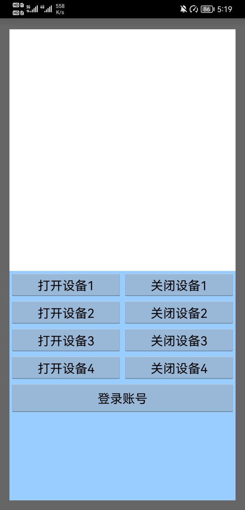
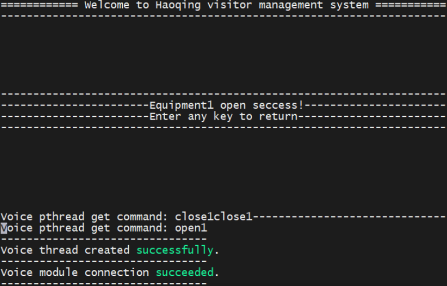
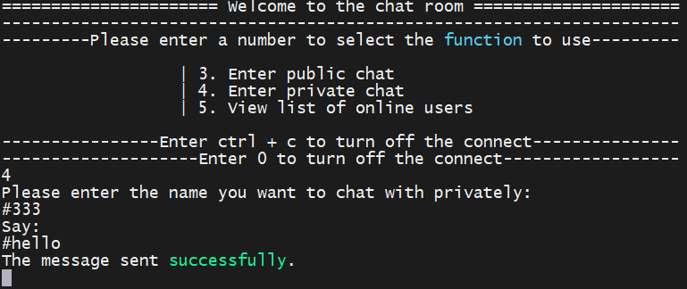

# VisitorMS - 访客管理控制系统

[TOC]

------


### 项目博文（个人博客）

**VisitorMS系列文章**

***【[VisitorMS - 访客管理控制系统](https://wuxiaolie.github.io/hq.github.io/2022/06/19/VisitorMS.html)】***

***【[VisitorMS - 访客管理控制系统 - 搭建流程](https://wuxiaolie.github.io/hq.github.io/2022/06/17/VisitorMS.html)】***

***【[VisitorMS - 访客管理控制系统 - 组织架构](https://wuxiaolie.github.io/hq.github.io/2022/06/18/VisitorMS.html)】***

***【[VisitorMS - 安卓APP开发](https://wuxiaolie.github.io/hq.github.io/2022/06/15/VisitorMS.html)】***

**树莓派开发系列文章**

***【[树莓派开发 - 基础使用教程](https://wuxiaolie.github.io/hq.github.io/2022/05/01/RaspberryPi.html)】***

***【[树莓派开发 - FTP云盘项目](https://wuxiaolie.github.io/hq.github.io/2022/05/02/RaspberryPi.html)】***

***【[树莓派开发 - 基于Socket的聊天室项目](https://wuxiaolie.github.io/hq.github.io/2022/05/03/RaspberryPi.html)】***

***【[树莓派开发 - libcurl库实现车牌识别](https://wuxiaolie.github.io/hq.github.io/2022/05/04/RaspberryPi.html)】***

***【[树莓派开发 - MJPG-Streamer视频方案](https://wuxiaolie.github.io/hq.github.io/2022/05/05/RaspberryPi.html)】***

***【[树莓派开发 - 交叉编译&内核编译](https://wuxiaolie.github.io/hq.github.io/2022/05/06/RaspberryPi.html)】***

***【[树莓派开发 - 驱动开发](https://wuxiaolie.github.io/hq.github.io/2022/05/07/RaspberryPi.html)】***

***【[树莓派开发 - wiringPi库开发](https://wuxiaolie.github.io/hq.github.io/2022/05/08/RaspberryPi.html)】***

***【[树莓派开发 - 应用开发](https://wuxiaolie.github.io/hq.github.io/2022/05/09/RaspberryPi.html)】***

***【[树莓派开发 - 贪吃蛇游戏开发](https://wuxiaolie.github.io/hq.github.io/2022/05/10/RaspberryPi.html)】***

***【[树莓派开发 - ncurses库开发](https://wuxiaolie.github.io/hq.github.io/2022/05/11/RaspberryPi.html)】***

## 项目介绍

项目为**基于树莓派Linux系统开发的访客管理控制系统**。

- 系统既有多种用户身份验证功能，又针对不同身份的用户提供不同的应用控制功能。

- 涉及多线程、多并发，socket编程，数据库，通讯加密，驱动开发等；
- 其中设备控制部分采用简单工厂模式开发，可扩展性强；
- 运用ncurses图形库、libcurl网络库、sqlite3数据库，以及wiringPi驱动库；
- 项目还包含MJPG-Streamer开源视频方案、安卓APP开发。

项目使用make工具进行编译，可自动配置软链接，具体见**【项目使用】& 【Makefile】**。

**身份验证方式**：

- 账号登录 - 查询sqlite3数据库；

- APP登录 - APP客户端发送验证密钥；

- 人脸识别 - 使用libcurl库调用翔云人脸识别API接口；

- 语音验证 - 使用语音识别模块LD3320进行口令识别。

**设备控制功能**：

- 基于简单工厂模式开发，指令工厂包括语音、串口、网络控制，多线程接收控制指令；

- 控制工厂由PIN口所接外设组成，执行用户控制指令，部分驱动为独立编写，其余基于wiringPi库实现。

**应用功能**：

- 摄像头监控 – 使用MJPG-Streamer视频方案；

- FTP日志传输 – 用户可远程连接系统，进行上传下载日志；

- 聊天室功能 – 系统在线用户可进行公聊/私聊，允许并发连接，通讯过程实现数据加密。

**项目 Git 仓库**

```
# Gitee
https://gitee.com/yang-haoqing/visitor-ms.git
git@gitee.com:yang-haoqing/visitor-ms.git
# GitHub
https://github.com/wuxiaolie/VisitorMS
git@github.com:wuxiaolie/VisitorMS.git
```

仓库数据统计（不定时更新）

> 

仓库网络图（不定时更新）

==具体见同一目录下【树莓派项目 - 开发流程 - HQ】文档 & 博文【[VisitorMS - 访客管理控制系统 - 搭建流程](https://wuxiaolie.github.io/hq.github.io/2022/06/17/VisitorMS.html)】==

> 


## 项目说明

项目从2022.5.8开始开发，创建项目工程文件，创建Git仓库。

到2022.5.31完成基本开发，所有预设功能全部实现。

- 整个系统可编(make)可清(make clean)，

- 可进(进入子菜单)可退(进入父菜单)，

- 具有一定的健壮性（不会轻易报错崩溃）。

项目为原创项目，整个项目由HQ一人开发，其中70%以上代码为个人编写。

**由于项目前后只用了20多天的时间开发，许多细节处理的不到位、不够人性化，如端口号没有使用宏定义而直接写的数字等等（具体见【[VisitorMS - 访客管理控制系统 - 待完善内容](https://wuxiaolie.github.io/hq.github.io/2022/06/17/VisitorMS.html)】），后期有时间会进行代码重构，还会推送更稳定的版本。**

此外，为了便于理解程序，进行学习，程序中进行了详细的注释。

### 项目统计报告

详细统计报告见最后一章【项目统计】，不含安卓App和语音模块代码。

```
Total Files:           43
Total Bytes:       276240
Total Lines:         7742
Total Symbols:        458
```

### 开发文档说明

**仓库文件说明**

> 

**项目详细开发流程见同一目录下【树莓派项目 - 开发流程 - HQ】文档 & 博文【[VisitorMS - 访客管理控制系统 - 搭建流程](https://wuxiaolie.github.io/hq.github.io/2022/06/17/VisitorMS.html)】**

> 

**项目详细组织架构见同一目录下【树莓派项目 - 组织架构 - HQ】文档 & 博文【[VisitorMS - 访客管理控制系统 - 组织架构](https://wuxiaolie.github.io/hq.github.io/2022/06/18/VisitorMS.html)】**

>

**此外同一目录下还提供系统结构图的源文件**

> 

**项目开发具体详细资料，及每一部分开发参考案例、实操步骤、库、手册等，请联系我 970407688@qq.com。**

> 
>
> 

### 项目所需硬件

树莓派 Raspberry Pi 3 Model B v1.2（配摄像头）

>

串口模块

> 

语音识别模块

> CPU: STC11L08XE
>
> 晶振：22.1184MHZ
>
> 波特率：9600 bit/S
>
> 配套产品信息：YS-V0.7语音识别开发板

>
>
>

4路继电器（不限，其他使用PIN口控制的外设都可）

>

接线展示

> 


## 项目待完善部分

==具体见同一目录下【树莓派项目 - 开发流程 - HQ】文档 & 博文【[VisitorMS - 访客管理控制系统 - 待完善内容](https://wuxiaolie.github.io/hq.github.io/2022/06/17/VisitorMS.html)】==

| 定位       | 需要解决的Bug                                |
| ---------- | -------------------------------------------- |
| 贪吃蛇游戏 | 第一次进入游戏正常运行，第二次进入游戏会闪退 |
| xxx        | xxx                                          |

| 定位 | 更多操作需要优化的地方 |
| ---- | ---------------------- |
| xxx  | xxx                    |
| xxx  | xxx                    |


## 项目结构

#### 系统程序功能结构图

>

#### 系统菜单切换结构图

>

#### 系统身份验证方式导图

>

#### 系统不同用户功能导图

>


## 项目配置

### 项目运行环境

平台：树莓派 3B 板子

系统：树莓派 Linux-ubuntu 系统

**树莓派原始内核信息参考：**

```
pi@raspberrypi:~/raspberry/VisitorMS $ cat /proc/version
Linux version 5.10.17-v7+ (dom@buildbot) (arm-linux-gnueabihf-gcc-8 (Ubuntu/Linaro 8.4.0-3ubuntu1) 8.4.0, GNU ld (GNU Binutils for Ubuntu) 2.34) #1414 SMP Fri Apr 30 13:18:35 BST 2021

pi@raspberrypi:~/raspberry/VisitorMS $ uname -a
Linux raspberrypi 5.10.17-v7+ #1414 SMP Fri Apr 30 13:18:35 BST 2021 armv7l GNU/Linux

pi@raspberrypi:~/raspberry/VisitorMS $ lsb_release -a
No LSB modules are available.
Distributor ID: Raspbian
Description:    Raspbian GNU/Linux 10 (buster)
Release:        10
Codename:       buster

pi@raspberrypi:~/raspberry/VisitorMS $ cat /etc/issue
Raspbian GNU/Linux 10 \n \l

pi@raspberrypi:~/raspberry/VisitorMS $ df -h
Filesystem      Size  Used Avail Use% Mounted on
/dev/root        25G  3.5G   20G  15% /
devtmpfs        404M     0  404M   0% /dev
tmpfs           437M     0  437M   0% /dev/shm
tmpfs           437M  6.0M  431M   2% /run
tmpfs           5.0M  4.0K  5.0M   1% /run/lock
tmpfs           437M     0  437M   0% /sys/fs/cgroup
/dev/mmcblk0p1  253M   48M  205M  19% /boot
tmpfs            88M  4.0K   88M   1% /run/user/1000
```

**树莓派个人编译内核信息参考：**

```
pi@raspberrypi:~/raspberry/VisitorMS $ cat /proc/version
Linux version 4.14.114-v7 (hq@hq-virtual-machine) (gcc version 4.9.4 (Linaro GCC 4.9-2017.01)) #1 SMP Fri Jun 17 13:43:18 CST 2022

pi@raspberrypi:~/raspberry/VisitorMS $ uname -a
Linux raspberrypi 4.14.114-v7 #1 SMP Fri Jun 17 13:43:18 CST 2022 armv7l GNU/Linux

pi@raspberrypi:~/raspberry/VisitorMS $ lsb_release -a
No LSB modules are available.
Distributor ID: Raspbian
Description:    Raspbian GNU/Linux 10 (buster)
Release:        10
Codename:       buster

pi@raspberrypi:~/raspberry/VisitorMS $ cat /etc/issue
Raspbian GNU/Linux 10 \n \l
```


### 项目所需要的库

**项目开发具体详细资料，及每一部分开发参考案例、实操步骤、库、手册等，请联系我 970407688@qq.com。**

#### 更新

```
sudo apt-get update      #更新软件列表
sudo apt-get upgrade     #更新软件
```

#### sqlite3库 - 数据库需要

```
sudo apt-get install sqlite sqlite3   
sudo apt-get install libsqlite3-dev 
```

#### openssl库 - 人脸识别需要

```
wget https://www.openssl.org/source/openssl-1.1.1a.tar.gz
tar xvf openssl-1.1.1a.tar.gz
cd openssl-1.1.1a/
./config
make
make install
```

#### libcurl库 - 人脸识别需要

解压libcurl库安装包到指令目录

```
tar xvf curl-7.71.1.tar.bz2 
./configure --prefix=$PWD/_install --with-ssl
make
make install
```

#### MJPG-Streamer - 摄像头需要

[参考文章](https://jingyan.baidu.com/article/47a29f2474a555c01523994c.html)

```
sudo apt-get install subversion		#Subversion是一个自由开源的版本控制系统
sudo apt-get install libjpeg8-dev   #JPEG支持库
sudo apt-get install imagemagick
sudo apt-get install libv4l-dev  	#4l是小写"L"
sudo apt-get install cmake 			#下载编译工具

sudo apt-get install git
git clone https://github.com/jacksonliam/mjpg-streamer.git

cd mjpg-streamer/mjpg-streamer-experimental #进入下载目录后进入左侧路径
make all 				#编译
sudo make install 		#安装

#其他具体设置见详细说明
```

#### wiringPi库 - 驱动需要

默认已安装

查看wiringPi库版本

```
gpio -v
```

#### ncurses库 - 界面显示需要

```
sudo apt-get install libncurses5-dev libncursesw5-dev 
```


## 项目使用

### 项目编译

#### 编译方法

```
chmod 777 *.sh
./make_project.sh
```

#### 编译过程

>

#### 编译前

```
pi@raspberrypi:~/raspberry/VisitorMS $ tree
.
├── clean_project.sh
├── make_project.sh
└── src
    ├── core
    │   ├── controlDevice
    │   │   ├── equipment1.c
    │   │   ├── equipment2.c
    │   │   └── fireAlarm.c
    │   ├── identityRecognition
    │   │   ├── appRecognition.c
    │   │   ├── data.c
    │   │   ├── faceRecognition.c
    │   │   └── passwordIdentification.c
    │   ├── inputCommand
    │   │   ├── socketControl.c
    │   │   ├── usartControl.c
    │   │   └── voiceControl.c
    │   ├── otherFunctions
    │   │   ├── camera.c
    │   │   ├── ftp.c
    │   │   └── snake.c
    │   └── system
    │       ├── mainPro.c
    │       └── menu.c
    ├── include
    │   ├── camera.h
    │   ├── controlDevice.h
    │   ├── data.h
    │   ├── ftp.h
    │   ├── identityRecognition.h
    │   ├── inputCommand.h
    │   ├── mainPro.h
    │   ├── menu.h
    │   └── snake.h
    ├── lib
    │   ├── chat
    │   │   ├── chat_client
    │   │   │   ├── include
    │   │   │   │   └── key.h
    │   │   │   ├── Makefile
    │   │   │   ├── obj
    │   │   │   │   └── Makefile
    │   │   │   └── src
    │   │   │       ├── client.c
    │   │   │       ├── key.c
    │   │   │       └── Makefile
    │   │   ├── chat_client_start.sh
    │   │   ├── chat.h
    │   │   ├── chat_server
    │   │   │   ├── include
    │   │   │   │   ├── data.h
    │   │   │   │   └── key.h
    │   │   │   ├── Makefile
    │   │   │   ├── obj
    │   │   │   │   └── Makefile
    │   │   │   └── src
    │   │   │       ├── data.c
    │   │   │       ├── key.c
    │   │   │       ├── Makefile
    │   │   │       └── server.c
    │   │   ├── chat_server_start.sh
    │   │   ├── clean.sh
    │   │   └── gcc.sh
    │   ├── drivers
    │   │   ├── pin4driver2.ko
    │   │   ├── pin4driver.c
    │   │   ├── pin4driver.ko
    │   │   └── pin4driver_start.sh
    │   ├── ftp
    │   │   ├── ftp_client.c
    │   │   ├── ftp_client_start.sh
    │   │   ├── ftp_server.c
    │   │   └── ftp_server_start.sh
    │   ├── libcurl
    │   │   ├── back_up_photo2.jpg
    │   │   ├── back_up_photo.jpg
    │   │   ├── include
    │   │   │   └── curl
    │   │   │       ├── curl.h
    │   │   │       ├── curlver.h
    │   │   │       ├── easy.h
    │   │   │       ├── mprintf.h
    │   │   │       ├── multi.h
    │   │   │       ├── stdcheaders.h
    │   │   │       ├── system.h
    │   │   │       ├── typecheck-gcc.h
    │   │   │       └── urlapi.h
    │   │   └── lib
    │   │       └── libcurl.so.4.6.0
    │   ├── ncurses
    │   ├── sqlite3
    │   └── wiringPi
    ├── Makefile
    └── tmp
        ├── photo2.jpg
        └── photo.jpg

28 directories, 68 files
```

#### 编译后

```
pi@raspberrypi:~/raspberry/VisitorMS $ tree
.
├── clean_project.sh
├── make_project.sh
├── src
│   ├── core
│   │   ├── controlDevice
│   │   │   ├── equipment1.c
│   │   │   ├── equipment1.o
│   │   │   ├── equipment2.c
│   │   │   ├── equipment2.o
│   │   │   ├── fireAlarm.c
│   │   │   └── fireAlarm.o
│   │   ├── identityRecognition
│   │   │   ├── appRecognition.c
│   │   │   ├── appRecognition.o
│   │   │   ├── data.c
│   │   │   ├── data.o
│   │   │   ├── faceRecognition.c
│   │   │   ├── faceRecognition.o
│   │   │   ├── passwordIdentification.c
│   │   │   └── passwordIdentification.o
│   │   ├── inputCommand
│   │   │   ├── socketControl.c
│   │   │   ├── socketControl.o
│   │   │   ├── usartControl.c
│   │   │   ├── usartControl.o
│   │   │   ├── voiceControl.c
│   │   │   └── voiceControl.o
│   │   ├── otherFunctions
│   │   │   ├── camera.c
│   │   │   ├── camera.o
│   │   │   ├── ftp.c
│   │   │   ├── ftp.o
│   │   │   ├── snake.c
│   │   │   └── snake.o
│   │   └── system
│   │       ├── mainPro.c
│   │       ├── mainPro.o
│   │       ├── menu.c
│   │       └── menu.o
│   ├── include
│   │   ├── camera.h
│   │   ├── controlDevice.h
│   │   ├── data.h
│   │   ├── ftp.h
│   │   ├── identityRecognition.h
│   │   ├── inputCommand.h
│   │   ├── mainPro.h
│   │   ├── menu.h
│   │   └── snake.h
│   ├── lib
│   │   ├── chat
│   │   │   ├── chat_client
│   │   │   │   ├── bin
│   │   │   │   ├── include
│   │   │   │   │   └── key.h
│   │   │   │   ├── Makefile
│   │   │   │   ├── obj
│   │   │   │   │   ├── client.o
│   │   │   │   │   ├── key.o
│   │   │   │   │   └── Makefile
│   │   │   │   └── src
│   │   │   │       ├── client.c
│   │   │   │       ├── key.c
│   │   │   │       └── Makefile
│   │   │   ├── chat_client_start.sh
│   │   │   ├── chat.h
│   │   │   ├── chat_server
│   │   │   │   ├── bin
│   │   │   │   ├── include
│   │   │   │   │   ├── data.h
│   │   │   │   │   └── key.h
│   │   │   │   ├── Makefile
│   │   │   │   ├── obj
│   │   │   │   │   ├── data.o
│   │   │   │   │   ├── key.o
│   │   │   │   │   ├── Makefile
│   │   │   │   │   └── server.o
│   │   │   │   └── src
│   │   │   │       ├── data.c
│   │   │   │       ├── key.c
│   │   │   │       ├── Makefile
│   │   │   │       └── server.c
│   │   │   ├── chat_server_start.sh
│   │   │   ├── clean.sh
│   │   │   ├── client
│   │   │   ├── gcc.sh
│   │   │   └── server
│   │   ├── drivers
│   │   │   ├── pin4driver
│   │   │   ├── pin4driver2.ko
│   │   │   ├── pin4driver.c
│   │   │   ├── pin4driver.ko
│   │   │   └── pin4driver_start.sh
│   │   ├── ftp
│   │   │   ├── client
│   │   │   ├── ftp_client.c
│   │   │   ├── ftp_client_start.sh
│   │   │   ├── ftp_server.c
│   │   │   ├── ftp_server_start.sh
│   │   │   └── server
│   │   ├── libcurl
│   │   │   ├── back_up_photo2.jpg
│   │   │   ├── back_up_photo.jpg
│   │   │   ├── include
│   │   │   │   └── curl
│   │   │   │       ├── curl.h
│   │   │   │       ├── curlver.h
│   │   │   │       ├── easy.h
│   │   │   │       ├── mprintf.h
│   │   │   │       ├── multi.h
│   │   │   │       ├── stdcheaders.h
│   │   │   │       ├── system.h
│   │   │   │       ├── typecheck-gcc.h
│   │   │   │       └── urlapi.h
│   │   │   └── lib
│   │   │       ├── libcurl.so -> libcurl.so.4.6.0
│   │   │       ├── libcurl.so.4 -> libcurl.so.4.6.0
│   │   │       └── libcurl.so.4.6.0
│   │   ├── ncurses
│   │   ├── sqlite3
│   │   └── wiringPi
│   ├── Makefile
│   └── tmp
│       ├── photo2.jpg
│       └── photo.jpg
└── VisitorMS

30 directories, 96 files
```

### 项目清理

```
./clean_project.sh
```

**清理过程**

> 


## 项目展示

运行项目

```
./VisitorMS
```

### 系统部分

#### 系统提示

**开始界面 - 选择登录身份**

- 输入1 - 以访客身份登录
- 输入2 - 以User1身份登录
- 输入3 - 以User2身份登录
- 输入4 - 以管理员身份登录
- 输入5 - 以其他用户身份登录
- 输入q - 退出系统

> 

**提示界面 - 输入未指定功能的按键**

在每个功能选择中，如果输入的不是指定按键则会显示此提示错误界面

- 按任意键返回

> 


### 身份验证部分

#### 身份验证提示

**提示界面 - 选择身份验证方式**

- 输入1 - 账号密码验证
- 输入2 - 人脸识别验证
- 输入3 - 语音口令验证
- 输入4 - 手机APP验证
- 输入5 - 忘记密码
- 输入q - 返回开始界面

> 

**提示界面 - 忘记密码**

选择 5 忘记密码后打印的提示界面

- 按任意键返回

>

**提示界面 - 登录验证失败**

任一验证方式失败后，打印的提示界面

- 按任意键返回

>

#### 账号密码验证

**验证界面 - 账号密码验证**

进入验证功能后打印的提示界面如下，然后系统会初始化数据库，提示用户输入账号和密码

- 输入账号，然后回车
- 输入密码，然后回车

>

验证成功后，提示如下

- 按任意键返回（进入该身份对于的功能选择列表）

> 

如果输入的账号不存在，提示如下

- 按任意键返回

> 

如果输入的账号存在，但是密码不正确，提示如下

- 按任意键返回

> 

#### 人脸识别验证

**验证界面 - 人脸识别验证**

进入验证功能后打印的提示界面如下

- 根据提示，将自己的照片放到.\src\tmp目录下（相对于VisitorMS系统存放的位置）
- 输入任意键开始进行识别

>

识别成功提示界面如下

- 按任意键返回

> 

识别失败提示界面如下

- 按任意键返回

>

#### 语音口令验证

**验证界面 - 语音口令验证**

进入验证功能后打印的提示界面如下

- 按任意键开始进行语音识别
- 然后对着语音模块说出识别口令，如”芝麻开门“，语音模块识别到正确口令后，发送特定密钥给系统，系统接收后与本地特定密钥对比相同，则提示识别成功，否则失败

>

识别成功提示界面如下

- 按任意键返回

>

识别失败提示界面如下，由于树莓派没有连接串口，提示串口打开失败

- 按任意键返回

>

#### 手机APP验证

**验证界面 - 手机APP验证**

进入验证功能后打印的提示界面如下，系统启动服务端，等待手机app客户端进行连接，然后接收手机app客户端发送的加密密钥，与本地生成的加密密钥对比相同后，提示识别成功，否则失败

- 按任意键开始进行语音识别

>

手机app客户端成功连接系统服务端提示如下

- 等待app发送特定密钥（123312）

> 

系统接收到app发送的特定密钥后，提示识别成功

- 按任意键返回

>

识别失败提示界面（暂无）

- 按任意键返回

**手机APP界面展示**

图标

>

APP-II 打开提示界面

> 

APP-I 打开提示界面

- 点击登录账号进行身份验证

> 


### 用户功能选择部分

#### 访客

**用户功能选择界面 - 选择访客可使用的功能**

- 输入1 - 注册用户
- 输入2 - 打开贪吃蛇游戏
- 输入3 - 进入聊天室
- 输入q - 返回用户选择界面

> 

#### User1

**用户功能选择界面 - 选择User1可使用的功能**

- 输入1 - 选择控制设备1
- 输入2 - 选择控制设备2
- 输入3 - 选择控制火灾报警器
- 输入4 - 开启语音控制
- 输入5 - 开启串口控制
- 输入6 - 开启网络控制
- 输入7 - 进入聊天室
- 输入q - 返回用户选择界面
- 输入其他按键 - 刷新语音 & 串口 & 网络控制 

> 

#### User2

**用户功能选择界面 - 选择User2可使用的功能**

- 输入1 - 选择控制设备1
- 输入2 - 选择控制火灾报警器
- 输入3 - 选择控制摄像头
- 输入4 - 开启语音控制
- 输入5 - 开启串口控制
- 输入6 - 开启网络控制
- 输入7 - 进入聊天室
- 输入q - 返回用户选择界面
- 输入其他按键 - 刷新语音 & 串口 & 网络控制 

> 

#### 管理员

**用户功能选择界面 - 选择管理员可使用的功能**

- 输入1 - 选择控制设备1
- 输入2 - 选择控制设备2
- 输入3 - 选择控制火灾报警器
- 输入4 - 选择控制摄像头
- 输入5 - 开启语音控制
- 输入6 - 开启串口控制
- 输入7 - 开启网络控制
- 输入8 - 进入聊天室
- 输入q - 返回用户选择界面
- 输入其他按键 - 刷新语音 & 串口 & 网络控制 

> 

#### 其他用户

**用户功能选择界面 - 选择其他/普通用户可使用的功能**

- 输入1 - 打开贪吃蛇游戏
- 输入2 - 进入聊天室
- 输入q - 返回用户选择界面

> 


### 系统功能部分

#### 注册用户

选择注册用户功能后，系统成功初始化数据库，打印的提示界面如下，根据提示输入想要注册的账号和密码

- 输入想要注册的账号

>

输入的账号，与数据库中的账号重复，提示错误

- 按任意键返回

> 

输入的账号可用

- 输入想要注册的密码

> 

账号密码都可用，注册成功

- 按任意键返回

> 

#### 控制设备1

选择控制设备1功能后，进入控制设备1功能选择菜单，选择想要进行的控制功能

- 输入1 - 打开设备1
- 输入2 - 关闭设备1 
- 输入3 - 读取设备1当前状态
- 输入q - 返回上一级

>

设备1的控制驱动为个人编写，增加了一层选择界面

- 输入0 - 打开设备1
- 输入1 - 关闭设备1

> 

可通过 `dmesg` 查看内核打印信息

> 

设备1打开成功

- 输入任意键返回

> 

设备1关闭成功

- 输入任意键返回

> 

读取设备当前状态

- 按任意键返回

> 

#### 控制设备2

选择控制设备2功能后，进入控制设备2功能选择菜单，选择想要进行的控制功能

- 输入1 - 打开设备1
- 输入2 - 关闭设备1 
- 输入3 - 读取设备1当前状态
- 输入q - 返回上一级

>

设备2打开成功

- 输入任意键返回

> 

设备2关闭成功

- 输入任意键返回

> 

读取设备当前状态

- 按任意键返回

> 

#### 控制火灾报警器

选择火灾报警器功能后，进入火灾报警器功能选择菜单，选择想要进行的控制功能

- 输入1 - 打开火灾报警器
- 输入2 - 关闭火灾报警器
- 输入3 - 读取火灾报警器当前状态
- 输入q - 返回上一级

>

火灾报警器默认为开启状态，选择打开后，将提示一直处于开启状态

- 输入任意键返回

> 

火灾报警器关闭成功，提示注意防火

- 输入任意键返回

> 

读取火灾报警器当前状态

- 按任意键返回

> 

#### 控制摄像头

选择控制摄像头后，进入摄像头功能选择界面

- 打开摄像头
- 关闭摄像头

>

选择打开摄像头后，打印如下提示界面

- 输入任意键继续（真正打开摄像头）

> 

成功打开摄像头，输出运行信息

- 进入 `http://192.168.3.143:8080/index.html` 查看摄像头画面
- 输入 `ctrl + c` 关闭摄像头，返回系统

> 

浏览器进入 `http://192.168.3.143:8080/index.html` 网址，查看摄像头画面

>

打开APP-II  显示摄像头画面

> 

打开APP-I 显示摄像头画面，可点击按钮选择功能（需要树莓派运行访客管理系统并打开对应功能才能成功执行）

> 

输入 `ctrl + c` 结束摄像头运行后，打印界面提示关闭成功

- 输入任意键返回

> 

选择关闭摄像头后，打印提示界面如下，提示摄像头已经关闭

- 输入任意键返回

> 

#### 语音控制

选择语音控制后，打印界面如下，如果未连接语音识别模块，提示打开串口失败

- 输入任意键返回

>

连接语音模块后，提示串口打开成功，成功接收指令后界面如下

- 输入任意键返回

> 

#### 串口控制

选择串口控制后，打印界面如下，由于树莓派未连接串口，提示打开串口失败

- 输入任意键返回

>

连接串口模块后，提示串口打开成功，成功接收指令后界面如下

- 输入任意键返回

> 

#### 网络控制

选择网络控制功能后，打印的界面如下，此时系统创建了新线程作为服务端，接收客户端的连接，并接收其发送的控制指令，然后执行相应的控制。

- 运行客户端连接服务端， `./client 192.168.3.143 8010`

>

客户端连接成功

- 客户端输入open1 - 系统打开设备1
- 客户端输入close1 - 系统关闭设备1
- 客户端输入open2 - 系统打开设备2
- 客户端输入close2 - 系统关闭设备2
- 输入任意键返回

> 

输入close1，系统成功关闭设备1

- 按任意键返回

> 

返回用户功能选择界面后，此时既可以选择控制设备进行相应的控制，也可以通过客户端发送对应的指令来进行控制。

- 输入1-9 - 选择相应的功能
- 输入q - 返回用户身份选择界面
- 输入其他按键 - 刷新网络控制

> 

#### 日志传输

选择上传或下载日志功能后，进入功能选择界面

- 输入1 - 选择下载日志功能（系统作为服务器，通过其他客户端连接后下载服务端日志）
- 输入2 - 选择上传日志功能（系统作为客户端，通过连接其他服务器后上传本地日志）
- 输入3 - 关闭功能（返回到上一级）
- 输入q - 返回上一级

>

选择下载日志功能，打印提示界面

- 输入任意键继续

> 

选择下载日志功能（系统作为服务器，通过其他客户端连接后下载服务端日志）

- 通过运行其他客户端进行连接 `./client 192.168.3.143 8000`
  - 客户端输入`ls指令`，能获取服务端上文件列表。
  - 客户端输入`cd指令+路径`，可以切换服务端的目录。
  - 客户端输入`pwd`，可以获取服务端当前路径。
  - 客户端输入`lls指令` 能够查看自己的文件列表。
  - 客户端输入`lcd指令+路径` 能够切换自己的目录。
  - 客户端输入`get指令+文件名`，能将服务端上面的某个文件下载到客户端。
  - 客户端输入`put指令+文件名`，能将客户端上面的某个文件上传到服务端。
- 输入 `ctrl + c` 返回系统

> 

运行结束后，打印提示界面

- 按任意键返回

> 

---

选择上传日志功能，打印提示界面

- 输入任意键继续

>

选择上传日志功能（系统作为客户端，通过连接其他服务器后上传本地日志）

- 通过连接其他运行中的服务器 `.server 8000`  （其他服务器的开启要先于此系统）
  - 客户端输入`ls指令`，能获取服务端上文件列表。
  - 客户端输入`cd指令+路径`，可以切换服务端的目录。
  - 客户端输入`pwd`，可以获取服务端当前路径。
  - 客户端输入`lls指令` 能够查看自己的文件列表。
  - 客户端输入`lcd指令+路径` 能够切换自己的目录。
  - 客户端输入`get指令+文件名`，能将服务端上面的某个文件下载到客户端。
  - 客户端输入`put指令+文件名`，能将客户端上面的某个文件上传到服务端。
- 输入 `ctrl + c` 返回系统

> 

运行结束后，打印提示界面

- 输入任意键返回

> 

---

客户端运行界面

> 
>
> 

服务端运行界面

>

#### 聊天室

选择聊天室功能后，打印界面如下，此时系统后台新建线程已经在运行聊天室服务器程序，并且成功初始化数据库

- 输入任意键进入聊天室

>

进入聊天室后，打印界面如下，注意，目前系统的数据库和聊天室数据库并不互通，这里需要重新注册一个账号

- 输入1 - 选择注册一个用户
- 输入2 - 选择进行登录账号
- 输入ctrl + c 退出聊天室
- 输入0 - 退出聊天室

> 

选择注册账号，注册成功，界面如下

- 输入注册的账号名称，然后回车
- 输入注册的账号密码，然后回车
- 输入回车，重新选择功能
- 输入ctrl + c 退出聊天室
- 输入0 - 退出聊天室

> 

选择登录账号，登录成功，界面如下

- 输入账号名称，然后回车
- 输入账号密码，然后回车
- 输入回车，重新选择功能
- 输入ctrl + c 退出聊天室
- 输入0 - 退出聊天室

> 

登录成功后，打印界面如下

- 输入3 - 选择公聊（所有在线用户可以接收到你的消息）
- 输入4 - 选择私聊（选择指定用户可以接收到你的消息）
- 输入5 - 查看当前在线的用户
- 输入ctrl + c 退出聊天室
- 输入0 - 退出聊天室

> 

选择公聊，成功发送消息后，界面如下

- 输入想要发送的消息，回车发送
- 消息发送成功后，回车返回
- 输入ctrl + c 退出聊天室
- 输入0 - 退出聊天室

> 

选择私聊，成功发送消息后，界面如下

- 选择想要给哪个用户发送消息
- 输入想要发送的消息，回车发送
- 消息发送成功后，回车返回
- 输入ctrl + c 退出聊天室
- 输入0 - 退出聊天室

>

选择查看当前在线的用户，界面如下

- 输入ctrl + c 退出聊天室
- 输入0 - 退出聊天室

> 

退出聊天室后，打印界面如下

- 输入任意键返回

> 

#### 贪吃蛇游戏

选择贪吃蛇游戏后，打印界面如下，然后选择贪吃蛇游戏难度

- 输入1 - 选择傻瓜模式 - 蛇的移动速度非常慢，允许触碰蛇身，允许触碰边界，允许跨越边界，允许掉头
- 输入2 - 选择简单模式 - 蛇的移动速度较慢，允许触碰蛇身，允许触碰边界，允许跨越边界，允许掉头
- 输入3 - 选择困难模式 - 蛇的移动速度较快，不允许触碰蛇身，不允许触碰边界，不允许掉头
- 输入4 - 选择地狱模式 - 蛇的移动速度非常快，不允许触碰蛇身，不允许触碰边界，不允许掉头
- 输入5 - 选择开挂模式 - 自动控制蛇吃食物，且允许触碰蛇身，允许掉头
- 输入q - 返回上一级

> 

进入贪吃蛇游戏后，界面如下（如果遇到界面乱码情况，调整一下终端的大小即可恢复正常）

- 输入上下左右 - 控制蛇头移动方向
- 输入q - 退出游戏

> 

游戏闯关成功，提示界面如下

- 输入q - 退出游戏

>


## 项目报告

统计数据 - 来自Source Insight软件

```
Project Report for G:\知识汇总\0 - 个人学习\1 - 工程实践\校招树莓派项目开发\VisitorMS_Project\VisitorMS.si4project\VisitorMS

Project Data Directory: G:\知识汇总\0 - 个人学习\1 - 工程实践\校招树莓派项目开发\VisitorMS_Project\VisitorMS.si4project
Project Source Directory: G:\知识汇总\0 - 个人学习\1 - 工程实践\校招树莓派项目开发\VisitorMS_Project
Project contains 458 symbol records, 1449 index entries, and 43 files.


File                                                                                    大小      Obj  Lines      Date
------------------------------------------------------------------------------
appRecognition.c (VisitorMS\src\core\identityRecognition)                                 5249        -    135     2022/6/18
    int AppRecognitionMain(int numOfIdentity)                                           (Function at line 41-117)
    Msg                                                                                 (Structure at line 36-37)
        data                                                                                (Data Member at line 37-37)
camera.c (VisitorMS\src\core\otherFunctions)                                              7327        -    126     2022/6/18
    void closeCamera(void)                                                              (Function at line 97-121)
    void openCamera(void)                                                               (Function at line 33-93)
camera.h (VisitorMS\src\include)                                                          2306        -     39     2022/6/18
    void closeCamera(void)                                                              (Function Prototype at line 38-38)
    void openCamera(void)                                                               (Function Prototype at line 35-35)
chat.h (VisitorMS\src\lib\chat)                                                           3499        -     95     2022/6/18
    BROADCAST                                                                           (Constant at line 78-78)
    enc_data                                                                            (Structure at line 71-74)
        data                                                                                (Data Member at line 74-74)
        sync                                                                                (Data Member at line 73-73)
    KEYGEN                                                                              (Constant at line 84-84)
    LOGIN                                                                               (Constant at line 81-81)
    LOGOUT                                                                              (Constant at line 83-83)
    MAX_USER_NAME_LEN                                                                   (Constant at line 49-49)
    MAX_USER_NUM                                                                        (Constant at line 50-50)
    NAME_EXIST                                                                          (Constant at line 90-90)
    NAME_PWD_NMATCH                                                                     (Constant at line 91-91)
    ONLINEUSER                                                                          (Constant at line 82-82)
    ONLINEUSER_OK                                                                       (Constant at line 88-88)
    ONLINEUSER_OVER                                                                     (Constant at line 89-89)
    ONLINE_USER                                                                         (Structure at line 54-59)
        fd                                                                                  (Data Member at line 56-56)
        flage                                                                               (Data Member at line 57-57)
        name                                                                                (Data Member at line 58-58)
        passwd                                                                              (Data Member at line 59-59)
    OP_OK                                                                               (Constant at line 87-87)
    PRIVATE                                                                             (Constant at line 79-79)
    protocol                                                                            (Structure at line 63-68)
        cmd                                                                                 (Data Member at line 65-65)
        data                                                                                (Data Member at line 68-68)
        name                                                                                (Data Member at line 67-67)
        state                                                                               (Data Member at line 66-66)
    REGISTE                                                                             (Constant at line 80-80)
    SERVER_PORT                                                                         (Constant at line 51-51)
    _TCP_CHAT                                                                           (Constant at line 33-33)
    USER_LOGED                                                                          (Constant at line 92-92)
    USER_NOT_REGIST                                                                     (Constant at line 93-93)
client.c (VisitorMS\src\lib\chat\chat_client\src)                                        12745        -    520     2022/6/18
    addrlen                                                                             (Variable at line 45-45)
    int born_sync()                                                                     (Function Prototype at line 54-54)
    void broadcast_client(int fd)                                                       (Function at line 215-236)
    int enc_keygen_rcv(int fd, void * pmsg, int len)                                    (Function at line 93-125)
    int enc_rcv(int fd, void * pmsg, int len)                                           (Function at line 129-166)
    int enc_send(int fd, void * data, int len)                                          (Function at line 57-88)
    void * func(void * arg)                                                             (Function at line 170-211)
    glob_keygen                                                                         (Variable at line 47-47)
    void list_online_user(int sockfd)                                                   (Function at line 270-290)
    int login(int fd)                                                                   (Function at line 334-361)
    login_f                                                                             (Variable at line 50-50)
    int logout(int fd)                                                                  (Function at line 365-368)
    int main(int argc, char * * argv)                                                   (Function at line 397-519)
    pid                                                                                 (Variable at line 48-48)
    void private_client(int fd)                                                         (Function at line 240-266)
    int rcv_keygen(int sockfd)                                                          (Function at line 373-393)
    int registe(int fd)                                                                 (Function at line 294-330)
    void reset_keygen()                                                                 (Function Prototype at line 53-53)
    server_addr                                                                         (Variable at line 46-46)
    sockfd                                                                              (Variable at line 44-44)
controlDevice.h (VisitorMS\src\include)                                                   2996        -     79     2022/6/18
    struct controlDevice * addequipment1ToDevices(struct controlDevice * phead)         (Function Prototype at line 53-53)
    struct controlDevice * addequipment2ToDevices(struct controlDevice * phead)         (Function Prototype at line 54-54)
    struct controlDevice * addfireAlarmToDevices(struct controlDevice * phead)          (Function Prototype at line 55-55)
    controlDevice                                                                       (Structure at line 37-49)
        changeStatus                                                                        (Data Member at line 47-47)
        close                                                                               (Data Member at line 43-43)
        deviceInit                                                                          (Data Member at line 44-44)
        deviceName                                                                          (Data Member at line 38-38)
        deviceStatus                                                                        (Data Member at line 39-39)
        next                                                                                (Data Member at line 49-49)
        open                                                                                (Data Member at line 42-42)
        pinNum                                                                              (Data Member at line 40-40)
        readStatus                                                                          (Data Member at line 46-46)
data.c (VisitorMS\src\core\identityRecognition)                                           6023        -    196     2022/6/18
    void database_close()                                                               (Function at line 192-194)
    int database_init()                                                                 (Function at line 160-188)
    DATABASE_NAME                                                                       (Constant at line 45-45)
    db                                                                                  (Variable at line 49-49)
    int db_add_user(char name [ ], char passwd [ ])                                     (Function at line 53-81)
    db_mutex                                                                            (Variable at line 48-48)
    int db_user_if_reg(char * name)                                                     (Function at line 87-115)
    int db_user_pwd_corrct(char * name, char * passwd)                                  (Function at line 119-156)
    TABLE_USER                                                                          (Constant at line 46-46)
data.c (VisitorMS\src\lib\chat\chat_server\src)                                          12694        -    536     2022/6/18
    int database_close()                                                                (Function at line 499-502)
    int database_init()                                                                 (Function at line 467-495)
    DATABASE_NAME                                                                       (Constant at line 45-45)
    db                                                                                  (Variable at line 43-43)
    int db_add_user(char name [ ], char passwd [ ])                                     (Function at line 54-92)
    int db_broadcast(int fd, char * buf)                                                (Function at line 320-361)
    int db_list_online_user(int fd, int keygen)                                         (Function at line 419-463)
    db_mutex                                                                            (Variable at line 47-47)
    int db_private(int fd, char * dest, char * buf, int keygen)                         (Function at line 365-415)
    int db_update_keygen(char * name, int keygen)                                       (Function at line 223-259)
    int db_user_if_online(char * name, char * passwd)                                   (Function at line 100-141)
    int db_user_if_reg(char * name)                                                     (Function at line 148-180)
    int db_user_on_off(int fd, char * name, unsigned int on_off)                        (Function at line 268-314)
    int db_user_pwd_corrct(char * name, char * passwd)                                  (Function at line 186-219)
    int enc_send_srv(int fd, void * data, int len, int keygen)                          (Function Prototype at line 50-50)
    TABLE_USER                                                                          (Constant at line 46-46)
data.h (VisitorMS\src\include)                                                            2910        -     80     2022/6/18
    void database_close()                                                               (Function Prototype at line 57-57)
    int database_init()                                                                 (Function Prototype at line 54-54)
    int db_add_user(char name [ ], char passwd [ ])                                     (Function Prototype at line 43-43)
    int db_user_if_reg(char * name)                                                     (Function Prototype at line 48-48)
    int db_user_pwd_corrct(char * name, char * passwd)                                  (Function Prototype at line 51-51)
    ONLINE_USER                                                                         (Structure at line 33-38)
        fd                                                                                  (Data Member at line 35-35)
        flage                                                                               (Data Member at line 36-36)
        name                                                                                (Data Member at line 37-37)
        passwd                                                                              (Data Member at line 38-38)
data.h (VisitorMS\src\lib\chat\chat_server\include)                                       2598        -     47     2022/6/18
    int database_close()                                                                (Function Prototype at line 43-43)
    int database_init()                                                                 (Function Prototype at line 42-42)
    int db_add_user(char name [ ], char passwd [ ])                                     (Function Prototype at line 38-38)
    int db_broadcast(int fd, char * buf)                                                (Function Prototype at line 44-44)
    _DB_DATA                                                                            (Constant at line 33-33)
    int db_user_if_online(char * name, char * passwd)                                   (Function Prototype at line 45-45)
    int db_user_if_reg(char * name)                                                     (Function Prototype at line 39-39)
    int db_user_on_off(int fd, char * name, unsigned int on_off)                        (Function Prototype at line 41-41)
    int db_user_pwd_corrct(char * name, char * passwd)                                  (Function Prototype at line 40-40)
    OFFLINE                                                                             (Constant at line 35-35)
    ONLINE                                                                              (Constant at line 36-36)
equipment1.c (VisitorMS\src\core\controlDevice)                                          10009        -    254     2022/6/18
    struct controlDevice * addequipment1ToDevices(struct controlDevice * phead)         (Function at line 226-233)
    equipment1                                                                          (Variable at line 216-222)
    int equipment1Close(struct controlDevice * equipmentNode)                           (Function at line 110-179)
    int equipment1Init(struct controlDevice * equipmentNode)                            (Function at line 182-185)
    int equipment1Open(struct controlDevice * equipmentNode)                            (Function at line 37-107)
    int equipment1Status(struct controlDevice * equipmentNode)                          (Function at line 188-212)
equipment2.c (VisitorMS\src\core\controlDevice)                                           6292        -    150     2022/6/18
    struct controlDevice * addequipment2ToDevices(struct controlDevice * phead)         (Function at line 121-128)
    equipment2                                                                          (Variable at line 111-117)
    int equipment2Close(struct controlDevice * equipmentNode)                           (Function at line 54-74)
    int equipment2Init(struct controlDevice * equipmentNode)                            (Function at line 77-80)
    int equipment2Open(struct controlDevice * equipmentNode)                            (Function at line 32-51)
    int equipment2Status(struct controlDevice * equipmentNode)                          (Function at line 83-107)
faceRecognition.c (VisitorMS\src\core\identityRecognition)                                5685        -    149     2022/6/18
    bool                                                                                (Type Definition at line 35-35)
    buf                                                                                 (Variable at line 36-36)
    int faceRecognitionMain(int numOfIdentity)                                          (Function at line 130-132)
    char * getPicBase64FromFile(char * filePath)                                        (Function at line 43-60)
    bool postUrl(int numOfIdentity)                                                     (Function at line 63-127)
    size_t readData(void * ptr, size_t size, size_t nmemb, void * stream)               (Function at line 38-40)
fireAlarm.c (VisitorMS\src\core\controlDevice)                                            6305        -    149     2022/6/18
    struct controlDevice * addfireAlarmToDevices(struct controlDevice * phead)          (Function at line 121-128)
    fireAlarm                                                                           (Variable at line 111-117)
    int fireAlarmClose(struct controlDevice * equipmentNode)                            (Function at line 55-74)
    int fireAlarmInit(struct controlDevice * equipmentNode)                             (Function at line 105-108)
    int fireAlarmOpen(struct controlDevice * equipmentNode)                             (Function at line 32-52)
    int fireStatusRead(struct controlDevice * equipmentNode)                            (Function at line 77-102)
ftp.c (VisitorMS\src\core\otherFunctions)                                                 7639        -    134     2022/6/18
    void closeFtp(void)                                                                 (Function at line 105-129)
    void openFtp(int flag)                                                              (Function at line 33-101)
ftp.h (VisitorMS\src\include)                                                             2299        -     39     2022/6/18
    void closeFtp(void)                                                                 (Function Prototype at line 38-38)
    void openFtp(int)                                                                   (Function Prototype at line 35-35)
ftp_client.c (VisitorMS\src\lib\ftp)                                                      9791        -    290     2022/6/18
    CD                                                                                  (Constant at line 48-48)
    int cmd_handler(struct Msg msg, int fd)                                             (Function at line 87-163)
    DOFILE                                                                              (Constant at line 51-51)
    GET                                                                                 (Constant at line 43-43)
    int get_cmd_type(char * cmd)                                                        (Function at line 61-73)
    char * get_dir(char * cmd)                                                          (Function at line 77-83)
    void handler_server_message(int c_fd, struct Msg msg)                               (Function at line 167-200)
    IFGO                                                                                (Constant at line 45-45)
    LCD                                                                                 (Constant at line 46-46)
    LLS                                                                                 (Constant at line 47-47)
    LS                                                                                  (Constant at line 42-42)
    int main(int argc, char * * argv)                                                   (Function at line 204-289)
    Msg                                                                                 (Structure at line 54-57)
        data                                                                                (Data Member at line 56-56)
        secondBuf                                                                           (Data Member at line 57-57)
        type                                                                                (Data Member at line 55-55)
    PUT                                                                                 (Constant at line 49-49)
    PWD                                                                                 (Constant at line 44-44)
    QUIT                                                                                (Constant at line 50-50)
ftp_server.c (VisitorMS\src\lib\ftp)                                                      9691        -    246     2022/6/18
    CD                                                                                  (Constant at line 49-49)
    DOFILE                                                                              (Constant at line 52-52)
    GET                                                                                 (Constant at line 44-44)
    int get_cmd_type(char * cmd)                                                        (Function at line 62-71)
    char * get_dir(char * cmsg)                                                         (Function at line 75-81)
    IFGO                                                                                (Constant at line 46-46)
    LCD                                                                                 (Constant at line 47-47)
    LLS                                                                                 (Constant at line 48-48)
    LS                                                                                  (Constant at line 43-43)
    int main(int argc, char * * argv)                                                   (Function at line 163-245)
    Msg                                                                                 (Structure at line 55-58)
        data                                                                                (Data Member at line 57-57)
        secondBuf                                                                           (Data Member at line 58-58)
        type                                                                                (Data Member at line 56-56)
    void msg_handler(struct Msg msg, int fd)                                            (Function at line 85-159)
    PUT                                                                                 (Constant at line 50-50)
    PWD                                                                                 (Constant at line 45-45)
    QUIT                                                                                (Constant at line 51-51)
identityRecognition.h (VisitorMS\src\include)                                             4279        -     87     2022/6/18
    ADMINISTRATORS                                                                      (Constant at line 49-49)
    int AppRecognitionMain(int numOfIdentity)                                           (Function Prototype at line 82-82)
    int faceRecognitionMain(int numOfIdentity)                                          (Function Prototype at line 67-67)
    OTHERUSERS                                                                          (Constant at line 50-50)
    int passwordRecognitionMain(int numOfIdentity)                                      (Function Prototype at line 74-74)
    int registeredUserMain(void)                                                        (Function Prototype at line 60-60)
    USER1                                                                               (Constant at line 47-47)
    USER2                                                                               (Constant at line 48-48)
    VISITOR                                                                             (Constant at line 46-46)
inputCommand.h (VisitorMS\src\include)                                                    3131        -     79     2022/6/18
    struct inputCommand * addsocketControlToCommand(struct inputCommand * phead)        (Function Prototype at line 64-64)
    struct inputCommand * addusartControlToCommand(struct inputCommand * phead)         (Function Prototype at line 65-65)
    struct inputCommand * addvoiceControlToCommand(struct inputCommand * phead)         (Function Prototype at line 63-63)
    inputCommand                                                                        (Structure at line 47-59)
        commandID                                                                           (Data Member at line 50-50)
        commandName                                                                         (Data Member at line 48-48)
        deviceName                                                                          (Data Member at line 49-49)
        fd                                                                                  (Data Member at line 57-57)
        getCommand                                                                          (Data Member at line 52-52)
        initCommand                                                                         (Data Member at line 51-51)
        IP                                                                                  (Data Member at line 55-55)
        log                                                                                 (Data Member at line 53-53)
        next                                                                                (Data Member at line 59-59)
        port                                                                                (Data Member at line 54-54)
        sfd                                                                                 (Data Member at line 56-56)
key.c (VisitorMS\src\lib\chat\chat_client\src)                                            4135        -    125     2022/6/18
    int born_keygen()                                                                   (Function at line 58-64)
    int born_seed(int sync, int key)                                                    (Function at line 91-93)
    int born_sync()                                                                     (Function at line 68-74)
    default_keygen                                                                      (Variable at line 42-42)
    keygen                                                                              (Variable at line 40-40)
    offset                                                                              (Variable at line 41-41)
    void print_array(unsigned char title [ ], unsigned char data [ ], unsigned int len) (Function at line 45-54)
    int request_key(int sync, int key_num, char key [ ])                                (Function at line 100-124)
    void reset_keygen()                                                                 (Function at line 78-80)
    void set_keygen(int key)                                                            (Function at line 84-87)
key.c (VisitorMS\src\lib\chat\chat_server\src)                                            4135        -    125     2022/6/18
    int born_keygen()                                                                   (Function at line 58-64)
    int born_seed(int sync, int key)                                                    (Function at line 91-93)
    int born_sync()                                                                     (Function at line 68-74)
    default_keygen                                                                      (Variable at line 42-42)
    keygen                                                                              (Variable at line 40-40)
    offset                                                                              (Variable at line 41-41)
    void print_array(unsigned char title [ ], unsigned char data [ ], unsigned int len) (Function at line 45-54)
    int request_key(int sync, int key_num, char key [ ])                                (Function at line 100-124)
    void reset_keygen()                                                                 (Function at line 78-80)
    void set_keygen(int key)                                                            (Function at line 84-87)
key.h (VisitorMS\src\lib\chat\chat_client\include)                                        2385        -     40     2022/6/18
    int born_seed(int sync, int key)                                                    (Function Prototype at line 37-37)
    _KEY_STATION                                                                        (Constant at line 33-33)
    MAX_KEY_REQUEST                                                                     (Constant at line 34-34)
    int request_key(int sync, int key_num, char key [ ])                                (Function Prototype at line 38-38)
    void set_keygen(int key)                                                            (Function Prototype at line 36-36)
key.h (VisitorMS\src\lib\chat\chat_server\include)                                        2410        -     41     2022/6/18
    int born_seed(int sync, int key)                                                    (Function Prototype at line 37-37)
    int born_sync(void)                                                                 (Function Prototype at line 39-39)
    _KEY_STATION                                                                        (Constant at line 33-33)
    MAX_KEY_REQUEST                                                                     (Constant at line 34-34)
    int request_key(int sync, int key_num, char key [ ])                                (Function Prototype at line 38-38)
    void set_keygen(int key)                                                            (Function Prototype at line 36-36)
mainPro.c (VisitorMS\src\core\system)                                                     9986        -    414     2022/6/18
    void administratorsProcess(void)                                                    (Function at line 285-354)
    int identityRecognitionProcess(int numOfIdentity)                                   (Function at line 33-76)
    int main()                                                                          (Function at line 358-413)
    void otherUsersProcess(void)                                                        (Function at line 114-147)
    void user1Process(void)                                                             (Function at line 151-213)
    void user2Process(void)                                                             (Function at line 217-280)
    void visitorProcess(void)                                                           (Function at line 80-110)
mainPro.h (VisitorMS\src\include)                                                        26770        -    929     2022/6/18
    int AppRecognitionProcess(int numOfIdentity)                                        (Function at line 894-911)
    void cameraProcess(void)                                                            (Function at line 649-677)
    void chatRoomProcess(void)                                                          (Function at line 719-749)
    chatThread                                                                          (Variable at line 57-57)
    void * chat_thread(void * data)                                                     (Function at line 188-190)
    CLOSE1                                                                              (Constant at line 41-41)
    CLOSE2                                                                              (Constant at line 42-42)
    cond                                                                                (Variable at line 46-46)
    c_fd                                                                                (Variable at line 53-53)
    int doInputCommand(char * cmd)                                                      (Function at line 126-175)
    void downloadLogProcess(void)                                                       (Function at line 681-715)
    void equipment1Process(void)                                                        (Function at line 503-551)
    void equipment2Process(void)                                                        (Function at line 556-604)
    int faceRecognitionProcess(int numOfIdentity)                                       (Function at line 781-795)
    struct inputCommand * findCommandByName(char * name, struct inputCommand * phead)   (Function at line 100-112)
    struct controlDevice * findDeviceByName(char * name, struct controlDevice * phead)  (Function at line 75-87)
    void fireAlarmProcess(void)                                                         (Function at line 608-645)
    g_avail                                                                             (Variable at line 47-47)
    void mainFunctionInit(void)                                                         (Function at line 414-424)
    mutex                                                                               (Variable at line 45-45)
    name                                                                                (Variable at line 56-56)
    OPEN1                                                                               (Constant at line 39-39)
    OPEN2                                                                               (Constant at line 40-40)
    int passwordRecognitionProcess(int numOfIdentity)                                   (Function at line 872-889)
    pcommandHead                                                                        (Variable at line 51-51)
    pdeviceHead                                                                         (Variable at line 50-50)
    void registeredUserProcess(void)                                                    (Function at line 753-771)
    void socketControlDeviceProcess(void)                                               (Function at line 480-499)
    socketHead                                                                          (Variable at line 52-52)
    socketReadThread                                                                    (Variable at line 61-61)
    socketThread                                                                        (Variable at line 60-60)
    void * socket_read_thread(void * data)                                              (Function at line 315-348)
    void * socket_thread(void * data)                                                   (Function at line 361-401)
    tmp                                                                                 (Variable at line 63-63)
    void usartControlDeviceProcess(void)                                                (Function at line 434-453)
    usartThread                                                                         (Variable at line 59-59)
    void * usart_thread(void * data)                                                    (Function at line 203-246)
    void voiceControlDeviceProcess(void)                                                (Function at line 457-476)
    int voiceRecognitionProcess(int numOfIdentity)                                      (Function at line 799-868)
    voiceThread                                                                         (Variable at line 58-58)
    void * voice_thread(void * data)                                                    (Function at line 259-302)
Makefile (VisitorMS\src)                                                                  6023        -    151     2022/6/18
    all                                                                                 (Label at line 81-127)
    all                                                                                 (Label at line 81-151)
    CC                                                                                  (Variable at line 34-36)
    CFLAGS                                                                              (Variable at line 37-42)
    clean                                                                               (Label at line 128-151)
    INCLUDE                                                                             (Variable at line 70-72)
    OBJ1                                                                                (Variable at line 73-73)
    OBJ2                                                                                (Variable at line 74-74)
    OBJ3                                                                                (Variable at line 75-75)
    OBJ4                                                                                (Variable at line 76-76)
    OBJ5                                                                                (Variable at line 77-77)
    OBJH                                                                                (Variable at line 78-151)
    src1                                                                                (Variable at line 43-43)
    SRC1                                                                                (Variable at line 58-58)
    src2                                                                                (Variable at line 44-44)
    SRC2                                                                                (Variable at line 59-59)
    src3                                                                                (Variable at line 45-45)
    SRC3                                                                                (Variable at line 60-60)
    src4                                                                                (Variable at line 46-46)
    SRC4                                                                                (Variable at line 61-61)
    src5                                                                                (Variable at line 47-47)
    SRC5                                                                                (Variable at line 62-62)
    srch                                                                                (Variable at line 48-57)
    SRCH                                                                                (Variable at line 63-69)
    TARGETS                                                                             (Label at line 40-80)
    TARGETS                                                                             (Variable at line 40-151)
Makefile (VisitorMS\src\lib\chat\chat_client)                                             2494        -     50     2022/6/18
    all                                                                                 (Label at line 39-39)
    all                                                                                 (Label at line 39-50)
    BIN                                                                                 (Variable at line 34-34)
    BIN_DIR                                                                             (Variable at line 36-50)
    CC                                                                                  (Variable at line 30-30)
    CHECK_DIR                                                                           (Label at line 40-43)
    clean                                                                               (Label at line 46-50)
    ECHO                                                                                (Label at line 44-45)
    OBJS                                                                                (Variable at line 33-33)
    OBJS_DIR                                                                            (Variable at line 35-35)
    SUBDIRS                                                                             (Variable at line 31-32)
Makefile (VisitorMS\src\lib\chat\chat_client\obj)                                         2230        -     34     2022/6/18
Makefile (VisitorMS\src\lib\chat\chat_client\src)                                         2245        -     33     2022/6/18
    all                                                                                 (Label at line 30-33)
Makefile (VisitorMS\src\lib\chat\chat_server)                                             2501        -     50     2022/6/18
    all                                                                                 (Label at line 39-39)
    all                                                                                 (Label at line 39-50)
    BIN                                                                                 (Variable at line 34-34)
    BIN_DIR                                                                             (Variable at line 36-50)
    CC                                                                                  (Variable at line 30-30)
    CHECK_DIR                                                                           (Label at line 40-43)
    clean                                                                               (Label at line 46-50)
    ECHO                                                                                (Label at line 44-45)
    OBJS                                                                                (Variable at line 33-33)
    OBJS_DIR                                                                            (Variable at line 35-35)
    SUBDIRS                                                                             (Variable at line 31-32)
Makefile (VisitorMS\src\lib\chat\chat_server\obj)                                         2227        -     33     2022/6/18
Makefile (VisitorMS\src\lib\chat\chat_server\src)                                         2300        -     34     2022/6/18
    all                                                                                 (Label at line 30-34)
menu.c (VisitorMS\src\core\system)                                                       34740        -    687     2022/6/18
    void initNcurse()                                                                   (Function at line 33-37)
    void picOfAppRecognition(void)                                                      (Function at line 131-143)
    void picOfAuthenticationInterface(void)                                             (Function at line 453-471)
    void picOfAuthenticationInterfacePro(void)                                          (Function at line 475-494)
    void picOfCameraFunctionSelect(void)                                                (Function at line 190-208)
    void picOfChatRoomEnd(void)                                                         (Function at line 258-275)
    void picOfChatRoomFunction(void)                                                    (Function at line 234-254)
    void picOfEquipmentFunctionSelect(void)                                             (Function at line 168-186)
    void picOfFaceRecognition(void)                                                     (Function at line 85-104)
    void picOfForgetPassword(void)                                                      (Function at line 62-81)
    void picOfFtpFunctionSelect(void)                                                   (Function at line 212-230)
    void picOfFunctionSelect_administrators(void)                                       (Function at line 590-610)
    void picOfFunctionSelect_otherusers(void)                                           (Function at line 520-538)
    void picOfFunctionSelect_user1(void)                                                (Function at line 542-562)
    void picOfFunctionSelect_user2(void)                                                (Function at line 566-586)
    void picOfFunctionSelect_visitor(void)                                              (Function at line 498-516)
    void picOfIdentityError(void)                                                       (Function at line 363-381)
    void picOfInputError(void)                                                          (Function at line 385-404)
    void picOfPasswordRecognition(void)                                                 (Function at line 147-158)
    void picOfRegisteredUser(void)                                                      (Function at line 47-58)
    void picOfSelectIdentity(void)                                                      (Function at line 408-426)
    void picOfSelectIdentityPro(void)                                                   (Function at line 430-449)
    void picOfSnakeGame(void)                                                           (Function at line 614-632)
    void picOfSocketControl(void)                                                       (Function at line 285-305)
    void picOfUsartControl(void)                                                        (Function at line 333-353)
    void picOfVoiceControl(void)                                                        (Function at line 309-329)
    void picOfVoiceRecognition(void)                                                    (Function at line 108-127)
    void picRefresh(void)                                                               (Function at line 636-671)
menu.h (VisitorMS\src\include)                                                            5578        -    145     2022/6/18
    void initNcurse()                                                                   (Function Prototype at line 37-37)
    void picOfAppRecognition(void)                                                      (Function Prototype at line 58-58)
    void picOfAuthenticationInterface(void)                                             (Function Prototype at line 133-133)
    void picOfAuthenticationInterfacePro(void)                                          (Function Prototype at line 136-136)
    void picOfCameraFunctionSelect(void)                                                (Function Prototype at line 73-73)
    void picOfChatRoomEnd(void)                                                         (Function Prototype at line 82-82)
    void picOfChatRoomFunction(void)                                                    (Function Prototype at line 79-79)
    void picOfEquipmentFunctionSelect(void)                                             (Function Prototype at line 70-70)
    void picOfFaceRecognition(void)                                                     (Function Prototype at line 52-52)
    void picOfForgetPassword(void)                                                      (Function Prototype at line 49-49)
    void picOfFtpFunctionSelect(void)                                                   (Function Prototype at line 76-76)
    void picOfFunctionSelect_administrators(void)                                       (Function Prototype at line 130-130)
    void picOfFunctionSelect_otherusers(void)                                           (Function Prototype at line 121-121)
    void picOfFunctionSelect_user1(void)                                                (Function Prototype at line 124-124)
    void picOfFunctionSelect_user2(void)                                                (Function Prototype at line 127-127)
    void picOfFunctionSelect_visitor(void)                                              (Function Prototype at line 118-118)
    void picOfIdentityError(void)                                                       (Function Prototype at line 106-106)
    void picOfInputError(void)                                                          (Function Prototype at line 109-109)
    void picOfPasswordRecognition(void)                                                 (Function Prototype at line 61-61)
    void picOfRegisteredUser(void)                                                      (Function Prototype at line 46-46)
    void picOfSelectIdentity(void)                                                      (Function Prototype at line 112-112)
    void picOfSelectIdentityPro(void)                                                   (Function Prototype at line 115-115)
    void picOfSnakeGame(void)                                                           (Function Prototype at line 139-139)
    void picOfSocketControl(void)                                                       (Function Prototype at line 94-94)
    void picOfUsartControl(void)                                                        (Function Prototype at line 97-97)
    void picOfVoiceControl(void)                                                        (Function Prototype at line 91-91)
    void picOfVoiceRecognition(void)                                                    (Function Prototype at line 55-55)
    void picRefresh(void)                                                               (Function Prototype at line 142-142)
passwordIdentification.c (VisitorMS\src\core\identityRecognition)                         4669        -    162     2022/6/18
    int passwordRecognitionMain(int numOfIdentity)                                      (Function at line 37-91)
    int registeredUserMain()                                                            (Function at line 95-143)
pin4driver.c (VisitorMS\src\lib\drivers)                                                  3055        -     64     2022/6/18
    int main()                                                                          (Function at line 36-63)
server.c (VisitorMS\src\lib\chat\chat_server\src)                                        12829        -    487     2022/6/18
    int born_keygen()                                                                   (Function Prototype at line 57-57)
    void broadcast_server(int fd, char * name, struct protocol * msg, int keygen)       (Function at line 152-159)
    int database_close()                                                                (Function Prototype at line 53-53)
    int database_init()                                                                 (Function Prototype at line 52-52)
    int db_add_user(char name [ ], char passwd [ ])                                     (Function Prototype at line 48-48)
    int db_list_online_user(int fd, int keygen)                                         (Function Prototype at line 58-58)
    db_mutex                                                                            (External Variable at line 61-61)
    int db_private(int fd, char * dest, char * buf, int keygen)                         (Function Prototype at line 54-54)
    int db_update_keygen(char * name, int keygen)                                       (Function Prototype at line 55-55)
    int db_user_if_reg(char * name)                                                     (Function Prototype at line 49-49)
    int db_user_on_off(int fd, char * name, unsigned int on_off)                        (Function Prototype at line 51-51)
    int db_user_pwd_corrct(char * name, char * passwd)                                  (Function Prototype at line 50-50)
    __DEBUG                                                                             (Constant at line 44-44)
    int enc_rcv_srv(int fd, void * pmsg, int len, int keygen)                           (Function at line 109-148)
    int enc_send_srv(int fd, void * data, int len, int keygen)                          (Function at line 65-105)
    void * func(void * arg)                                                             (Function at line 348-413)
    int keygen_send(int fd, int * keygen)                                               (Function at line 302-344)
    void login(int sockfd, int * index, struct protocol * msg, int keygen)              (Function at line 217-296)
    int main(int argc, char * * argv)                                                   (Function at line 417-486)
    __PRINTF                                                                            (Constant at line 45-45)
    void private_server(int fd, char * name, struct protocol * msg, int keygen)         (Function at line 163-179)
    void regist(int sockfd, int * index, struct protocol * msg, int keygen)             (Function at line 183-213)
    void reset_keygen()                                                                 (Function Prototype at line 56-56)
snake.c (VisitorMS\src\core\otherFunctions)                                               9352        -    394     2022/6/18
    void addNode()                                                                      (Function at line 77-103)
    void changeDir()                                                                    (Function at line 164-198)
    void deleNode()                                                                     (Function at line 68-73)
    void gamePic()                                                                      (Function at line 220-284)
    int hasFood(int i, int j)                                                           (Function at line 42-48)
    int hasSnakeNode(int i, int j)                                                      (Function at line 52-64)
    int ifSnakeDie()                                                                    (Function at line 132-146)
    void initFood()                                                                     (Function at line 33-38)
    void initSnake()                                                                    (Function at line 107-128)
    void moveSnake()                                                                    (Function at line 202-216)
    void refreshJieMian()                                                               (Function at line 288-315)
    int snakeGameStart(void)                                                            (Function at line 319-376)
    void turn(int direction)                                                            (Function at line 150-160)
snake.h (VisitorMS\src\include)                                                           2769        -     82     2022/6/18
    dir                                                                                 (Variable at line 53-53)
    DOWN                                                                                (Constant at line 36-36)
    food                                                                                (Variable at line 49-49)
    head                                                                                (Variable at line 50-50)
    key                                                                                 (Variable at line 52-52)
    LEFT                                                                                (Constant at line 37-37)
    nub                                                                                 (Variable at line 55-55)
    RIGHT                                                                               (Constant at line 38-38)
    set                                                                                 (Variable at line 54-54)
    Snake                                                                               (Structure at line 41-45)
        hang                                                                                (Data Member at line 43-43)
        lie                                                                                 (Data Member at line 44-44)
        next                                                                                (Data Member at line 45-45)
    int snakeGameStart(void)                                                            (Function Prototype at line 58-58)
    tail                                                                                (Variable at line 51-51)
    UP                                                                                  (Constant at line 35-35)
socketControl.c (VisitorMS\src\core\inputCommand)                                         3643        -     89     2022/6/18
    struct inputCommand * addsocketControlToCommand(struct inputCommand * phead)        (Function at line 79-86)
    socketControl                                                                       (Variable at line 66-74)
    int socketGetCommand(struct inputCommand * socketMsg)                               (Function at line 60-63)
    int socketInit(struct inputCommand * socketMsg, char * ipAdress, char * port)       (Function at line 32-57)
usartControl.c (VisitorMS\src\core\inputCommand)                                          3149        -     72     2022/6/18
    struct inputCommand * addusartControlToCommand(struct inputCommand * phead)         (Function at line 61-68)
    usartControl                                                                        (Variable at line 49-56)
    int usartGetCommand(struct inputCommand * usartDevice)                              (Function at line 41-46)
    int usartInit(struct inputCommand * usartDevice, char * ipAdress, char * port)      (Function at line 32-38)
voiceControl.c (VisitorMS\src\core\inputCommand)                                          3147        -     71     2022/6/18
    struct inputCommand * addvoiceControlToCommand(struct inputCommand * phead)         (Function at line 61-68)
    voiceControl                                                                        (Variable at line 49-56)
    int voiceGetCommand(struct inputCommand * voiceDevice)                              (Function at line 41-46)
    int voiceInit(struct inputCommand * voiceDevice, char * ipAdress, char * port)      (Function at line 32-38)

Total Files:           43
Total Bytes:       276240
Total Lines:         7742
Total Symbols:        458
```


