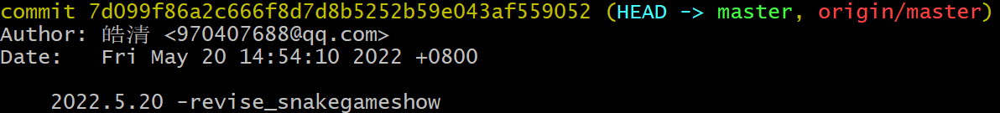
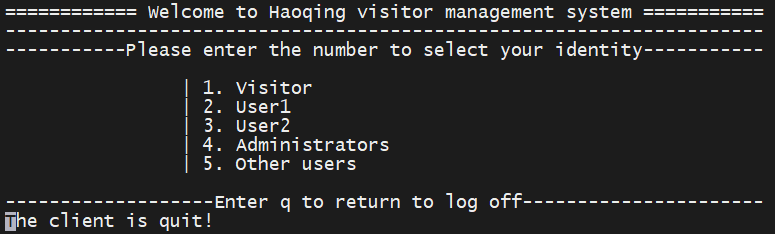

## 树莓派项目 - 开发流程 - HQ

[TOC]

------

#### 注意

- git 版本切换指令

  ```
  git reset --hard  597330ae0a183c9db8f68b7c9f60df94f8965778
  ```

- 

------

## 系统待优化 & 待完善记录

| 模块             | 优化内容                                                     |
| ---------------- | ------------------------------------------------------------ |
| 整个系统         | 数字指示部分可以用宏定义代替                                 |
| 整个系统         | 全局变量，局部变量，全局函数，静态局部函数使用不规范，该加static的地方没有加；const没怎么用，比如不希望被更改的传参 |
| 整个系统         | 大部分函数调用，并没有检测返回值，判断函数运行是否正确正常，没有报错和容错程序，报错调试没有使用专用的DEBUG宏定义调试方法，且函数返回后也没有添加显示调用是否成功的打印信息 |
| 整个系统         | 规范化，比如将用到的库文件复制到项目lib文件夹下（libcurl库已经移植到项目的lib文件夹下），提高可移植性 |
| 整个系统显示     | 可以在每个菜单显示后面通过printf来打印一些有用信息，不必局限在固有的菜单显示，在菜单切换时，通过调用界面刷新函数清除这些打印信息。（通过使用ncurses库显示界面，并配合使用printf打印一些运行提示信息） |
| 数据库           | 需要修改补充数据库，在数据库中添加区分不同用户对应身份的数据项（普通用户、user1、user2、管理员）。由于系统是先选择身份，再验证登录，所以验证的时候要查询数据库判断所登录的用户是否与选择的身份匹配，匹配则继续验证，否则提示登录用户与身份不匹配。（目前的做法就是单纯的，只要用户输入的账号密码正确就验证通过，这样就无法区分不同身份的用户了） |
| FTP功能          | 将system系统调用改为exec系统调用，并接收用户输入指定的IP地址和端口号，将参数传入shell脚本中，访问指定IP地址和端口号 |
| 人脸识别         | 区分用户身份的人脸识别部分未实现。在目前功能基础上，增加让用户自己输入照片位置-名称信息的功能，系统根据输入信息进行查找照片位置，然后比对。增加自动打开摄像头拍照功能，然后将拍取的照片与原始照片比对。 |
| 日志             | 增加日志记录功能，登录用户后，记录信息，每个行为都可以进行记录到脚本 |
| 系统shell脚本    | shell脚本可以根据输入的内容选择性编译内容                    |
| 聊天室           | 聊天室运行时，先打开服务端程序，再打开客户端程序，所以如果其他用户要进入聊天室，只能通过客户端的应用进入，不能通过系统进入，否则会开启两个服务端，冲突。解决方法，一个是服务端单独手动开启，一个是开启前，先判断系统进程中是否存在服务器应用，高级做法就是加锁，信号量等高级操作。 |
| 其他注意         | system系统调用ftp和chat运行脚本都是使用的相对地址，相对VisitorMS文件地址进行查找，如果更改了VisitorMS文件的打开位置，则这个相对地址也要改，这样才能使system系统调用找到启动脚本位置并运行脚本；并且启动的脚本文件里面的地址也要改它们运行程序的相对地址；改树莓派摄像头脚本地址；改人脸识别调用图片地址；修改mainPro.h中chat_thread()函数调用的脚本地址 |
| APP验证登录      | 通过将时间（年-月-日-时，不包含分秒）写入文本，然后计算文本的mdk5值，传输这个值到管理系统，管理系统采用相同方法生成mdk5值进行比对，相同则验证通过（目前是发送固定数字） |
| APP验证登录      | 主程序作为服务端等待客户端connect连接时会阻塞，如果没有接收到连接就会一直卡住 |
| APP验证登录      | 如果使用APP进行验证的密码，那么后面再用APP进行网络线程控制就会出现不响应的情况，需要ssh重连树莓派（线程退出或者服务器关闭时没有清理干净） |
| APP              | 存在问题，如果通过APP访问了摄像头，在关闭摄像头之前退出APP可以正常退出，但是如果没有退出APP，则摄像头无法通过Ctrl + C退出，只能Ctrl +Z强制退出系统 |
| **串口**         | **在使用自己编译的内核后，树莓派串口失灵，经排查，不是电脑驱动问题，不是程序问题，不是串口模块的问题，树莓派运行串口测试程序，收发数据在电脑上都接收不到，怀疑是树莓派Linux串口驱动的问题，ttyAMA0存在问题。** |
| **语音识别模块** | **语音模块程序测试未完成**                                   |
|                  |                                                              |
|                  |                                                              |


## 总体开发流程记录

1. 熟悉回顾各个子部分内容，补充基础知识，复现个别项目。

2. 学习嵌入式项目开发流程、工程文件组织架构。

3. 绘制VisitorMS文件结构和VisitorMS系统结构导图。

4. 创建项目工程文件，创建[Gitee仓库](https://gitee.com/yang-haoqing/visitor-ms.git)，配置git。(2022.5.8)

5. 学习Makefile语法。

6. 学习【上官第三阶段练手项目：智能家居】课程。

   > 使用简单工厂设计模式搭建工程框架。
   >
   > 使用libcurl库调用翔云API进行人脸识别。
   >
   > 使用语言识别模块识别口令通过串口传输信号。

7. 参考简单工程设计模式，重新调整项目文件组织架构，编写Makefile文件并成功编译运行，通过git上传代码。

8. 重新设计系统的功能组织架构，加入身份验证的设计构想，绘制简单工厂模式的程序结构图，项目脉络和开发流程基本清晰。

9. 【8】ncurses库界面开发 - 搭建流程

  - 基本完成
  - 

10. 【7】贪吃蛇游戏 - 搭建流程

  - 贪吃蛇游戏显示出现乱码问题，影响不是很大，调整MobatXterm窗口大小后乱码消失，暂时不打算深入解决；还有第二次运行贪吃蛇游戏后，界面不显示，猜测是线程问题，暂时不解决。
  - 
  - 

11. 绘制程序执行顺序框图，梳理程序执行逻辑。

    - 修改程序，测试完成，现在界面显示框架基本完成，下面开始写识别工厂程序。
    - 


12. 【5】树莓派应用开发 - 搭建流程
    - 修改完成设备工厂部分代码。
    - 
    - 将整个系统功能串联起来，可以完整执行任一部分，除身份认证功能外，其余逻辑基本实现。

13. 【4】MJPG-Streamer项目 - 搭建流程
    - 编写代码，测试完成。
    - 

14. 【1】FTP云盘 - 搭建流程
    - 编写代码，排查功能异常问题，测试完成。
    - 

15. 修改程序结构图、功能组织架构图、身份验证方式图，更新第二版组织架构。（2022.5.23）

16. 【5】树莓派应用开发 - 搭建流程（2022.5.24）

    -  添加指令工厂部分，把原来的指令工厂移植到当前系统，修改代码。
    -  完成指令工厂功能添加，经反复修改调试，调整界面信息显示，现多线程（语音线程、网络线程）基本功能已经正常运行，可正常接收信息并执行对应指令，并且与主程序并不冲突
    -  

17. 【3】libcurl库人脸识别 - 搭建流程（2022.5.25）
    - 人脸识别验证身份功能初步实现成功。目前实现方式是让用户把照片放到指定位置并命名为指定名称，然后后台将这张照片与原始照片进行比对。
    - 

18. 【5】树莓派应用开发 - 搭建流程 （2022.5.25）
    - 串口控制功能程序添加完成，由于功能选择菜单没有位置了，未启用。
    - 添加口令识别功能完成。
    - 

19. 修改系统界面，添加补充功能，重新组织项目文件结构，重新修改系统所有结构图。

    - 扩充所有打印界面
       - 将界面由原来的11行扩展到15行，增加四行空行
       - 但是扩展的界面显示出现问题，重新修改，可能是/t的问题，把所有的/t去掉，然后填充空格
       - 根据实际显示继续调整所有的打印界面，修改完成
    - 为用户1和2，管理员添加串口控制线程，测试成功
    - 为访客添加注册用户功能选项，修改菜单，添加选择接口
    - 为所有用户添加聊天室功能选项，修改菜单，添加选择接口
    - 添加其他用户的处理程序，打印界面，功能选择。
    - 重新组织项目文件结构，编写make_project.sh和clean_project.sh两个脚本，用来配置库文件、编译所有程序，清理程序。
    - 

20. 【2】socket聊天室 - 搭建流程

    - 为所有用户添加聊天室功能，即通过脚本调用打开chat功能（同ftp传文件功能）。
    - 重新修改所有的Makefile文件，修改打印信息，修改make_project.sh和clean_project.sh两个脚本的打印信息。
    - 阅读原始代码和博文，理解程序，修改代码，修改打印输出信息，添加注释（修改了3-4遍），测试完成。
    - 

    - 用户密码登录功能添加完成（查询数据库用户是否存在，密码是否正确）。用户注册功能添加完成（数据库插入数据）。

21. 【6】智能家居APP开发 - 搭建流程

    - App验证登录功能添加完成。

    - 修改第五版系统结构框图等，整个项目基本完成（2022.5.31）

    - 手机App端暂时没有开发。

    - 

22. 完善项目开发流程和组织架构两个文档，编写好README文档，上传Gitee。
    - 

23. 修改补充README文档。
    - 

24. 【6】智能家居APP开发 - 搭建流程（2022.6.15）
    - APP基本功能已实现，点击APP-I登录账号按钮，APP作为客户端可发送指定密钥到服务器，服务器与本地密钥比对，正确则验证登录成功。
    - 扩展APP功能，可显示摄像头的界面，APP-I可以显示，APP-II也可以显示
    - 扩展APP功能，可作为网络控制客户端发送控制指令，如果打开设备1，关闭设备1等，APP-I作为客户端发送控制指令到服务器，服务器网络控制线程接受到指令后执行相应功能。
25. 【5】树莓派应用开发 - 搭建流程（2022.6.15）
    - 串口控制功能添加完成，语音控制功能添加完成，语音识别功能添加完成，串口控制功能测试成功。
    - 

26. 【5】树莓派驱动开发 - 搭建流程（2022.6.17）

    - 交叉编译树莓派内核，成功移植到树莓派，交叉编译PIN4驱动模块，修改程序，编写驱动脚本，测试成功。
    - 
27. 添加线程阻塞功能（来防止并发问题），当主线程进入设备1或者设备2的功能选择界面时，要将语音和网络线程阻塞（使用条件变量实现线程阻塞），退出功能选择界面时再打开。同时，条件变量也实现了语音线程和网络线程互斥执行指令功能。
    - 添加安卓App模块程序到仓库，添加LD3320语音识别模块到仓库。
    - 在所有程序文件开头添加版权声明注释代码。
    - 修改README文档，修改开发流程、组织架构文档。
    - 
28. 优化网络控制线程程序，使服务器自动获取本机IP，而不用手动配置。（2022.6.21）


## 注意内容 & 知识记录

1. 在ncurses界面使用printf打印信息排列不整齐是因为没有加\r 

   ```c
   printf("socketThread start success\r\n");
   ```

   > 

   printw和printf在ncurses中都可以正常显示，但是printf是直接显示到屏幕，printw是通过refresh刷新后统一显示到屏幕，且可以指定坐标等规则。

2. getchar 和 getch区别，测试发现，在本程序中，两者效果无区别，推荐使用getch。

   > 1、getchar有一个int型的返回值.当程序调用getchar时.程序就等着用户按键.用户输入的字符被存放在键盘缓冲区(输入缓冲区)中.直到用户按回车为止(回车字符也放在缓冲区中).getchar函数的返回值是用户输入的第一个字符的ASCII码,如出错返回-1,且将用户输入的字符回显到屏幕.如用户在按回车之前输入了不止一个字符,其他字符会保留在键盘缓存区中,等待后续getchar调用读取.也就是说,后续的getchar调用不会等待用户按键,而直接读取缓冲区中的字符,直到缓冲区中的字符读完为后,才等待用户按键. 
   > 2、getch与getchar基本功能相同,差别是getch直接从键盘获取键值（没有输入缓冲区）,不等待用户按回车,只要用户按一个键,getch就立刻返回,getch返回值是用户输入的ASCII码,出错返回-1.输入的字符不会回显在屏幕上.getch函数常用于程序调试中,在调试时,在关键位置显示有关的结果以待查看,然后用getch函数暂停程序运行,当按任意键后程序继续运行.
   > 3、简单的说, getch()是读取按键值常放在程序末尾起暂停作用 而getchar()是从标准输入设备读取下一个字符~~所读字符若文件结束或出错则返回-1
   > 4、注意:linux系统中使用getch函数需指定#include <curses.h>头文件，编译时需指定-lcurses

3. 网络开发时，如果服务端使用结束，需要及时执行清理命令，否则会占用资源，影响再次使用。

   > 

4. 调试驱动程序时，未赋初值0导致接收到的数据一直错误，以后需要注意。

   > 


## 实现细节 & 难点记录

1. 下面内容来自《从0实现基于Socket聊天室》。

   > 

2. ==系统中的chat部分，具有线程加锁解锁功能，需要好好理解。==


---

## 涉及知识点整理

### 树莓派启动加载文件 rc.local

在ubuntu下要把一个程序加入开机启动，一般可以通过修改rc.local来完成

> ubuntu下有两个rc.local文件，分别是/etc/rc.local和/etc/init.d/rc.local，
>
> 要添加开机启动项，只需在/etc/rc.local文件中添加就行了。

原本想修改这个开机启动文件，将ip信息上传到自己的服务器中，实现步骤如下

1. 配置树莓派的SSH

   1. `ssh root@47.98.147.248`  测试能否连接服务器（能）

   2. `ssh-keygen`  创建密钥

   3. 本地设置服务器

      > 

   4. `ssh-copy-id myserver`  设置免登陆，一键添加公钥

2. 修改/etc/rc.local脚本

   ```cpp
   #!/bin/bash
   
   # Print the IP address
   #_IP=$(hostname -I) || true
   #if [ "$_IP" ]; then
   #  printf "My IP address is %s\n" "$_IP"
   #fi
   #ifconfig wlan0 192.168.3.104
   
   ifconfig > /home/pi/ip.txt
   scp /home/pi/ip.txt hq:/home/hq/
   
   exit 0
   ```

3. 解决树莓派/etc/rc.local开机启动不执行问题

   1.  查看rc-local服务状态，如服务出现错误，则解决错误后重启，如无错误：

      ```
      ls -l /etc/rc.local
      ```

       查看rc.local权限，如果是`-rw-r--r--`，则执行：

      ```
      sudo chmod +x /etc/rc.local
      ```

      然后重启即可

   2. 方法1：在终端执行 

      ```
      sudo dpkg-reconfigure dash
      ```

      然后选择 no.

      方法2：重新进行软链接:

      ```
      sudo rm /bin/sh
      sudo ln -s /bin/bash /bin/sh
      ```

      最后将rc.local开头的

      ```
      #!/bin/sh -e
      ```

      修改为

      ```
      #!/bin/bash
      ```

4. 最终rc.local脚本可以正常运行，结果发现，当这个脚本运行时，wifi网络并未连接，所以只能生成本地的ip.txt，无法传文件到服务器，卒。

   > 

5. 后面思考了下，能否通过延迟脚本的运行，给联网一点时间，结果发现可行

   1. ifconfig成功将ip数据写入ip.txt

   2. 但是scp指令未成功，原因未知（即使延迟到30秒也未成功）

      >偶尔可以成功，可能与ssh有关
      >
      >

   3. 但是，我可以将SD卡插入虚拟机查看ip.txt，进而得知此时ip，这个问题也算是被解决了。

6. 其他解决方法，可以使用p2p终结者软件，扫描同一路由器下的所有设备ip，进而推断出哪个是树莓派的ip。

7. 更新方法：修改 /etc/rc.local ，成功获得IP输出，且每次都输出到以时间命名的文件中

   -  注释的内容依然会运行，有点奇怪

   - sleep 5 不行，需要sleep 10才能输出IP

   - 更改文件命名方式，以时间命名，防止同名文件覆盖

     ```shell
     #!/bin/bash
     
     sleep 10
     ifconfig > /home/pi/test_file/"$(date +%Y-%m-%d-%r)"
     
     exit 0
     ```

     > 

8. 参考上官树莓派开机启动文件 rc.local

   ```shell
   #!/bin/sh -e
   # Print the IP address
   _IP=$(hostname -I) || true
   if [ "$_IP" ]; then
   	printf "My IP address is %s\n" "$_IP"
   fi
   ifconfig wlan 192.168.1.111
   e
   ```

   


## 树莓派基本设置

1. 账号 `pi`      密码 `raspberry`

2. 系统存储情况 - 2022.4.6  开启项目前

   > 

   系统存储情况 - 2022.5.31  项目基本完成时

   > 

   系统存储情况 - 2022.6.18 完善功能

   > 

3. 项目运行环境

   ```
   pi@raspberrypi:~/raspberry/VisitorMS $ cat /proc/version
   Linux version 5.10.17-v7+ (dom@buildbot) (arm-linux-gnueabihf-gcc-8 (Ubuntu/Linaro 8.4.0-3ubuntu1) 8.4.0, GNU ld (GNU Binutils for Ubuntu) 2.34) #1414 SMP Fri Apr 30 13:18:35 BST 2021
   
   pi@raspberrypi:~/raspberry/VisitorMS $ uname -a
   Linux raspberrypi 5.10.17-v7+ #1414 SMP Fri Apr 30 13:18:35 BST 2021 armv7l GNU/Linux
   
   pi@raspberrypi:~/raspberry/VisitorMS $ lsb_release -a
   No LSB modules are available.
   Distributor ID: Raspbian
   Description:    Raspbian GNU/Linux 10 (buster)
   Release:        10
   Codename:       buster
   
   pi@raspberrypi:~/raspberry/VisitorMS $ cat /etc/issue
   Raspbian GNU/Linux 10 \n \l
   ```

4. wifi配置

   > 

5. gcc 版本

   > 

6. /boot/cmdline.txt内容（wifi模式，非串口模式）

   ```
   dwc_otg.lpm_enable=0 console=tty1 console=serial0,115200 root=/dev/mmcblk0p2 rootfstype=ext4 elevator=deadline fsck.repair=yes rootwait
   ```

7. 树莓派GPIO表

   > 
   >
   > 


## Linux基本操作

### scp传输文件

1. 从本地上传文件到远程计算机或服务器的命令如下

```
scp xxx.c pi@192.168.1.103:/home/pi
```

2. 从远程主机复制文件到本地主机(下载)的命令如下

```
scp pi@192.168.1.103:/home/pi/xxx.c .
scp pi@192.168.1.103:/home/pi/{a.c,b.c} .
```

3. 从本地文件复制整个文件夹到远程主机上

```
scp -v -r xxxx pi@192.168.1.104:/usr/local
```

4. 从远程主机复制整个文件夹到本地目录下

```
scp -r p@192.168.1.104:/usr/local/xxxx .
```


## 搭建开发环境

1. 配置网络

   1. 由于身边没有串口转TTL模块，没有显示屏直连，采用直接修改配置文件方法修改网络配置

   2. 打开电脑虚拟机，将树莓派的SD卡连接到虚拟机

   3. `sudo vi /media/hq/rootfs/etc/wpa_supplicant`  U盘直接挂载到虚拟机的media文件夹下，打开wifi配置文件，添加账号密码

      > 

   4. `sudo vi /media/hq/rootfs/etc/dhcpcd.conf`    配置固定IP（方法对，但是参数自己不会设置，导致配置未成功）

      > 其中：wlan0代表无线，也就是指定接口（有线网络修改的是eth0接口）
      >
      > ip_address代表设置的静态ip地址
      > routers代表路由器/网关IP地址
      >
      > 

   5. 卒，连接不上，决定连接到屏幕查问题

      1. 之前印象笔记中整理的固定ip方法是错误的，导致ifconfig出来的ip连接不上

         > 

      2. 将上面的语句注释掉，成功获得ip，电脑成功通过ssh连接到树莓派，网络配置完成

2. 配置工具
   1. Xshell - ssh
   2. FileZilla - sftp
   3. MobaXterm - ssh (使用这个)
   
3. 交叉编译工具链

   >

4. 串口\蓝牙切换\打开与关闭

   1. 在pi3b上，“/dev/ttyAMA0”通常是为蓝牙保留的，要使用Pi 3B上的串行端口（或运行更新Raspbian Jessie的任何型号的Pi），需要下面操作

   2. 从文件“/boot/cmdline.txt”中删除短语“console=serial0115200”

      > 请注意，此文件只能包含一行，编辑时不要拆分该行，或尝试添加注释。这可以防止Linux向串行端口发送引导消息。

   3. 在文件“/boot/config.txt”的末尾添加行“enable\u uart=1”。

      > 确保此文件不包含引用uart的任何其他命令，它负责使用pi3b上的串行端口所需的所有后台任务。

   4. 重新启动。
   5. 在代码中将您的串行端口称为`“/dev/serial0”`
   6. 无需更改默认的组或权限。


## 【1】FTP云盘 - 搭建流程

1. 整理自己第一遍课程时程序代码 - 参考个人博客文章  

   > https://blog.csdn.net/weixin_45346142/article/details/116889955

2. 搜集整理同类博客程序代码 

   > https://blog.csdn.net/hdbzh/article/details/119799121

3. 开始研读**FTP客户端与服务器**程序代码，整理修改笔记，查阅代码，做好注释

4. 复现**FTP客户端与服务器**

   > 运行成功，解决了树莓派与虚拟机不能互连（connection refuse）问题，
   >
   > 代码写错，argv[1]已经是字符串指针，不应该再加双引号。 
   >
   > 


5. 同MJPG-Streamer项目的camera实现流程，基本复用其代码，通过执行shell脚本来打开服务器程序。

   ```c
   	/* 返回shell界面，正常打印摄像头启动信息 */
   	endwin();
   	/* 打开树莓派摄像头 */
   	system("./lib/ftp/ftp_server_start.sh");
   	/* 摄像头使用结束后，重新打开ncurses界面 */
   	initNcurse();
   	/* 刷新界面 */
   	picRefresh();
   ```

   进入界面

   > 

   服务器执行界面

   > 

   客户端执行界面

   > 

6. 将 `gets` 函数替换成 `fgets`，排除警告。

   > 

7. 客户端成功执行 `pwd ls lls lcd get put quit`  指令，`cd` 指令不响应，修改代码。

   `strtok(cmsg, “”);`  没加空格，导致每次分割后识别的目录位置都为NULL，添加空格后`cd `指令功能正常。

   > 
   >
   > 

8. 客户端执行 `get` 指令，只会打印文件信息，并不会在下载到本地。

   一个原因是 `msg.tpye` 错写成 `msgget.type`，导致每次都不执行生成文件代码。

   > 

   问题未解决，下载文件依然不成功。

   > 

   排查问题，发现并不是 `msg.tpye` 错写成 `msgget.type`，此处的`msg`是局部变量，`msgget`被赋值从服务器传来的数据，问题在于服务器传递的数据被设置错误，修改后`get xxx`功能正常。

   >

9. 访客管理系统中补充ftp其他功能，不再局限于远程下载日志。

   > 
   >
   > 
   >
   > 
   >
   > 

10. 仿照chat服务端的程序，修改了FTP服务端的程序，不用每次都需要通过脚本传入服务器的IP地址，服务端的IP地址就是本地的IP地址可以自动获取（同APP验证登录的服务端），同步更改运行的脚本文件ftp_server-start.sh。


## 【2】socket聊天室 - 搭建流程

1. 整理公众号博主Linux socket 聊天室文章 

   > https://mp.weixin.qq.com/s/9ylvqttxuTGuMKdERL-UHg

2. 开始研读**Linux socket客户端与服务器**程序代码，整理修改笔记，查阅代码，做好注释

3. 复现**Linux socket客户端与服务器**

4. 学习Sqlite3嵌入式数据库使用和开发，整理笔记。

5. 学习数据加密算法，整理笔记。

6. 为所有用户添加聊天室功能，即通过脚本调用打开chat功能（同ftp传文件功能）。

   - 主程序通过新建一个chat线程来调用服务端打开脚本，进而运行服务端程序，主程序运行客户端程序，这样就不用手动打开服务端程序了。
   - 要注意把所有服务端的打印都屏蔽掉（利用宏定义预处理屏蔽服务器的打印输出），做为一个后台程序运行即可，否则其打印会干扰主程序的输入
   - ==聊天室运行时，先打开服务端程序，再打开客户端程序，所以如果其他用户要进入聊天室，只能通过客户端的应用进入，不能通过系统进入，否则会开启两个服务端，冲突。解决方法，一个是服务端单独手动开启，一个是开启前，先判断系统进程中是否存在服务器应用，高级做法就是加锁，信号量等高级操作。==
   - 客户端可以通过127.0.0.1 8888进行访问本机上服务器，也可以通过服务器的实际IP地址进行连接同一个局域网的服务器。
   - 其他注意，聊天室客户端服务端调用的脚本都是相对地址，可能会出错，要注意一下

7. 阅读原始代码，修改代码，修改打印输出信息，添加注释（修改了3-4遍）。

   - 测试聊天室程序功能完成。
   - 给脚本增加运行权限，执行编译脚本
   - 对照聊天室和加密算法的博文笔记，重新梳理程序，添加注释（2022.5.30）
     - 关于线程添加互斥锁设置keygen然后申请密钥，申请结束后释放线程互斥锁的过程（防止多个线程同时进行申请密钥，导致出现并发问题）有了清晰的了解。
     - 服务器在刚开始与客户端进行连接时，要先下发keygen给客户端，后面服务器与客户端之间的通讯都基于这个keygen来进行加解密。
     - 客户端与服务器之间传递信息，都是传递的加密后的数据密文，都是先申请加密密钥（不同的客户端，keygen是不同的，每次都需要从数据库中获取对应的客户端的keygen），然后对明文数据进行加密，最后传输密文给对方。
     - 接收数据也是类似，接收密文后，先申请密钥，然后对密文解密成明文。


   > 
   >
   > 

   - 执行程序，进入chat聊天室

   > 

   注册用户

   > 

   登录成功

   >

   - 选择chat聊天室功能：公聊，私聊，打印在线用户

   > 

   退出chat聊天室

   > 

   查看数据库

   > 
   >
   > 

8. 测试当前chat程序，修改了一些打印信息，增加了一些提示信息，解决了公聊私聊时打印信息闪退的问题。

8. 在core/identityRecognition文件下添加data.c，在include文件下添加data.h，拷贝chat聊天室中的程序，将不用的功能都删掉，修改程序，编写passwordIdentification.c程序，修改Makefile，编译通过。

   - 用户密码登录功能添加完成（查询数据库用户是否存在，密码是否正确）。

     > 

   - 用户注册功能添加完成（数据库插入数据）。
   
     > 
   
   - ==需要修改补充数据库，在数据库中添加区分不同用户对应身份的数据项（普通用户、user1、user2、管理员）。由于系统是先选择身份，再验证登录，所以验证的时候要查询数据库判断所登录的用户是否与选择的身份匹配，匹配则继续验证，否则提示登录用户与身份不匹配。（目前的做法就是单纯的，只要用户输入的账号密码正确就验证通过，这样就无法区分不同身份的用户了）==


## 【3】libcurl库人脸识别项目 - 搭建流程

1. 添加识别程序，完善层层函数调用逻辑，增加人脸识别提示界面，提示用户把照片放到指定位置并命名为指定名称。

2. 在树莓派上安装openssl库和libcurl库。

   解压安装包到指令目录

   ```
   tar xvf curl-7.71.1.tar.bz2 
   ```

   在解压文件夹中建立一个安装目录（可以不用新建文件夹，make install安装的时候会自动创建）

   ```
   mkdir _install 
   ```

   添加ssl功能安装 - 报错

   ```
    ./configure --prefix=$PWD/_install --with-ssl
   ```

   > 

   分析，报错信息

   > 其他解决方法https://blog.csdn.net/xiaopang_love_study/article/details/122147436

   ```
   configure: error: --with-openssl was given but OpenSSL could not be detected
   配置：错误：--已提供openssl，但无法检测到openssl
   ```

   猜测是ssl库版本太老或者是未安装完整，重新安装ssl库

   ```
   wget https://www.openssl.org/source/openssl-1.1.1a.tar.gz
   tar xvf openssl-1.1.1a.tar.gz
   cd openssl-1.1.1a/
   ./config
   make
   make install
   ```

   > 
   >
   > 

   重新安装ssl成功，进入libcurl安装目录中，卸载安装文件，重新编译安装libcurl库

   ```
   cd _install  
   rm * -rf
   ./configure --prefix=$PWD/_install --with-ssl  # 重新编译
   make
   make install
   ```

   安装libcurl库成功

   > 

   运行测试demo，打印正常，测试成功。

   > 

3. 程序编译

   -I（大i）是链接头文件，-L是链接库文件

   ```
   gcc test_1.c -I ~/raspberry/libcurl/curl-7.71.1/_install/include/ -L ~/raspberry/libcurl/curl-7.71.1/_install/lib/ -lcurl
   ```

   如果提示找不到库，则修改环境变量，导入链接库地址

   ```
   export LD_LIBRARY_PATH=~/raspberry/libcurl/curl-7.71.1/_install/lib/  
   ```

   程序运行后，会在/tmp/下生成`get.html`和`post.html`文件

   ```
   vi /tmp/get.html   # 查看调用libcurl编程访问的主页
   ```


4. 将编译好libcurl库中的include头文件和lib库文件复制到项目的lib/libcurl目录下，修改Makefile文件

   > 
   >
   > 
   >
   > 

   ```shell
   # 截取部分内容
   $(TARGETS) : $(OBJ1) $(OBJ2) $(OBJ3) $(OBJ4) $(OBJ5) $(OBJH)
   	@echo "prepare Link "
   	# 编译的时候需要查到头文件
   	@$(CC) $^ -o $@ -lwiringPi -lpthread -lcurses -L ./lib/libcurl/lib/ -lcurl
   	@echo "prepare successfully!"
   	
   %.o : %.c 
   	@echo "prepare to compile include_h "
   	# 链接的时候需要链接动态库
   	@$(CC) -c $< $(CFLAGS) $(INCLUDE) -o $@ -I ./lib/libcurl/include/ 
   	@echo "compiled_h "$<" successfully!"

5. 人脸识别验证身份功能初步实现成功，效果如图。

   目前实现方式是让用户把照片放到指定位置并命名为指定名称，然后后台将这张照片与原始照片进行比对。

   但是下面内容未实现，记录以后可以实现。

   - ==区分用户身份的人脸识别部分未实现。==
   - ==在目前功能基础上，增加让用户自己输入照片位置-名称信息的功能，系统根据输入信息进行查找照片位置，然后比对。==
   - ==增加自动打开摄像头拍照功能，然后将拍取的照片与原始照片比对。==

   >
   >
   >
   >
   >


## 【4】MJPG-Streamer项目 - 搭建流程

1. 修改程序，由于摄像头不符合控制工厂模型，所以直接新建一个camera.c和camera.h文件。

2. 参考ftp代码，通过调用popen函数执行摄像头的start.sh脚本文件。

   > 

   报错

   > 

   修改脚本文件，添加cd xxx，先进入摄像头的文件夹，然后执行摄像头打开脚本，问题解决。

   > 

3. 摄像头可以打开，但是会直接打印输出信息到屏幕，而且设置保存输出信息的/tmp/camera_tmp_file文件也出现了乱码。

   ```c
   char msg[1024];
   /* 创建一个文件描述符 */
   int fd = open("./camera_tmp_file", O_RDWR | O_CREAT, S_IRWXU | S_IRGRP | S_IROTH);
   
   /* 调用fork()生成子进程，在子进程中调用/bin/sh -c来执行参数的指令，
   	是以创建管道的方式创建子进程并连接到子进程的标准输出设备或标准输入设备，
   	功能是执行指令将输出放入文件中，返回文件指针 */
   FILE *r1 = popen("/home/pi/raspberry/mjpg-streamer/mjpg-streamer-experimental/start.sh", "r");
   
   /* 从文件读取1个数据项，每个数据项大小为sizeof(msg),将读取到的数据存放在参数ptr指向的缓冲区中 */
   fread(msg, sizeof(msg), 1, r1);
   
   /* 将数据写入文件中 */
   lseek(fd, 0, SEEK_SET);
   write(fd, &msg, sizeof(msg));
   
   pclose(r1);	
   close(fd);
   ```

   > 
   >
   > 

4. 放弃使用popen函数，直接使用system系统调用。但是mjpg-streamer启动摄像头打印的信息不会排列在同一列，经测试，发现通过printf打印的信息会出现相同的现象，这是ncurses的显示问题，只有通过printw输出的信息才会正常显示。

   **补充：**这是因为在ncurses界面中，使用printf进行打印信息，后面只有\r\n才是真正的换行，而mjpg-streamer打印没有加\r，导致打印信息排列不整齐。

   ```c
   	/* 打开树莓派摄像头 */
   	system("/home/pi/raspberry/mjpg-streamer/mjpg-streamer-experimental/start.sh");
   	/* 刷新界面 */
   	picRefresh();
   ```

   > 

5. 找到一个解决上述问题的办法，就是先关闭ncurses，然后退出到shell界面进行打印，当 ctrl+c 关闭摄像头后，自动重新进入到ncurses界面，进行其他操作。（2022.5.22）

   ```c
   	/* 返回shell界面，正常打印摄像头启动信息 */
   	endwin();
   	/* 打开树莓派摄像头 */
   	system("/home/pi/raspberry/mjpg-streamer/mjpg-streamer-experimental/start.sh");
   	/* 摄像头使用结束后，重新打开ncurses界面 */
   	initNcurse();
   ```

   > 
   >
   > 
   >
   > 


## 【5】树莓派应用开发 - 搭建流程

1. 使用wiringPi库开发应用程序

3. 使用简单工厂设计模式搭建工程框架。

4. 使用语言识别模块识别口令通过串口传输信号。

5. 修改原来的设备工厂程序，添加设备功能选择界面，在设备处理函数中添加展示程序。将整个系统功能串联起来，可以完整执行任一部分，除身份认证功能外，其余逻辑基本实现。（2022.5.21）

   > 
   >
   > 
   >
   > 
   >
   > 
   >
   > 

6. 添加指令工厂，把原来的指令工厂移植到当前系统，修改代码。完善多线程代码，主线程执行主程序，创建网络线程去接收客户端指令并执行，创建语音线程去接收语音模块通过串口发来的指令并执行。

7. 在多线程中，在主函数用户退出时，要结束网络线程，但是网络线程中又创建了网络指令读取线程，其父进程被结束，他就变成了孤儿线程。

   >

   解决方法，将子线程创建的子线程的线程号定义为全局变量，父线程通过结束这个线程号来结束子线程的子线程。

   ```c
   	/* 退出前，结束语言或者网络线程 */
   	pthread_cancel(voiceThread);
   	pthread_cancel(socketReadThread);
   	pthread_cancel(socketThread);
   	
   	/* 回收线程 */
   	pthread_join(voiceThread, NULL);
   	pthread_join(socketReadThread, NULL);
   	pthread_join(socketThread, NULL);
   ```


8. 完成指令工厂功能添加，经反复修改调试，调整界面信息显示，现多线程（语音线程、网络线程）基本功能已经正常运行，可正常接收信息并执行对应指令，并且与主程序并不冲突，

   但是由于在主线程中使用了getch来获取用户输入的指令，导致语音线程和网络线程并不能在接收到指令后立刻执行，这里会导致显示和使用上的问题，但是已在菜单中添加了提示信息（通过输入其他键值来刷新显示）。

   ==至于网络线程和语音线程如何关闭，暂时没加功能选项，可以退出当前用户来结束线程运行。==

   功能选择界面

   > 

   网络连接成功

   > 

   成功执行客户端发来的指令

   > 

   语音提示界面，串口打开失败

   > 

11. ~~串口控制功能程序添加完成，完全拷贝语言控制的程序，只做了名称的修改，由于打印菜单没有位置了，暂时未启用，如果要启用，可采用如下方法中的一种：~~

    - ~~需要将所有打印的功能菜单进行扩充行数，然后把串口控制功能仿照语言控制功能加入程序中。~~
    2. ~~更麻烦一点的办法，是将所有的界面显示添加刷新界面函数，这样就不必严格遵循界面行数都一致的要求。~~
    3. ~~还有一种方法，就是直接将语言控制功能改为语言&串口控制功能，只改名称和打印信息。~~

    > 


12. 添加口令识别功能完成

    这里使用到了控制工厂链表并且调用执行了控制工厂的函数，但是并不需要考虑并发问题，因为这是在登录验证身份环节，并未到后面的实际控制环节。

    > 

    实际执行界面

    > 
    >
    > 
    >
    > 

13. 串口开发。串口控制功能添加完成，语音控制功能添加完成，语音识别功能添加完成，串口控制功能测试成功。（2022.6.15）

    - 初次使用树莓派串口编程，需要配置，因为最初树莓派连接电脑是通过串口进行终端显示，被占用了，需要修改

    - 修改/boot/cmdline.txt文件

      ```
      dwc_otg.lpm_enable=0 console=tty1 console=serial0,115200 root=/dev/mmcblk0p2 rootfstype=ext4 elevator=deadline fsck.repair=yes rootwait
      ```

      改为

      ```
      dwc_otg.lpm_enable=0 console=tty1 root=/dev/mmcblk0p2 rootfstype=ext4 elevator=deadline fsck.repair=yes rootwait
      ```

    - 修改/etc/inittab文件，注释掉最后一行（如果没有这个文件，则忽略）

    - sudo reboot 重启

    - 调试成功，发送指令的时候不要选择发送新行，否则会有换行符识别失败

      > 

    - 语音验证测试（实为直接使用串口发送指定密钥）

      > 

    - 串口控制功能测试

      > 

14. 添加线程阻塞功能（来防止并发问题），当主线程进入设备1或者设备2的功能选择界面时，要将语音和网络线程阻塞（使用条件变量实现线程阻塞），退出功能选择界面时再打开。同时，条件变量也实现了语音线程和网络线程互斥执行指令功能。

   >
   >
   >

   ==但是，网络线程阻塞，并不影响它接收指令，当退出设备功能选择界面时，会直接执行阻塞期间接收到的指令，可能导致输出乱码。==

   > 

15. 优化网络控制线程程序，使服务器自动获取本机IP，而不用手动配置。（2022.6.21）

   > 


## 【5】树莓派驱动开发 - 搭建流程

1. 在ubuntu中配置树莓派交叉编译工具链。

2. 在ubuntu中交叉编译树莓派内核，并将新内核移植到树莓派上，移植成功。（2022.6.17）

   > 

3. 编写驱动模块程序，在ubuntu中的树莓派内核目录中交叉编译驱动模块。

   >驱动代码的编译需要一个提前编译好的内核，编译内核就必须配置，配置的最终目标会生成 .config文件，该文件指导Makefile去把有用东西组织成内核。
   >
   >

4. 修改 `equipment1.c` 源程序，编写驱动测试应用，新建 `pin4driver_start.sh` 脚本，修改 `make_project.sh` 和 `clean_project.sh`脚本

   > 

   ==注：直接在源程序中修改运行，会出现跳屏问题，陷入死循环，getchar一直读到非法数据，下面程序已被注释掉。==

   > 

5. 测试成功。（2022.6.17）

   >
   >
   >


## 【6】智能家居APP开发 - 搭建流程

1. App验证登录功能添加完成。

   - ==主程序作为服务端等待客户端connect连接时会阻塞，如果没有接收到连接就会一直卡住==
   - ==改进验证方式，通过将时间（年-月-日-时，不包含分秒）写入文本，然后计算文本的mdk5值，传输这个值到管理系统，管理系统采用相同方法生成mdk5值进行比对，相同则验证通过（目前是发送固定数字）==

   >

2. 在上官智能家居APP的基础上进行修改，修改APP名称、页面名称、图标，修改主程序中摄像头网址，修改连接树莓派服务器的网址和端口号，修改按钮名称和发送内容。

   > 
   >
   > 

3. APP基本功能已实现，点击APP-I登录账号按钮，APP作为客户端可发送指定密钥到服务器，服务器与本地密钥比对，正确则验证登录成功。

   - 扩展APP功能，可显示摄像头的界面，APP-I可以显示，APP-II也可以显示
   - 扩展APP功能，可作为网络控制客户端发送控制指令，如果打开设备1，关闭设备1等，APP-I作为客户端发送控制指令到服务器，服务器网络控制线程接受到指令后执行相应功能。

   - ==如果使用APP进行验证的密码，那么后面再用APP进行网络线程控制就会出现不响应的情况，需要ssh重连树莓派（线程退出或者服务器关闭时没有清理干净）==
   - ==存在问题，如果通过APP访问了摄像头，在关闭摄像头之前退出APP可以正常退出，但是如果没有退出APP，则摄像头无法通过Ctrl + C退出，只能Ctrl +Z强制退出系统==

   > 

   APP-II打开提示界面

   > 

   APP-II 显示摄像头画面

   > 

   APP-I 显示摄像头画面，可点击按钮选择功能（需要树莓派运行访客管理系统并打开对应功能才能成功执行）

   > 

   APP验证成功

   > 

   APP遥控树莓派控制设备1关闭成功

   > 


## 【7】贪吃蛇游戏 - 搭建流程

1. 普通版本已在树莓派运行成功

2. ==贪吃蛇游戏显示出现乱码问题，影响不是很大，调整MobatXterm窗口大小后乱码消失，暂时不打算深入解决；还有第二次运行贪吃蛇游戏后，界面不显示，猜测是线程问题，暂时不解决。==

   正常情况

   > 

   ==出现乱码问题==

   > 

   第二次调用贪吃蛇程序，会直接闪退，测试线程创建可以成功并没有报错。

   ```c
   /* 创建两个线程，一个线程用于不断刷新界面，一个线程用于不断接收用户输入的上下左右方向信息 */
       pthread_create(&t1, NULL, (void *)refreshJieMian, NULL);
       pthread_create(&t2, NULL, (void *)changeDir, NULL);
   
       while (1) {
   		if (key == 113) {      //q的ASCII码为113
   			
   			/* 取消线程 */
   			pthread_cancel(t1);
   			pthread_cancel(t2);
   
   			/* 回收线程 */
   			pthread_join(t1, NULL);
   			pthread_join(t2, NULL);
   			
   			picRefresh();
   			break;
   		}
   	}
   	
       //endwin();
       return 0;
   ```

   


## 【8】ncurses库界面开发 - 搭建流程

1. 安装树莓派交叉编译库

   - 首先直接将树莓派的交叉编译工具链复制到ubuntu中，然后解压缩

   - 然后将编译器的位置加入到环境变量中，测试，完成。

2. 安装使用ncurses库

   - ubuntu有对应的ncurses库，树莓派也有对应ncurses库，都可通过apt直接安装

   - ubuntu中的树莓派交叉编译工具链中不包含ncurses库，无法编译贪吃蛇小游戏的代码，需要在树莓派中安装ncurses库，然后在树莓派中编译才能成功。

     > 使用ubuntu自身的ncurses库是不可行的，库中的头文件实现方法是针对x86架构的，而树莓派是arm架构的，除非是调用针对arm架构的ncurses库。

3. 将贪吃蛇程序拆解，加入到VisitorMS项目中。

   - 参考【黑马C++机房预约系统】和【贪吃蛇游戏程序】进行编写代码。

     > 封装：功能子文件中定义一个结构体，然后结构体内定义函数指针，通过在main函数中定义结构体变量，然后调用相应的功能函数。
   - 分成snack.c和snack.h，并将ncurses库初始化部分程序放到menu.c和menu.h中。
   - 将所有贪吃蛇相关函数/变量设置为全局静态函数/变量，修改bug，运行成功。

4. 搭建系统其他功能界面

   - 用户身份验证界面

     > 
   - 访客功能界面

     > 
   - 注册用户功能界面

     > 
   - 管理员功能界面

     > 

   - 程序注意事项

     ```c
     initNcurse();  /* 初始化ncurse库 */
     move(0, 0);    //将界面打印的坐标移动到左上角，必须先移动，再执行printw()
     //switch (selectFunction)  //getch读到的是字符，为ASCII码，0对应的是49
     //...
     //printw();
     refresh();  //刷新显示新的界面
     ```
     
     


