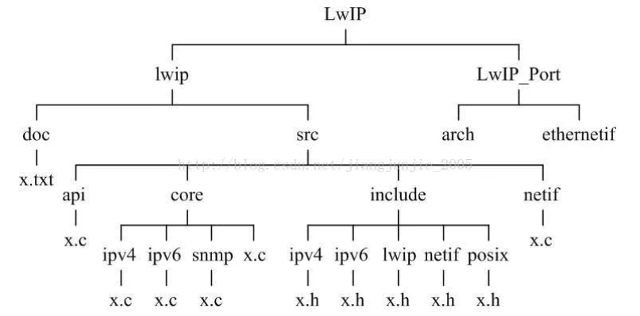
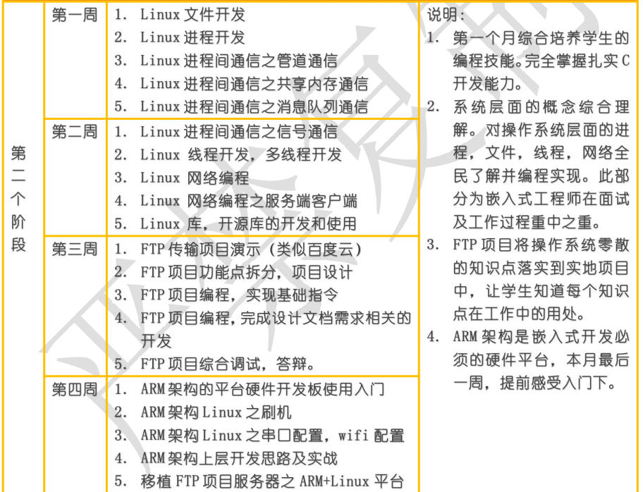
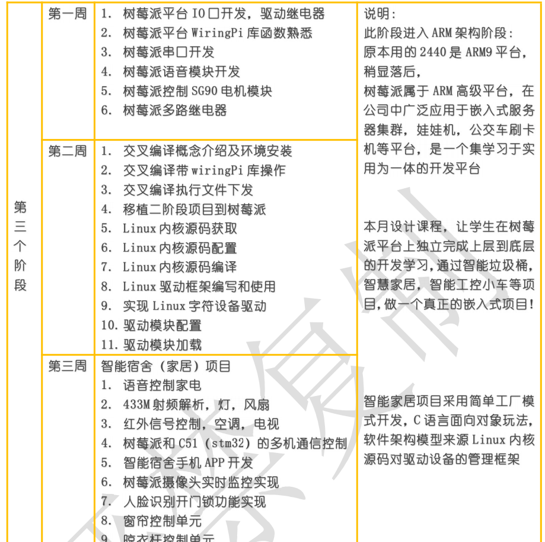
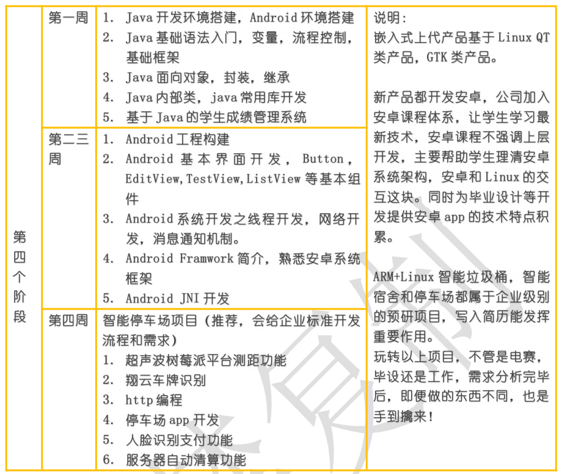

## 树莓派项目 - 组织架构 - HQ

[TOC]

------

#### 注意

- 

------

## 整体架构 - 见思维导图

### 第一版 - 2022.5.19

**功能结构图**

> 

> 

**程序结构图**

> 

**程序执行顺序**

> 

### 第二版 - 2022.5.23

**功能结构图**

> 

> 

**程序结构图**

> 

### 第三版 - 2022.5.24

**程序结构图**

>
>
>

**功能结构图**

> 
>
> 

### 第四版 - 2022.5.28

**程序结构图**

>

> 

**功能结构图**

> 

> 

### 第五版 - 2022.5.31

**程序结构图**

>
>
>

**功能结构图**

>
>
>


## 文件架构 - 待补充

### 第五版 - 2022.5.31

**源代码**

>
>
>

```
pi@raspberrypi:~/raspberry/VisitorMS $ tree
.
├── clean_project.sh
├── make_project.sh
├── README.md
└── src
    ├── core
    │   ├── controlDevice
    │   │   ├── equipment1.c
    │   │   ├── equipment2.c
    │   │   └── fireAlarm.c
    │   ├── identityRecognition
    │   │   ├── appRecognition.c
    │   │   ├── data.c
    │   │   ├── faceRecognition.c
    │   │   └── passwordIdentification.c
    │   ├── inputCommand
    │   │   ├── socketControl.c
    │   │   ├── usartControl.c
    │   │   └── voiceControl.c
    │   ├── otherFunctions
    │   │   ├── camera.c
    │   │   ├── ftp.c
    │   │   └── snake.c
    │   └── system
    │       ├── mainPro.c
    │       └── menu.c
    ├── include
    │   ├── camera.h
    │   ├── controlDevice.h
    │   ├── data.h
    │   ├── ftp.h
    │   ├── identityRecognition.h
    │   ├── inputCommand.h
    │   ├── mainPro.h
    │   ├── menu.h
    │   └── snake.h
    ├── lib
    │   ├── chat
    │   │   ├── chat_client
    │   │   │   ├── include
    │   │   │   │   └── key.h
    │   │   │   ├── Makefile
    │   │   │   ├── obj
    │   │   │   │   └── Makefile
    │   │   │   └── src
    │   │   │       ├── client.c
    │   │   │       ├── key.c
    │   │   │       └── Makefile
    │   │   ├── chat_client_start.sh
    │   │   ├── chat.h
    │   │   ├── chat_server
    │   │   │   ├── include
    │   │   │   │   ├── data.h
    │   │   │   │   └── key.h
    │   │   │   ├── Makefile
    │   │   │   ├── obj
    │   │   │   │   └── Makefile
    │   │   │   └── src
    │   │   │       ├── data.c
    │   │   │       ├── key.c
    │   │   │       ├── Makefile
    │   │   │       └── server.c
    │   │   ├── chat_server_start.sh
    │   │   ├── clean.sh
    │   │   └── gcc.sh
    │   ├── ftp
    │   │   ├── ftp_client.c
    │   │   ├── ftp_client_start.sh
    │   │   ├── ftp_server.c
    │   │   └── ftp_server_start.sh
    │   ├── libcurl
    │   │   ├── back_up_photo2.jpg
    │   │   ├── back_up_photo.jpg
    │   │   ├── include
    │   │   │   └── curl
    │   │   │       ├── curl.h
    │   │   │       ├── curlver.h
    │   │   │       ├── easy.h
    │   │   │       ├── mprintf.h
    │   │   │       ├── multi.h
    │   │   │       ├── stdcheaders.h
    │   │   │       ├── system.h
    │   │   │       ├── typecheck-gcc.h
    │   │   │       └── urlapi.h
    │   │   └── lib
    │   │       ├── libcurl.so -> libcurl.so.4.6.0
    │   │       ├── libcurl.so.4 -> libcurl.so.4.6.0
    │   │       └── libcurl.so.4.6.0
    │   ├── ncurses
    │   ├── sqlite3
    │   └── wiringPi
    ├── Makefile
    └── tmp
        ├── photo2.jpg
        └── photo.jpg

27 directories, 67 files
```

**编译**

>

**编译后**

```
pi@raspberrypi:~/raspberry/VisitorMS $ tree
.
├── clean_project.sh
├── make_project.sh
├── README.md
├── src
│   ├── core
│   │   ├── controlDevice
│   │   │   ├── equipment1.c
│   │   │   ├── equipment1.o
│   │   │   ├── equipment2.c
│   │   │   ├── equipment2.o
│   │   │   ├── fireAlarm.c
│   │   │   └── fireAlarm.o
│   │   ├── identityRecognition
│   │   │   ├── appRecognition.c
│   │   │   ├── appRecognition.o
│   │   │   ├── data.c
│   │   │   ├── data.o
│   │   │   ├── faceRecognition.c
│   │   │   ├── faceRecognition.o
│   │   │   ├── passwordIdentification.c
│   │   │   └── passwordIdentification.o
│   │   ├── inputCommand
│   │   │   ├── socketControl.c
│   │   │   ├── socketControl.o
│   │   │   ├── usartControl.c
│   │   │   ├── usartControl.o
│   │   │   ├── voiceControl.c
│   │   │   └── voiceControl.o
│   │   ├── otherFunctions
│   │   │   ├── camera.c
│   │   │   ├── camera.o
│   │   │   ├── ftp.c
│   │   │   ├── ftp.o
│   │   │   ├── snake.c
│   │   │   └── snake.o
│   │   └── system
│   │       ├── mainPro.c
│   │       ├── mainPro.o
│   │       ├── menu.c
│   │       └── menu.o
│   ├── include
│   │   ├── camera.h
│   │   ├── controlDevice.h
│   │   ├── data.h
│   │   ├── ftp.h
│   │   ├── identityRecognition.h
│   │   ├── inputCommand.h
│   │   ├── mainPro.h
│   │   ├── menu.h
│   │   └── snake.h
│   ├── lib
│   │   ├── chat
│   │   │   ├── chat_client
│   │   │   │   ├── bin
│   │   │   │   ├── include
│   │   │   │   │   └── key.h
│   │   │   │   ├── Makefile
│   │   │   │   ├── obj
│   │   │   │   │   ├── client.o
│   │   │   │   │   ├── key.o
│   │   │   │   │   └── Makefile
│   │   │   │   └── src
│   │   │   │       ├── client.c
│   │   │   │       ├── key.c
│   │   │   │       └── Makefile
│   │   │   ├── chat_client_start.sh
│   │   │   ├── chat.h
│   │   │   ├── chat_server
│   │   │   │   ├── bin
│   │   │   │   ├── include
│   │   │   │   │   ├── data.h
│   │   │   │   │   └── key.h
│   │   │   │   ├── Makefile
│   │   │   │   ├── obj
│   │   │   │   │   ├── data.o
│   │   │   │   │   ├── key.o
│   │   │   │   │   ├── Makefile
│   │   │   │   │   └── server.o
│   │   │   │   └── src
│   │   │   │       ├── data.c
│   │   │   │       ├── key.c
│   │   │   │       ├── Makefile
│   │   │   │       └── server.c
│   │   │   ├── chat_server_start.sh
│   │   │   ├── clean.sh
│   │   │   ├── client
│   │   │   ├── gcc.sh
│   │   │   └── server
│   │   ├── ftp
│   │   │   ├── client
│   │   │   ├── ftp_client.c
│   │   │   ├── ftp_client_start.sh
│   │   │   ├── ftp_server.c
│   │   │   ├── ftp_server_start.sh
│   │   │   └── server
│   │   ├── libcurl
│   │   │   ├── back_up_photo2.jpg
│   │   │   ├── back_up_photo.jpg
│   │   │   ├── include
│   │   │   │   └── curl
│   │   │   │       ├── curl.h
│   │   │   │       ├── curlver.h
│   │   │   │       ├── easy.h
│   │   │   │       ├── mprintf.h
│   │   │   │       ├── multi.h
│   │   │   │       ├── stdcheaders.h
│   │   │   │       ├── system.h
│   │   │   │       ├── typecheck-gcc.h
│   │   │   │       └── urlapi.h
│   │   │   └── lib
│   │   │       ├── libcurl.so -> libcurl.so.4.6.0
│   │   │       ├── libcurl.so.4 -> libcurl.so.4.6.0
│   │   │       └── libcurl.so.4.6.0
│   │   ├── ncurses
│   │   ├── sqlite3
│   │   └── wiringPi
│   ├── Makefile
│   └── tmp
│       ├── photo2.jpg
│       └── photo.jpg
└── VisitorMS

29 directories, 92 files

```

### 第三版 - 2022.5.24

**源代码**

> 

**编译**

> 

**编译后**

> 


## 参考资料

### 参考LWIP文件组织架构

> 

### 参考书籍

【【正点原子】I.MX6U 嵌入式 Linux C 应用编程指南 V1.3】

### 参考博文

【一口Linux公众号 - chat聊天室项目】

### 参考课程 

【上官可编程嵌入式Linux树莓派课程】

> 
>
> 
>
> 


